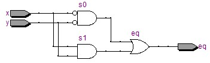
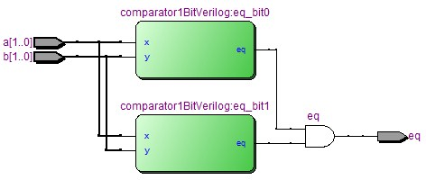

.. _`ch_VerilogInVhdl`:

Verilog designs in VHDL
***********************

.. raw:: latex

    \chapterquote{Finish the few duties you have at hand, and then you will have peace.}{Ramakrishna Paramahansa}

Introduction
============

Since, both VHDL and Verilog are widely used in FPGA designs, therefore it be beneficial to combine both the designs together; rather than transforming the Verilog code to VHDL and vice versa. This chapter presents the use of Verilog design in the VHDL codes. 

Verilog designs in VHDL
=======================

Design of 1 bit comparator in :numref:`verilog_comparator1BitVerilog` (which is written using Verilog) is same as the design of :numref:`vhdl_comparator1Bit`. Design generated by :numref:`verilog_comparator1BitVerilog` is shown in :numref:`fig_comparator1BitVerilog`. To use this Verilog design in VHDL, we need to declare the Verilog design as component, which is discussed in :numref:`vhdl_comparator2BitStructComponent`. Further, we can not use the 'work.comparator1BitVerilog' method (discussed in :numref:`vhdl_comparator2BitStruct`) to include the Verilog codes in the VHDL designs. 

.. literalinclude:: codes/Chapter-Verilog-desings-in-Vhdl/comparator1BitVerilog.v
    :language: vhdl
    :linenos:
    :caption: The 1 bit comparator in Verilog
    :name: verilog_comparator1BitVerilog

.. _`fig_comparator1BitVerilog`:

   The 1 bit comparator using Verilog

**Explanation** :numref:`vhdl_comparator2BitWithVerilog`

    Verilog design is declared as component in lines 17-22. Then this component is instantiated in line 26 and 28 to design the 2 bit comparator. The final design generated for the two bit comparator is shown :numref:`fig_comparator2BitWithVerilog` In this way, we can use the Verilog designs in VHDL codes. 

.. literalinclude:: codes/Chapter-Verilog-desings-in-Vhdl/comparator2BitWithVerilog.vhd
    :language: vhdl
    :linenos:
    :caption: Verilog design in VHDL
    :name: vhdl_comparator2BitWithVerilog

.. _`fig_comparator2BitWithVerilog`:

   The 2 bit comparator using Verilog and VHDL

Simulation of mixed designs
===========================

Note that, Altera-Modelsim-Starter version does not allow simulation of mixed designs i.e. VHDL design mixed with Verilog design, can not be simulated in free version. You need to buy the full edition of Altera-modelsim for this. 

Further, `Active-HDL student <https://www.aldec.com/en/products/fpga_simulation/active_hdl_student>`_ version can be downloaded for free and can be used for mixed-modeling simulation. 

Lastly, in Active-HDL, all the waveforms can be imported as '.vcd' format (if required); which can be used by Modelsim software as well. To use the .vcd file in Modelsim, first convert it into '.wlf' file. For this, first go to Modelsim's transcript window and then go to the desired directory (which contains the .vcd file) e.g. cd D\:\/VcdFiles; and then type conversion command i.e. 'vcd2wlf VCD\_file\_name.vcd WLF\_file\_name.wlf'. This will convert the .vcd file to .wlf file, which can be used in Modelsim to display waveforms. 

Conclusion
==========

In this chapter, we used the Verilog designs in VHDL. Further, Verilog design must be declared as component to use it with VHDL. 
