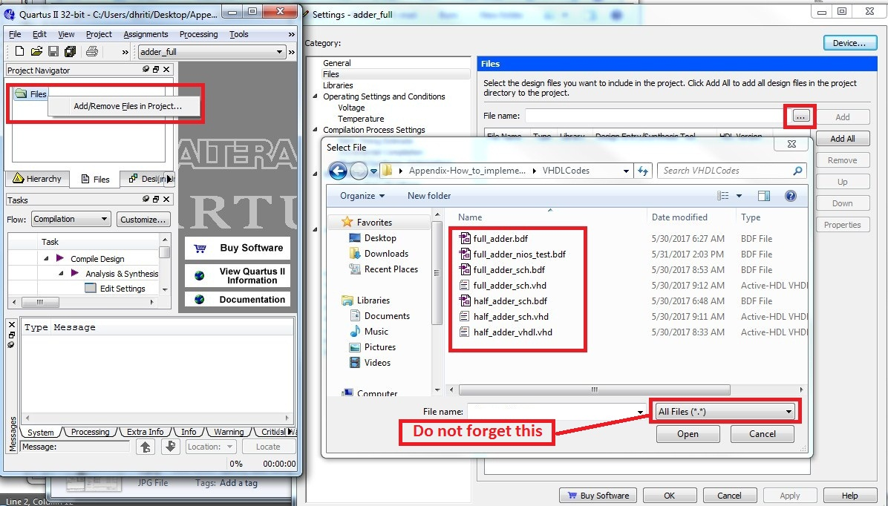
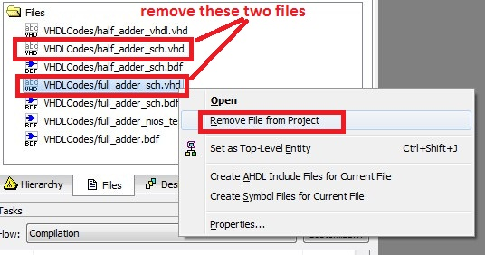
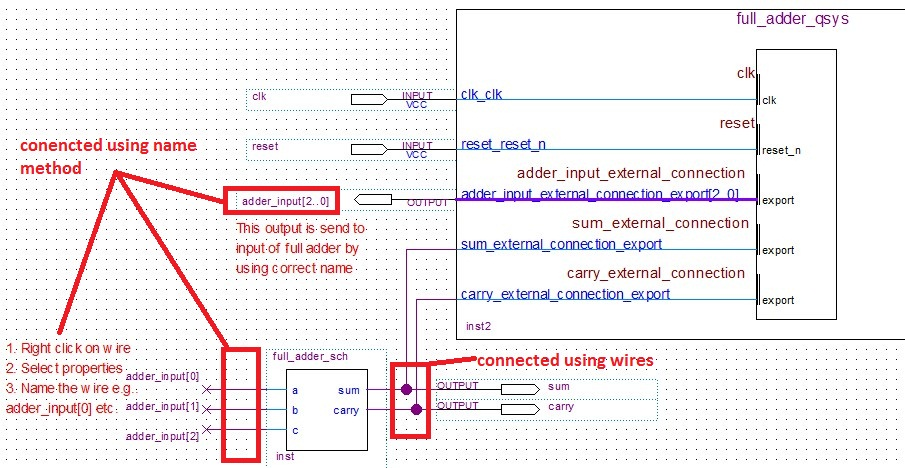
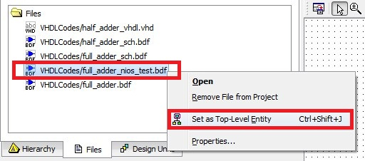
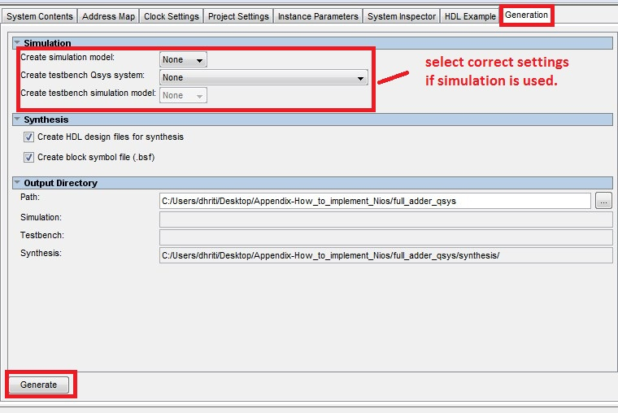
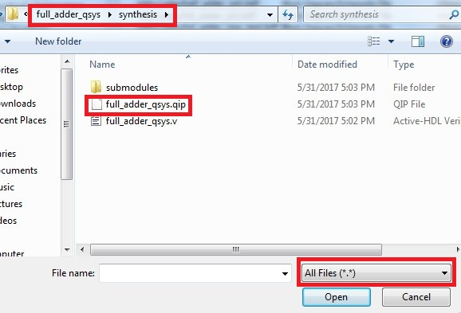
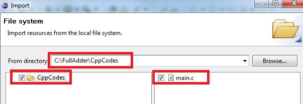
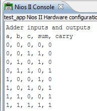

.. _`NiosQuartusModelsim`:

How to implement NIOS-designs
*****************************

.. raw:: latex

    \chapterquote{The most important is, the Lord is one, and you shall love the Lord your God with all your heart and with all your soul and with all your mind and with all your strength. The second is this, you should love your neighbor as yourself.}{Jesus Christ}

Please implement the designs of :numref:`Chapter %s <ch_FirstProject>` (i.e. VHDL design) and :numref:`Chapter %s <ch_NiosOverview>` (i.e. NIOS design), before following this section.

Unlike VHDL designs, NIOS designs can not be run directly on a system just by downloading it. Therefore, only required design-files are provided (instead of complete project) for NIOS systems. We need to follow the steps provided in this section, to implement the NIOS design on the FPGA. 

Note that **VHDL codes** and **C/C++** codes of the tutorials are available on the website; these codes are provided inside the folders with name VHDLCodes (or vhdl) and CppCodes (or c, or software/ApplicationName\_app) respectively. Along with these codes, **.qsys files** are also provided, which are used to generated the .sopc and .sopcinfo files. Lastly, **pin assignments files** for various Altera-boards are also provided in the zip folders. 

Please follow the below step, to compile the NIOS design on new system. Further, if you change the location of the project in the computer (after compiling it successfully), then NIOS design must be implemented again by following the instruction in :numref:`sec_nios_again_implement`

.. note:: 

    Codes files used in this section, are available in the folder 'Appendix-How\_to\_implement\_Nios\_design', which can be 'downloaded from the `website <http://pythondsp.readthedocs.io/en/latest/pythondsp/toc.html>`_. 

.. _'app_CreateProject':

Create project
==============

First create a new Quartus project (with any name) as shown in :numref:`sec_new_project`; and copy all the downloaded files (i.e. VHDLCodes, CppCodes, Pin-assignments  and .qsys files) inside the main project directory. 

Add all files from VHDLCodes folder
===================================

* Next, add all the files inside the folder 'VHDLCodes', to project as shown in :numref:`fig_add_all_VHDLCodes`. Do not forget to select 'All files' option while adding the files as shown in :numref:`fig_add_all_VHDLCodes`. 
    
    
.. _`fig_add_all_VHDLCodes`:

   Add all files from VHDLCodes folder

    
* In :numref:`Chapter %s <ch_FirstProject>`, we created  'VHDL codes' from the 'Block schematic design'. These two designs are same, therefore while compilation the multiple-design error will be reported. Therefore we need to remove the duplicate designs as shown in :numref:`fig_remove_duplicate`.  Note that, there are two duplicate designs i.e. one for half\_adder and other is for full\_adder as shown in the figure. 
    
.. _`fig_remove_duplicate`:

   Add all files from VHDLCodes folder

    
* In this project, 'full\_adder\_nios\_test.bdf' is the top-level design, which is shown in :numref:`fig_full_adder_top_d`. Note that, here 'name method' is used to connect the 'addr\_input[2..0] with port 'a', 'b' and 'c'. The method for giving name to a wire is shown in figure (see on the bottom-left side). 
    
    
.. _`fig_full_adder_top_d`:

   Select this design i.e. 'full\_adder\_nios\_test.bdf' as top level entity

    
* Now, select 'full\_adder\_nios\_test.bdf' as the top level entity, as shown in :numref:`fig_select_top_ent`.
    
.. _`fig_select_top_ent`:

   Select top level entity

* Modify the pin-assignment file and import it to the project . Also, make sure that correct FPGA-device is selected for the project. If problem in pin-assignments or device selection, then see :numref:`Chapter %s <ch_FirstProject>` again. 

Generate and Add QSys system
============================

Open the Qsys from Tools-->Qsys; and then open the downloaded '.qsys' file and follow the below steps, 

* First, refresh the system, by clicking on Files-->Refresh System.
    
* Next, select the correct the device type as shown in :numref:`fig_changeDevice`. 

.. _`fig_changeDevice`:

   Change device family

    
* Now, assign base addresses and interrupt numbers by clicking on System-->'Assign base addresses' and 'Assign interrupt numbers'.
    
* If there are some errors after following the above steps, then delete and add the Nios-processor again; and make the necessary connection again i.e. clock and reset etc. Sometimes we may need to create the whole Qsys-design again, if error is not removed by following the above steps. 
    
* Finally, generate the system as shown in :numref:`fig_generate_system` ( or refer to  :numref:`fig_simulationQsys` for generating system, if simulation is also used for NIOS design). Finally, close the Qsys after getting the message 'Generate Completed'. 

.. _`fig_generate_system`:

   Generate QSys system

* Finally, add the Qsys design to main project. For this, we need to add the '.qip' file generated by Qsys, which is available inside the synthesis folder. To add this file, follow the step in :numref:`fig_add_all_VHDLCodes`. You need to select the 'All files' option again to see the '.qip file' as shown in :numref:`fig_add_qsys_sys`. 

.. _`fig_add_qsys_sys`:

   Change device family
    
* Now, compile and load the design on FPGA system. 

.. _`sec_nios_again_implement`:

Nios system
===========

Next, we need to create the NIOS system. For this, follow the below steps, 

* Follow the steps in :numref:`sec_Nios_create_sys` and \ref{sec_add_modify_bsp` to create the NIOS-BSP file. Note that, you need to select the '.sopcinfo' file, which is inside the current main-project-directory.  

* Next, we need to create the application file. To create the application, go to File-->New-->Nios II Application. Fill the application name e.g. 'Application\_fullAdder' and select the BSP location as shown in :numref:`fig_createApplication`. 

* Note that, if 'c code' is provided inside the 'software folder (not in the 'CppCodes' or 'c' folders)' e.g. 'software/fullAdder\_app', then copy and paste folder-name as the application name i.e. 'fullAdder\_app' to create the application file. Note that, we usually add '\_app' at the end of application name and '\_bsp' at the end of BSP name. In this case, 'c code' will automatically added to the project. Next, right click on the 'c file' and select 'add to NIOS II build'; and skip the next step of adding 'c file', as it is already added in this case. Please see the `video: Appendix - How to implement NIOS design <https://www.youtube.com/playlist?list=PLpqu8JfoNKiNJpFvKTeBlI-LMzc2TAlRM>`_, if you have problem in this part of tutorial.    

* Next, we need to import the 'c' code from folder 'CppCodes (or c)'. For this, right click on the application and click on Import-->General-->File System-->From Directory; browse the directory, where we have saved  the CppCodes  and select the files as shown in :numref:`fig_AddCfiles`. Finally, simulate the system as described in :numref:`sec_SimulateNios`.

.. _`fig_AddCfiles`:

   Adding C files

* Finally, simulate or load the design on FPGA. Please refer to :numref:`sec_SimulateNios` for simulation; and to :numref:`sec_AddLoadNIOS` for loading the NIOS design on FPGA. **Do not forget to keep reset button high, while loading the NIOS II design**. 
    
* The current example will display the outputs on NIOS terminal, as shown in :numref:`fig_Final_adder_out`. Also, sum and carry values will be displayed on the LEDs.  
    

.. _`fig_Final_adder_out`:

   Nios Output of current design
