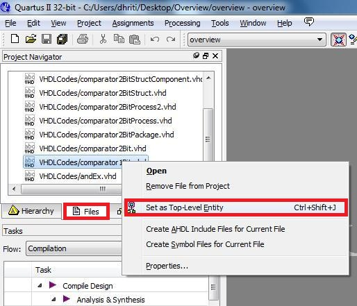

.. raw:: latex

    \appendix

    
.. _`QuartusModelsim`:

Script execution in Quartus and Modelsim
****************************************

.. raw:: latex

    \chapterquote{Who says God has created this world? We have created it by our own imagination. God is supreme, independent. When we say he has created this illusion, we lower him and his infinity. He is beyond all this.Only when we find him in ourselves, and even in our day to day life, do all doubts vanish.}{Meher Baba}

To use the codes of the tutorial, Quartus and Modelsim softwares are discussed here. Please see the `video: Create and simulate projects using Quartus and Modelsim <https://www.youtube.com/playlist?list=PLpqu8JfoNKiNJpFvKTeBlI-LMzc2TAlRM>`_, if you have problem in using  Quartus or Modelsim software. 

Quartus
=======

In this section, 'RTL view generation' and 'loading the design on FPGA board' are discussed. 

Generating the RTL view
-----------------------

The execute the codes, open the 'overview.qpf' using Quartus software. Then go to the files and right-click on the vhdl file to which you want to execute and click on 'Set as Top-Level Entity' as shown in :numref:`fig_Quartus`. Then press 'ctrl+L' to start the compilation. 

To generate the designs, go to **Tools-->Netlist Viewer-->RTL Viewer**; and it will display the design. 

Loading design on FPGA board
----------------------------

Quartus software generates two types of files after compilation i.e. '.sof' and '.pof' file. These files are used to load the designs on the FPGA board. Note that '.sof' file are erased once we turn off the FPGA device; whereas '.pof' files are permanently loaded (unless removed or overwrite manually). For loading the design on the FPGA board, we need to make following two changes which are board specific, 

* First, we need to select the board by clicking on **Assignments-->Device**, and then select the correct board from the list. 
* Next, connect the input/output ports of the design to FPGA board by clicking on **Assignments-->Pin Planner**. It will show all the input and output ports of the design and we need to fill 'location' column for these ports.   
* To load the design on FPGA board, go to **Tools-->Programmer**. 
* Then select JTAG mode to load the '.sof' file; or 'Active Serial Programming' mode for loading the '.pof' file. Then click on 'add file' and  select the '.sof/.pof' file and click on 'start'. In this way, the design will be loaded on FGPA board. 

.. _`fig_Quartus`:

   Quartus

Modelsim
========

We can also verify the results using modelsim. Follow the below steps for generating the waveforms, 

* First, open the modelsim and click on 'compile' button and select all (or desired) files; then press 'Compile' and 'Done' buttons. as shown in :numref:`fig_Modelsim`.
    
    .. _`fig_Modelsim`:

    .. figure:: fig/overview/ModelsimSimulate.jpg
       :width: 80%

       Modelsim: Compile and Simulate

    
* Above step will show the compile files inside the 'work library' on the library panel; then right click the desired file (e.g. comparator2Bit.vhd) and press 'simulate',  as shown on the left hand side of the :numref:`fig_Modelsim`. This will open a new window as shown in :numref:`fig_ModelsimWave`. 
    
    .. _`fig_ModelsimWave`:

    .. figure:: fig/overview/ModelsimWave.jpg
       :width: 80%

       Modelsim: Waveforms

    
*  Right click the name of the entity (or desired signals for displaying) and click on 'Add wave', as shown in :numref:`fig_ModelsimWave`. This will show all the signals on the 'wave default' panel. 
    
* Now go to transcript window, and write following command there as shown in the bottom part of the :numref:`fig_ModelsimWave`. Note that these commands are applicable for 2-bit comparators only; for 1-bit comparator assign values of 1 bit i.e. 'force a 1' etc. 

.. code-block:: text

    force a 00

    force b 01

    run

Above lines with assign the value 00 and 01 to inputs 'a' and 'b' respectively. 'run' command will run the code and since 'a' and 'b' are not equal in this case, therefore 'eq' will be set to zero and the waveforms will be displayed on 'wave-default' window, as shown in :numref:`fig_ModelsimWave`.  Next, run following commands, 

.. code-block:: text

    force a 01
    
    run
    
Now 'a' and 'b' are equal therefore 'eq' will be set to 1 for this case. In this way we can verify the designs using Modelsim. 
    
 
