.. _`ch_behavioralModeling`:

Behavioral modeling
*******************

.. raw:: latex

    \chapterquote{No matter what a man does, whether his deeds serve virtue or vice, nothing lacks importance. All actions bear a kind of fruit.}{Buddha}

Introduction
============

In :numref:`Chapter %s <ch_OverView>`, 2-bit comparator is designed using behavior modeling. In that chapter, 'if' keyword was used in the 'process' statement block. This chapter presents some more such keywords. 

Process block
=============

All the statements inside the process block execute sequentially. Further, if the architecture contains more than one process block, then all the process blocks execute in parallel, i.e. process blocks are the concurrent blocks. Also, if a signal is assigned values multiple times, then only last assignments will be considered as shown in :numref:`vhdl_multipleAssgEx`. In the listing, value to port 'z' is assigned at Lines 19 and 21. In this case, last assignment will be considered i.e. 'and' gate will implemented by Line 21, as shown in :numref:`fig_multipleAssgEx`

.. literalinclude:: codes/Chapter-BehavioralModeling/multipleAssgEx.vhd
    :language: vhdl
    :linenos:
    :caption: Multiple assignments to same signal
    :name: vhdl_multipleAssgEx

.. _`fig_multipleAssgEx`:

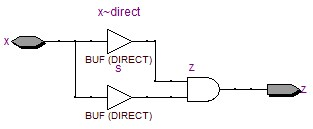

   Design generated by :numref:`vhdl_multipleAssgEx`

.. note:: 

    * If values are assigned to a signal multiple times, then only last assignment will be considered in the 'sequential design (:numref:`vhdl_multipleAssgEx`)', whereas error will be generated for 'concurrent design (:numref:`vhdl_deltaDelayEx`)'. 

    * We can write the complete design using sequential programming, but this may result in very complex hardware design, or to the design which can not be synthesized at all (see :numref:`sec_codesizeDesignSize` also). The best way of designing is to make small units using behavioral and dataflow modeling along with FSM design (:numref:`Chapter %s <ch_FSM>`), and then use the structural modeling style to create the large system. 

If-else statement
=================

In this section, :math:`4\times 1` multiplexed is designed using If-else statement. We already see the working of 'if' statement in :numref:`Chapter %s <ch_OverView>`. In lines of 17-27 of :numref:`vhdl_ifEx`, 'elsif' and 'else' are added to 'if' statement. Note that, If-else block can contain multiple 'elsif' statements between one 'if' and one 'else' statement. Further, 'null' is added in line 26 of :numref:`vhdl_ifEx`, whose function is same as 'unaffected' in concurrent signal assignment as shown in :numref:`vhdl_multiplexerVhdl`. :numref:`fig_ifExWave` shows the waveform generated by Modelsim for :numref:`vhdl_ifEx`. 

.. note::

    * The 'multiplexer design' in :numref:`fig_ifEx` (generated by if-else in :numref:`vhdl_ifEx`) is exactly same as the design in :numref:`fig_multiplexerEx` (generated by when-else in :numref:`vhdl_multiplexerEx`).  
        
    * Further, in :numref:`sec_concurrentSeq`, it is said that the 'combinational logic can be implemented using both the concurrent statements and the sequential statements. Note that, the multiplexer is the 'combinational design' as the output depends only on current input values. And it implemented using 'concurrent statements' and 'sequential statements' in :numref:`vhdl_multiplexerEx` and :numref:`vhdl_ifEx` respectively. 

.. literalinclude:: codes/Chapter-BehavioralModeling/ifEx.vhd
    :language: vhdl
    :linenos:
    :caption: Multiplexer using if statement
    :name: vhdl_ifEx

.. _`fig_ifEx`:

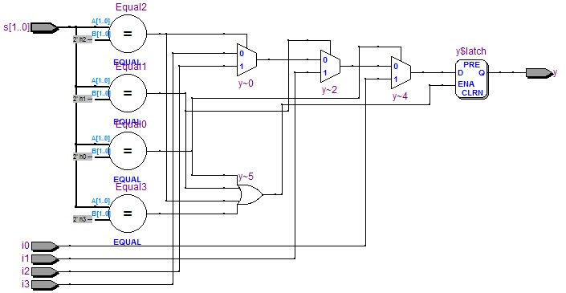

   Multiplexer using if statement, :numref:`vhdl_ifEx`

.. _`fig_ifExWave`:

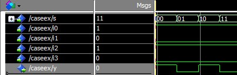

   Waveforms of :numref:`vhdl_ifEx` and :numref:`vhdl_caseEx`

Case statement
==============

Case statement is shown in lines 17-28 of :numref:`vhdl_caseEx`. 's' is defined in case statement at line 17; whose value is checked using 'when' keyword at lines 18 and 20 etc. The value of 'y' depends on the value of 's' e.g. if 's' is ''01'', then line 20 will be true, hence value of 'i1' will be assigned to 'y'. 

.. note::
    
    Note that the 'multiplexer design' in :numref:`fig_caseEx` (generated by case in :numref:`vhdl_caseEx`) is exactly same as the design in :numref:`fig_multiplexerVhdl` (generated by with-select in :numref:`vhdl_multiplexerVhdl`). 

.. literalinclude:: codes/Chapter-BehavioralModeling/caseEx.vhd
    :language: vhdl
    :linenos:
    :caption: Multiplexer using case statement
    :name: vhdl_caseEx

.. _`fig_caseEx`:

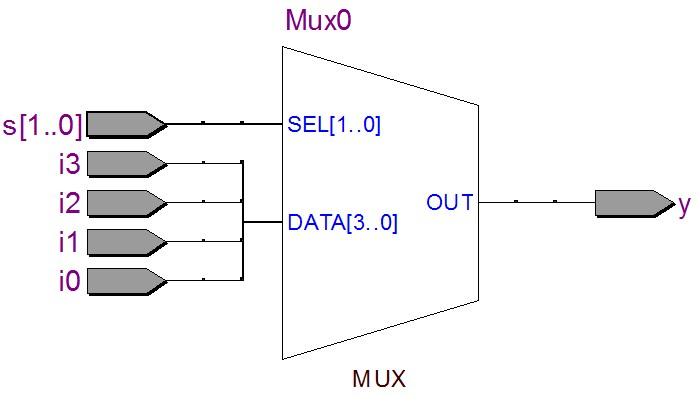

   Multiplexer using case statement, :numref:`vhdl_caseEx`

Wait statement
==============

'Wait statement' is used to hold the system for certain time duration. It can be used in three different ways as shown below, 

* **wait until** : It is **synthesizable** statement and holds the system until the defined condition is met e.g. ''wait until clk = '1''' will hold the system until clk is '1'. 
    
* **wait on** : It is **synthesizable** statement and holds the system until the defined signal is changed e.g. 'wait on clk' will hold the system until clk changes it's value i.e. '0' to '1' or vice-versa.
    
* **wait for** : It is **not synthesizable** and holds the system for the defined timed e.g. 'wait for 20ns' will hold the system for 20 ns. This is used with testbenches as shown in :numref:`Chapter %s <ch_Testbench>`.

Problem with Loops
==================

VHDL provides two loop statements i.e. 'for' loop and 'while' loop'. These loops are very different from software loops. Suppose 'for i = 1 to N' is a loop, then, in software 'i' will be assigned one value at a time i.e. first i=1, then next cycle i=2 and so on. Whereas in VHDL, N logic will be implement for this loop, which will execute in parallel. Also, in software, 'N' cycles are required to complete the loop, whereas in VHDL the loop will execute in one cycle. 

.. note::

    As loops implement the design-units multiple times, therefore design may become large and sometimes can not be synthesized as well. If we do not want to execute everything in one cycle (which is almost always the case), then loops can be replaced by 'case' statements and 'conditional' statements as shown in :numref:`sec_ifLoop`. Further, due to these reasons, we do not use loops for the design. Lastly, the loops can be extremely useful in testbences, when we want to iterate through all the test-data which is shown in :numref:`vhdl_half_adder_lookup_tb`.  

.. _`sec_ifLoop`:

Loop using 'if' statement
=========================

In :numref:`vhdl_ifLoop`, a loop is created using 'if' statement, which counts the number upto input 'x'. 

**Explanation** :numref:`vhdl_ifLoop`

    In the listing, two 'process' blocks are used i.e. at lines 20 and 31. The process at line 20 checks whether the signal 'count' value is 'less or equal' to input x (line 22), and sets the currentState to 'continueState'; otherwise if count is greater than the input x, then currentState is set to 'stopState'.
    
    Then next process statement (line 31), increase the 'count' by 1, if currentState is 'continueState'; otherwise count is set to 0 for stopState. Finally count is displayed at the output through line 39. In this way, we can implement the loops using process statements. 
    
    :numref:`fig_ifLoop` shows the loop generated by the listing with generic value N=1. Further,  :numref:`fig_ifLoopWave` shows the count-waveforms generated by the listing with generic value N = 3.
    
    Sensitivity list of the process block should be implemented carefully. For example, if we add 'count' in the sensitivity list at line 31 of Listing  :numref:`vhdl_ifLoop`, then the process block will execute infinite times. This will occur because the process block execute whenever there is any event in the signals in the sensitivity list; therefore any change in 'count' will execute the block, and then this block will change the 'count' value through line 34. Since 'count' value is changed, therefore process block will execute again, and the loop will never exit.
    

.. literalinclude:: codes/Chapter-BehavioralModeling/ifLoop.vhd
    :language: vhdl
    :linenos:
    :caption: Loop using 'if' statement
    :name: vhdl_ifLoop

.. _`fig_ifLoop`:

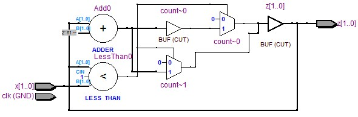

   Loop using 'if' statement, :numref:`vhdl_ifLoop` with N = 1

.. _`fig_ifLoopWave`:

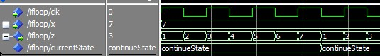

   Loop using 'if' statement, :numref:`vhdl_ifLoop` with N = 3

.. note::

    Note that, the design in :numref:`vhdl_ifLoop` is not good because of following reasons,
          
    * First, the clock is used in the sensitive list, therefore it may arise race-around condition in the system. To avoid it, the system should be sensitive to only edge of the clock (i.e. positive and negative) , which is discussed in :numref:`vhdl_BasicDFF` using 'event' keyword.
        
    * Secondly, the process statement in Line 31, does not required the 'clk' in the sensitive list. In :numref:`fig_combSeqBlock`, we saw that the sequential designs contain both 'combinational logic' and 'sequential logic'; also the figure shows that the 'clock' is required  only for 'sequential logics'. But in the current design, we used clock in both 'combinational logic' and 'sequential logic'. Detailed discussion about FSM designs are in :numref:`Chapter %s <ch_FSM>`, where such issues are raised for careful designs.  
    

Unintentional memories in combinational designs
===============================================

In previous sections, we saw various statements which can be used within the process-block. Also, in :numref:`sec_combSeqCircuit`, we discussed that the combinational designs do not have memories. Note that, processes are very easy to implement, but careful design is required, otherwise unintended memories (latches) or internal states (via feedback paths) may be created in combination designs, which is not desirable. This section shows one example of 'unintentional latches' along with the precautions to avoid such errors. 

:numref:`vhdl_latchEx` assign the values to 'large' and 'small' based on the values of 'a' and 'b'. The design generated by the listing is shown in :numref:`fig_latchEx`. Note that two latches are created in the design. Latches are introduced in the circuit, because we did not define the complete set of outputs in the conditions, e.g. we did no specify the value of 'small' when 'a \> b' at Line 17. Therefore, a latch is created to store the previous value of 'small' for this condition. 

.. literalinclude:: codes/Chapter-BehavioralModeling/latchEx.vhd
    :language: vhdl
    :linenos:
    :caption: Unintentional latch
    :name: vhdl_latchEx

.. _`fig_latchEx`:

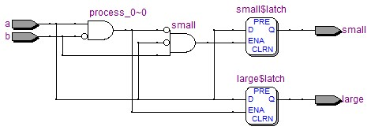

   Latch generated by :numref:`vhdl_latchEx`

.. note:: 

    The latches can be removed by following two simple rules which are applied in :numref:`vhdl_latchRemoveEx` and corresponding design in shown in :numref:`fig_latchRemoveEx`, 

    * Include all the input signals related to combinational designs in the sensitivity list of process statement. 
    * Always define the 'else' block in 'if statement' and 'others' block in 'case' statement. 
    * Assign all outputs inside every block of statements e.g define all outputs inside every 'elsif' block of 'if-else' statement and inside every  'when' block of 'case' statement etc. 

.. literalinclude:: codes/Chapter-BehavioralModeling/latchRemoveEx.vhd
    :language: vhdl
    :linenos:
    :caption: Remove unintentional latch
    :name: vhdl_latchRemoveEx

.. _`fig_latchRemoveEx`:

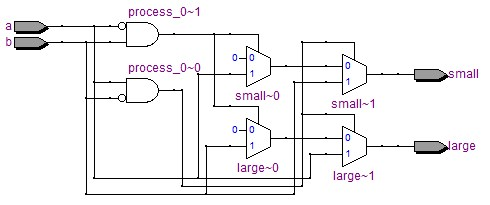

   Latch removed by :numref:`vhdl_latchRemoveEx`

Another method remove the unintended memories is the use of 'default values' as shown in :numref:`vhdl_latchRemoveEx2`. Here we can defined, all the outputs at the beginning of the process statement (Lines 18-19). Then, we can overwrite the values in different statements (i.e. using multiple assignments) e.g. value of 'large' is modified in Line 21. The design generated by the listing is shown in :numref:`fig_latchRemoveEx2`. 

.. note:: 

    Note that, 'multiple assignments' are error-prone as discussed in :numref:`vhdl_multipleAssgEx`. It's use should be limited to 'default-value-assignments' only. Do not use it for any other purposes.   

.. _`fig_latchRemoveEx2`:

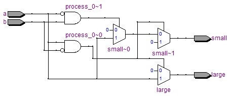

   Latch removed by default-value-assignments in :numref:`vhdl_latchRemoveEx2`

.. literalinclude:: codes/Chapter-BehavioralModeling/latchRemoveEx2.vhd
    :language: vhdl
    :linenos:
    :caption: Remove unintentional latch using default values
    :name: vhdl_latchRemoveEx2

.. _`sec_codesizeDesignSize`:

Code-size vs design-size
========================

Note that, in VHDL/Verilog designs the code-size has nothing to do with the design size. Remember, the well defined design (code may be very lengthy) can be easily understood by the synthesizer and will be implemented using less number of components. 

.. _`fig_squareWave`:

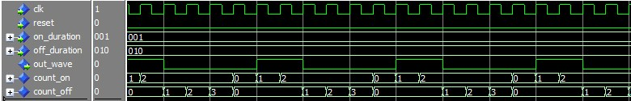

   Generated square wave by :numref:`vhdl_square_wave` and :numref:`vhdl_square_wave` : On-time = 2, Off-time = 4

Let's understand this with an example. In :numref:`vhdl_square_wave` and :numref:`vhdl_square_wave2`, an square wave generator is implemented whose on/off duration is programmable as shown in :numref:`fig_squareWave`. In :numref:`vhdl_square_wave`, the whole code is written in one process block, therefore the code is smaller as compare to :numref:`vhdl_square_wave2` where FSM approach is used to design the same circuit. The designs generated by these methods are shown in :numref:`fig_square_wave` and :numref:`fig_square_wave2` respectively. In these figures, we can observe that, the code is larger for the FSM approach (:numref:`vhdl_square_wave2`) but the resultant design is smaller than the first approach (:numref:`vhdl_square_wave`). 

.. _`fig_square_wave`:

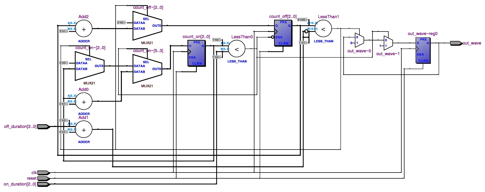

   Design generated by :numref:`vhdl_square_wave`

.. _`fig_square_wave2`:

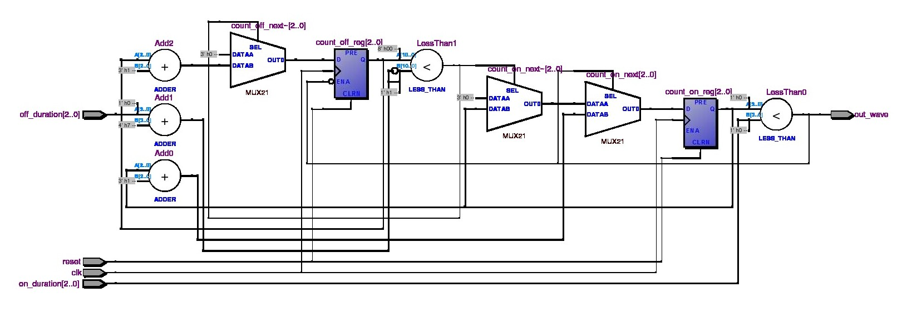

   Design generated by :numref:`vhdl_square_wave2`

.. note::

    Remember, code-size and design-size are independent of each other. The well defined designs are implemented with less number of components. 

.. literalinclude:: codes/Chapter-BehavioralModeling/square_wave.vhd
    :language: vhdl
    :linenos:
    :caption: Code is small but design is large (see :numref:`fig_square_wave`)
    :name: vhdl_square_wave

.. literalinclude:: codes/Chapter-BehavioralModeling/square_wave2.vhd
    :language: vhdl
    :linenos:
    :caption: code is lengthy but design is smaller (see :numref:`fig_square_wave2`
    :name: vhdl_square_wave2

Conclusion
==========

In this chapter, various statements of behavioral modeling styles are discussed. Also, we saw the relationship between the designs generated by behavior modeling and dataflow modeling. Further, problem with loops are discussed and finally loop is implemented using 'if' statement. 