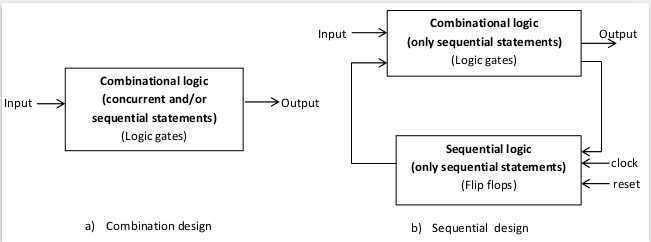
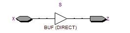
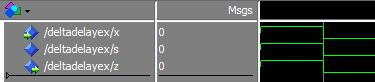
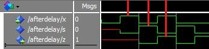
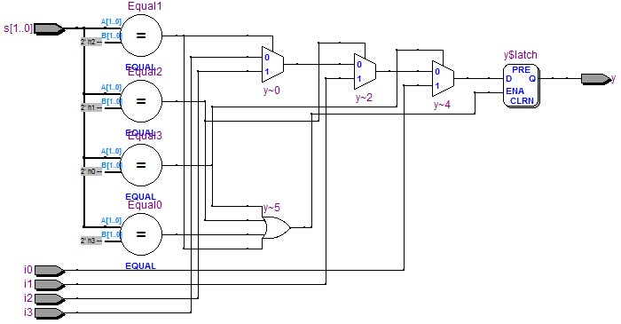
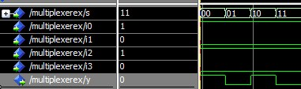
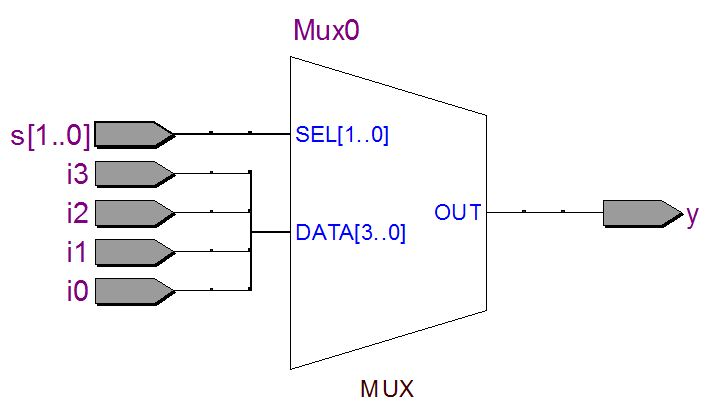

.. _`dataflowModeling`:

Dataflow modeling
*****************

.. raw:: latex

    \chapterquote{All action results from thought, so it is thoughts that matter.}{Sai Baba}

Introduction
============

In :numref:`Chapter %s <ch_OverView>` and :numref:`Chapter %s <ch_Datatypes>`, we saw various elements of VHDL language along with several examples. More specifically, :numref:`Chapter %s <ch_OverView>` presented various ways to design the 'comparator circuits' i.e. using dataflow modeling, structural modeling and packages etc.; and then :numref:`Chapter %s <ch_Datatypes>` presented various elements of VHDL language which can be used to implement the digital designs. These two chapters are the foundation of the VHDL language, and the illustrated designs-examples were not of any particular usage (especially in :numref:`Chapter %s <ch_Datatypes>`). From this chapter we will concentrate on the proper digital design using various elements of VHDL which are described in previous chapters.  

In this chapter, differences between 'combinational designs' and 'sequential designs' are shown. Also, various methods are discussed which are used for designing the 'combinational circuit' and 'sequential circuits'. Main focus of this chapter is the 'combinational designs' using 'Dataflow' modeling style; in which functionality of the entity is described using 'concurrent statements' (without defining the structure of the design); whereas :numref:`Chapter %s <ch_behavioralModeling>` will present the 'behavioral modeling' which can be used to create both 'sequential' and 'combinational' design. 

.. _`sec_combSeqCircuit`:

Combinational circuit and sequential circuit
============================================

Digital design can be broadly categorize in two ways i.e. **combinational designs** and **sequential designs**. It is very important to understand the difference between these two designs and see the relation between these designs with various elements of VHDL. 

* **Combinational designs** : Combinational designs are the designs in which output of the system depends on present value of the inputs only. Since, the outputs depends on current inputs only, therefore '**no memory**' is required for these designs. Further, memories are nothing but the 'flip flops' in the digital designs, therefore there is **no need of 'flip flops'** in combination designs. In the other words, only 'logic gates (i.e. and, not and xor etc.)' are required to implement the combinational designs.
    
* **Sequential designs** : Sequential designs are the designs in which the output depends on current inputs and previous states of the system. Since output depends on previous states, therefore '**memories**' are required for these systems. Hence, in sequential designs the 'flip flops' are need along with the logic gates. 

.. note::
    
    * Only 'logic gates (i.e. and, not and xor etc.)' are required to implement the combinational designs.
    * Both 'logic gates' and 'flip flops' are required for implementing the sequential designs. 
    * Lastly, the 'sequential design' contains both 'combinational logic' and 'sequential logic', but the combinational logic can be implement using 'sequential statements' only as shown in :numref:`fig_combSeqBlock`; whereas the 'combination logic' can be implement using 'concurrent or sequential statement' in the combinational designs. These statements are discussed in :numref:`sec_concurrentSeq`. 

.. _`fig_combSeqBlock`:

    Block diagram of 'combinational' and 'sequential' designs

.. _`sec_concurrentSeq`:

Concurrent statements and sequential statements
===============================================

In :numref:`sec_dataflowOverview`, we saw that the concurrent statements execute in parallel, i.e. the order of the statement does not matter. Whereas in :numref:`sec_behaviourModeling` shows the example of 'sequential statements' where the statements execute one by one. Following are the relationship between 'statements' and 'design-type', which are illustrated in :numref:`tbl_CombSeq` as well. 

.. note:: 

    * Remember, the 'sequential statements' and the 'sequential designs' are two different things. Do not mix these together.
    * Combinational designs can be implemented using both 'sequential statements' and 'concurrent statements'. 
    * Sequential designs can be implemented using 'sequential statements' only. 
    * Sequential statements can be defined inside 'process' , 'function' and 'procedure' block only. Further, these blocks executes concurrently e.g. if we have more than one process block then these block will execute in parallel, but statements inside each block will execute sequentially. 
    * VHDL constructs for combinational designs are 'when-else', 'with-select' and 'generate', which are discussed in this chapter. 
    * VHDL constructs for sequential designs are 'if', 'loop', 'case' and 'wait', which are discussed in :numref:`Chapter %s <ch_behavioralModeling>`.

.. _`tbl_CombSeq`:

.. table:: Relationship between 'design-type' and 'VHDL statements'

    +------------------------------+----------------------------+-------------+
    | Design                       | Statement                  | VHDL        |
    +==============================+============================+=============+
    | Sequential                   | Sequential statements only | If          |
    +                              +----------------------------+-------------+
    | (Flip-flops and logic gates) |                            | Case        |
    +                              +----------------------------+-------------+
    |                              |                            | Loop        |
    +                              +----------------------------+-------------+
    |                              |                            | Wait        |
    +------------------------------+----------------------------+-------------+
    | Combinational                | Concurrent and  Sequential |             |
    +                              +----------------------------+-------------+
    | (only logic gates)           |                            | when-else   |
    +                              +----------------------------+-------------+
    |                              |                            | with-select |
    +                              +----------------------------+-------------+
    |                              |                            | generate    |
    +------------------------------+----------------------------+-------------+

Delay in signal assignments
===========================

In :numref:`Chapter %s <ch_OverView>`, we saw that concurrent statements do not execute sequentially i.e. order of statements do not matter in concurrent statements. More precisely, these statements are 'event triggered' statements i.e. these statements execute whenever there is any event on the signal, as discussed in :numref:`vhdl_deltaDelayEx` and :numref:`vhdl_afterDelay`.

Remember that, lines 15 and 16 in :numref:`vhdl_deltaDelayEx` and :numref:`vhdl_afterDelay` are the example of signal assignments. In this section, two types of delays in signal assignments, i.e. 'delta delay (:math:`\Delta t`)' and 'delay using 'after' statement', are discussed. 

Delta delay
-----------

If 'no delay' or delay of '0 ns' is specified in the statement, then delta delay is assumed in the design. These two delays are shown in :numref:`vhdl_deltaDelayEx` which is explain below. 

**Explanation** :numref:`vhdl_deltaDelayEx`

    In this listing, 'x' and 'z' are the input and output ports respectively, whereas 's' is the signal. In line 15, delay is not defined explicitly; whereas in Line 16, 0 ns delay is defined. Hence, in both the cases 'delta delay (:math:`\Delta t`)' is assumed which is explained in next paragraph. 
    
    As explained before, concurrent statements execute whenever there is any change in the signals; therefore line 16 will be executed, when there is any change in the input 'x'. This statement will execute in :math:`\Delta t` time. Hence, the value of signals 's' will be changed after :math:`\Delta t` time. Since the value of 's' is changed, therefore in next :math:`\Delta t` time, line 15 will execute and the value of 'z' will be changed. 
    
    In the other words, the code will execute 'two times' in $2\Delta t$ time to complete the signal assignments; in first :math:`\Delta t` time, value of 's' will change and in next :math:`\Delta t` time, the value of 's' will be assigned to 'z'. In general, code will execute until there is no further change in the signals. Also, delta delay is very small and can not be seen in simulation results as illustrated in :numref:`fig_deltaDelayEx`. Further, in the figure, all the values i.e. 'x', 's' and 'z' are changed at the same time, which indicates that delta delay is very small and can not be observed. 
    
    .. note:: 
        
        * Multiple signal assignments are not allowed in VHDL, as shown in line 17 of :numref:`vhdl_deltaDelayEx`. Here, signal assignment for 'z' is done twice i.e. line 15 and 17. If we uncomment the line 17, then model will be invalid and error will be generated. 
        * The 'after' statements in the VHDL codes are discarded by the synthesizer. But 'after' keyword is very useful for writing testbenches.
        * A buffer is added to the system for 'inout port' as shown in :numref:`fig_bufferInOut`. 
        

.. _`fig_bufferInOut`:

    Buffer created for 'inout port (x)'

.. literalinclude:: codes/Chapter-Dataflow/deltaDelayEx.vhd
    :language: vhdl
    :linenos:
    :caption: Delta delay
    :name: vhdl_deltaDelayEx

.. _`fig_deltaDelayEx`:

    Delta delay

Delay with 'after' statement
----------------------------

We can assign the desired delay in the signal assignment statement as shown in lines 15 and 16 of :numref:`vhdl_afterDelay`. Here signal 's' is assigned after the delayed of 1 ns (line 15), then the value of 's' is assign to 'z' after 1 ns (line 16). Hence the output 'z' will be delay by 2 ns with respect to 'x' as shown in :numref:`fig_afterDelay` using vertical red lines (which show the propagation of value '1'). Also, horizontal red lines for 's' and 'z' show that these signals are uninitialized for that time period (because values are assigned after 1 and 2 ns respectively). 

.. literalinclude:: codes/Chapter-Dataflow/afterDelay.vhd
    :language: vhdl
    :linenos:
    :caption: Specify delay using 'after'
    :name: vhdl_afterDelay

.. _`fig_afterDelay`:

    Delay

Concurrent signal assignments
=============================

Similar to 'if' statement in behavioral modeling, the 'dataflow' modeling provides two signal assignments i.e. 'Conditional signal assignment' and 'Selected signal assignment'. In this chapter, the multiplexer is designed using these two assignments. 

Multiplexer is a combinational circuit which selects one of the many inputs with selection-lines and direct it to output. :numref:`tbl_Multiplexer` illustrates the truth table for :math:`4\times 1` multiplexer. Here 'i0 - i3' the input lines, whereas 's0' and 's1' are the selection line. Base on the values of 's0' and 's1', the input is sent to output line, e.g. if s0 and s1 are 0 then i0 will be sent to the output of the multiplexer.

.. _`tbl_Multiplexer`:

.. table:: Truth table of  :math:`4\times 1`  multiplexer

    +----+----+----+
    | s0 | s1 | y  |
    +====+====+====+
    | 0  | 0  | i0 |
    +----+----+----+
    | 0  | 1  | i1 |
    +----+----+----+
    | 1  | 0  | i2 |
    +----+----+----+
    | 1  | 1  | i3 |
    +----+----+----+

Conditional signal assignment
-----------------------------

Syntax for conditional signal assignment is shown in lines 15-18 of :numref:`vhdl_multiplexerEx`, where 'when' and 'else' keywords are used for assigning the value to output port 'y'. Conditional signal assignments are implemented using '2$\times$1' multiplexer as shown in :numref:`fig_multiplexerEx`. Here, three '2$\times$1' multiplexer (i.e. y:math:`\sim`0, y:math:`\sim`2 and y:math:`\sim`4) are used to design the ':math:`4\times 1`' multiplexer.

.. literalinclude:: codes/Chapter-Dataflow/multiplexerEx.vhd
    :language: vhdl
    :linenos:
    :caption: Multiplexer using Conditional signal assignment
    :name: vhdl_multiplexerEx

.. _`fig_multiplexerEx`:

    Multiplexer using Conditional signal assignment

:numref:`fig_multiplexerExWave` shows the waveform of :numref:`vhdl_multiplexerEx`. Here i0, i1, i2 and i3 are set to 1, 0, 1 and 0 respectively. Then simulator is run 4 times for all the combination of 's' i.e. 00, 01, 10 and 11 respectively; and output 'y' is assigned the value based on the 's' value e.g if s is '00' then y is assigned with the value of 'i0' i.e. 1 etc.  

.. _`fig_multiplexerExWave`:

    Multiplexer waveform for :numref:`vhdl_multiplexerEx` and :numref:`vhdl_multiplexerVhdl`

Selected signal assignment
--------------------------

Syntax for selected signal assignment is shown in lines 15-23 of :numref:`vhdl_multiplexerVhdl`, where 'with-select' and 'when' keywords are used for assigning the value to output port 'y'. Unlike conditional signal statement, in selected signal assignment implements the :math:`4\times 1` multiplexer with :math:`4\times 1` multiplexer itself as shown in :numref:`fig_multiplexerVhdl`, rather than with multiple 2$\times$1 multiplexer. Further, the waveforms for :numref:`vhdl_multiplexerVhdl` is shown in :numref:`fig_multiplexerExWave`.

Note that 'unaffected when others' is used in line 23.  'others' is used to avoid the error which is caused by the logics which can not be synthesized,  as mentioned in comments in lines 20-22. Further, 'unaffected' is the keyword which does not allow any change in the signal.

.. _`fig_multiplexerVhdl`:

    Multiplexer using Selected signal assignment

.. literalinclude:: codes/Chapter-Dataflow/multiplexerVhdl.vhd
    :language: vhdl
    :linenos:
    :caption: Multiplexer using Selected signal assignment
    :name: vhdl_multiplexerVhdl

Generate statement and problem with Loops
=========================================

'Generate statement' is used for creating loops in concurrent assignments. These loops are very different from software loops. Suppose 'for i = 1 to N' is a loop, then, in software 'i' will be assigned one value at a time i.e. first i=1, then next cycle i=2 and so on. Whereas in VHDL, N logic will be implement for this loop, which will execute in parallel. Also, in software, 'N' cycles are required to complete the loop, whereas in VHDL the loop will execute in one cycle. 

.. note::

    As loops implement the design-units multiple times, therefore design may become large and sometimes can not be synthesized as well. If we do not want to execute everything in one cycle (which is almost always the case), then loops can be replaced by 'case' statements and 'conditional' statements as shown in :numref:`sec_ifLoop`. Further, due to these reasons, we do not use loops in the design, and hence these are not discussed in the tutorial.

Conclusion
==========

In this chapter, we saw various features of Dataflow modeling style. We discussed the delays in VHDL designs. Also, :math:`4\times 1` multiplexer is implemented using conditional and selected signal assignments. Further, the differences in the designs generated by these two assignments are shown using figures.