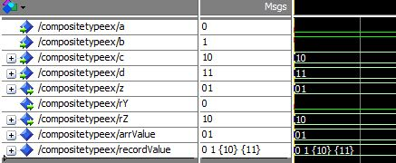

.. _`ch_Datatypes`:

Data types
**********

.. raw:: latex

    \chapterquote{That is real service where there is no thought of self at all.}{Meher Baba}

Introduction
============

In the :numref:`Chapter %s <ch_OverView>`, we used the data-types i.e. 'std\_logic' and 'std\_logic\_vector' to define '1-bit' \& '2-bit' input and output ports and signals. Also, some operators e.g. 'and' and 'or' etc. were discussed. In this chapter, some more information is provided on these topics.

Lexical rules
=============

VHDL is case insensitive language i.e. upper and lower case letters have same meanings. Further, 1-bit numbers are written in single quotation mark and numbers with more than 1-bit are written in double quotation mark, e.g. '0' and ''01'' are the valid notations. Also, VHDL is free formatting language (i.e. spaces can be added freely), but we use the python like approach to write the codes, as it is clear and readable. Lastly in VHDL, '\-\-' is used for comments. 

.. _`sec_libPack`:

Library and packages
====================

In the tutorials, we use only two packages i.e. 'std\_logic\_1164' and 'numeric\_std' packages, which are approved by IEEE. Further, There are various other non-IEEE-standard packages available e.g. std\_logic\_arith' etc., which allow quick and easy coding with VHDL. Since these are not standardized library therefore it may result in compatibility issues in future. 

'std\_logic\_1164' package
--------------------------

The 'std\_logic\_1164' package contains the various data types e.g. 'std\_logic', 'std\_logic\_vector' and 'integer' etc. But we can not control the size of the integer (default 32 bit size) and format (i.e. sign and unsigned) using this package. Further,  'Natural' data type is available in this package, which allows only '0' and positive integer values.

'numeric\_std' package
----------------------

We can not perform various mathematical operations on the data type which are defined in 'std\_logic\_1164' package. To perform various mathematical operations and to gain more control over integer values, 'numeric\_std' package can be used. This package allows 'sign' and 'unsigned' integer values along with the size control. For example, if integer has values from 0-7 only, then we can define 'unsigned' data type of width 3 as shown in :numref:`vhdl_typeConvertEx`.

'textio' and 'std\_logic\_textio' packages
------------------------------------------

These packages are used in testbences to write and read the data to the file. These packages are discussed in :numref:`Chapter %s <ch_Testbench>`.

Other standard packages
-----------------------

There are some more standard packages which are not used in this tutorial i.e. 'numeric\_bit', 'standard','numeric\_bit\_unsigned' and 'numeric\_std\_unsigned'. Further, there are various standard packages are available for '**fixed point**' and '**floating point**' operations as well (not discussed in the tutorial) e.g.'fixed\_pkg', 'float\_pkg', 'fixed\_float\_types', 'fixed\_generic\_pkg' and 'float\_generic\_pkg'. 

Entity and architecture
=======================

Although Entity and Architecture declarations are discussed in :numref:`Chapter %s <ch_OverView>`; but following are the some additional information about these declarations, 

Entity declaration
------------------

Entity can have three types of ports i.e. 'in', 'out' and 'inout' as shown in lines 3-6 in :numref:`vhdl_entityDeclaration`. Note that last declaration does not contain ';' at the end (see line 6). Also, types with different port names, can be defined in separate lines as shown in line 3-4. This is helpful for writing comments for different ports. 

.. code-block:: vhdl
    :linenos:
    :caption: Entity Declaration
    :name: vhdl_entityDeclaration

    entity entityEx is    -- entityEx is the name of entity
    port(
    a, b : in std_logic;  -- inputs for encoder
    c : in std_logic;     -- input for decoder
    d : inout std_logic;  -- inout
    y, z : out std_logic  -- out (no ';' in the last declaration)
    ); 
    end entityEx;         -- end entity declaration 

    

Architecture body
-----------------

Architecture declaration consists of name of the architecture and name of the entity as shown in line 1 of :numref:`vhdl_architectureBody`. It contains two parts i.e. 'declaration section' and 'body'. Declaration section is optional which is defined between architecture name and 'begin' statement as shown in line 2. In declaration section signals, variables and constants etc. can be defined (line 2), whereas design-logics are defined in body (line 4-7). We already see the use of signals and design-logics in :numref:`Chapter %s <ch_OverView>`; variables, constants are other data types are discussed in next section.

.. code-block:: vhdl
    :linenos:
    :caption: Architecture body
    :name: vhdl_architectureBody

    architecture arch_Name of entityEx is 
        signal s0, s1: std_logic;  -- declaration section
    begin  -- begin architecture
    s0 <= (not a) and (not b);
    s1 <= a and b;

    z <= s0 or s1;
    end arch_Name;  -- end architecture

.. _`otherdownto`:

Keyword 'others', 'downto' and 'to'
===================================

Keyword 'others' is very useful for making assignments. In the tutorial, we used others for assigning the initial values as zero e.g. :numref:`vhdl_ifLoop` and :numref:`vhdl_rand_num_generator` etc. but it can be used for assigning different values as well as shown in :numref:`vhdl_otherto`. Also, we already used 'downto' keyword at several places e.g. 'std\_logic\_vector(**7 downto 0**)', which indicates that ':math:`7^{th}` bit is the MSB (preferred style). But, if we want to have the :math:`0^{th}` bit as MSB, then 'to' keyword can be used as 'std\_vector(**0 to 7**)'.  Various usage of keywords 'others', 'downto' and 'to' are shown in :numref:`vhdl_otherto`. 

.. code-block:: vhdl
    :linenos:
    :caption: Keywords 'others', 'downto' and 'to'
    :name: vhdl_otherto

    -- assign zero to constant 'a' i.e a = 0000
    constant a : std_logic_vector(3 downto 0) := (others => '0');

    -- assign signal 'b' = "0011" 
    -- position 0 or 1 = 1, rest 0
    signal b : std_logic_vector(3 downto 0) := (0|1=>'1', others => '0');  

    -- assign signal 'c' = "11110000" 
    -- position 7 downto 4 = 1, rest 0
    signal c : std_logic_vector(7 downto 0) := (7 downto 4 =>'1', others => '0');  
    -- or
    signal c : std_logic_vector(7 downto 0) := (4 to 7 =>'1', others => '0'); 

    -- assign signal 'd' = "01000" 
    -- note that d starts from 1 and ends at 5, hence position 2 will be 1.
    signal d : std_logic_vector(1 to 5) := (2=>'1', others => '0');  

.. _`dataOjbects`:

Data objects
============

In this section three types of data-objects are discussed. 

* **Signal**: Signals can be seen as the intermediate connections for different ports. We already saw various signals in :numref:`Chapter %s <ch_OverView>`, which are used to design the 1-bit and 2-bit comparators e.g. in :numref:`vhdl_comparator1Bit`, the signal 's0' and 's1' are used for 1-bit comparator. 
    
* **Variable**: Variables are defined inside the process statements only and can be accessed within the 'process' (i.e. the process in which it is defined). The difference between 'variable' and 'signal' are shown in :numref:`vhdl_signal_variable`. Variables can be very useful in sequntial designs, as these are visible only inside the process. 
    
**Explanation** :numref:`vhdl_signal_variable`
    
    Variables can defined declaration part of the process i.e. between 'process' and 'begin' keywords as shown in Line 25. Also, value to the variable are assigned using ':=' (see Lines 25 and 28). In the listing, two processes are defined (Lines 15 and 23). Following points are important to note in these processes, 
    
    * Process at Line 15 updates the value of signal 'a' and then assign the value of 'a' to 'b'. The updated value of 'a' is assigned to 'b' in the next clock cycle (not in the same clock cycle) as shown in :numref:`fig_signal_variable`. 
    * Process at Line 23 updates the value of 'variable v' and then assign the value to signal 'c'. This time value will be assigned to signal immediately as shown in :numref:`fig_signal_variable`. **Note that, the variables are not shown in the simulation graph directly, wee need to add them manually as shown in the figure. Since variable is defined at line 24, therefore line 24 is added to waveform as illustrated in the figure.**
    * Further, variables are not visible outside the process i.e. these can be excessed within the process; hence Line 34 will generated error. 
    * Lastly, the variable can be shared between between processes by defining them in the 'architecture declaration part' using keyword '**shared variable**'. In this case, only one process can modify it and other process can use the variable. 

    
.. note::
        
    Remember :  
            
    *  If a **'signal'** is updated inside the process and then assigned to other signal or ports etc., then **'old value'** of the signal will be assigned. The updated value will appear in next clock cycle. 
    * Whereas, if a 'variable' is updated inside the process and then assigned to other signal or ports etc. then 'updated value' will be assigned. 
    * Further, we will use 'variables' only for the 'testbenches' (not for the synthesis). 
    * Lastly, avoid update and assignment of signals within the same process block. This can be done by defining two different signals for updating and assignments, which is discussed with several examples in :numref:`Chapter %s <ch_FSM>` and :numref:`ch_ExamplesBasicDesigns`. In these chapters, suffix '\_reg' and '\_next' are used for assignment and updating the signal respectively. 

.. _`fig_signal_variable`:

    Signal vs Variable

   
.. literalinclude:: codes/Chapter-Datatypes/signal_variable.vhd
    :language: vhdl
    :linenos:
    :caption: Signal vs Variable
    :name: vhdl_signal_variable

    
* **Constant**: Constants are the names which are provided to a specific data-type with some values as shown in :numref:`sec_Constants`. As the name suggests, the value of 'constant' can not be changed after defining it. Further, constants can be defined without defining it's value in the packages only, such constants are known as '**deferred constants**'. But value of the constants must be declared in the package body.  
     

Data types
==========

In this section, commonly used data-types are discussed. Data types can be categorized in various ways e.g. standard/user-defined data type, scalar/composite and synthesizable/non-synthesizable etc. We categorize the data type in five ways i.e. **Standard data types**, **user-defined scalar data types**, **user-defined composite data types**, **file type** and **access type**. Access type are the pointers to the object of other type (similar to C pointer). Since access types are not used in the designs therefore it is not discussed in the tutorial. Note that we can implement all kinds of complex-designs without using access types. 

Standard data type
------------------

Some of the widely used standard data types are listed below,  which are defined in two packages i.e. 'std\_logic\_1164' and 'numeric\_std'.  

* std\_logic
* std\_logic\_vector
* unsigned
* signed
* integer
* natural
* time
* string

We will use the above data types for synthesis purpose except 'time' and 'string' which will be used in testbenches. Also, these data types can be converted from one type to another (except time and string) as shown in :numref:`sec_typeconversion`. Lastly, Table :numref:`tbl_SynthesizeType` shows the list of synthesizable and non-synthesizable data types along with the packages in which those data types are defined.

.. _`tbl_SynthesizeType`:

.. table:: Data types

    +------------------------+-------------------------------------------+--------------------------------+
    | Category               | Data type                                 | Package                        |
    +========================+===========================================+================================+
    | **Synthesizable**      | bit, bit_vector                           | standard library               |
    +------------------------+-------------------------------------------+                                +
    |                        | boolean, boolean_vector                   | (automatically included,       |
    +------------------------+-------------------------------------------+                                +
    |                        | integer, natural, postive, integer_vector | no need to include explicitly) |
    +------------------------+-------------------------------------------+                                +
    |                        | character, string                         |                                |
    +------------------------+-------------------------------------------+--------------------------------+
    |                        | std_logic, std_logic_vector               | std_logic_1164                 |
    +------------------------+-------------------------------------------+--------------------------------+
    |                        | signed, unsigned                          | numeric_std                    |
    +------------------------+-------------------------------------------+--------------------------------+
    | **Non-synthesizable**  | real, real_vector                         | standard library               |
    +------------------------+-------------------------------------------+                                +
    |                        | time, time_vector                         | (automatically included,       |
    +------------------------+-------------------------------------------+                                +
    |                        | delay_length                              | no need to include explicitly) |
    +------------------------+-------------------------------------------+--------------------------------+
    |                        | read, write, line, text                   | textio                         |
    +------------------------+-------------------------------------------+--------------------------------+

User-defined scalar types
-------------------------

In the tutorials, we will use two user-defined scalar types i.e. **integer** and **enumerated**. Since other two scalar types (i.e. **physical** and **floating point**) are not synthesizable, therefore not discussed in the tutorial.  

* **Integer Types**: Custom integer ranges can be defined using '**range**' keywords as shown in :numref:`vhdl_scalarTypeEx`. Note that, all the mathematical operations can be performed on 'custom integer type' but the signals must be of same type e.g. in :numref:`vhdl_scalarTypeEx` 'a, b, c and v3' have same range, but 'v3' has different type, therefore Line 37 will generate error. Please see all the comments in the listing for better understanding of the scaler type. 
    
* **Enumerated Types**: Enumerated data types have a set of user defined values, as shown in :numref:`vhdl_scalarTypeEx`. Enumerated data types are very useful in sequential designs, where we use the finite state machines for implementation, which is discussed in :numref:`Chapter %s <ch_FSM>`.
     

**Explanation** :numref:`vhdl_scalarTypeEx`

    This listing contains the example of 'integer' and 'enumerated' data types. Since 'out' port is not readable, therefore in line 11, 'x' is define as 'inout' port (instead of out), because we are reading the 'x' in line 48 i.e 'if (x \>\= 0)'.

    The signals 'a', 'b' and 'c' are of user-defined integer type whose range is [0,5]. Further, two more integer types are defined at Lines 19-20 and 23-24. Note that first we need to define the 'type (Lines 19 and 23)' and then create the signal of that type (Lines 20 and 24). 

    Enumerated data type is defined in line 27 with name 'stateTypes', which has two values i.e. 'posState' and 'negState'. Further, stateTypes, posState and negState are the user-defined name (not the keywords). Then in line 28, the signal 'currentState' of type 'stateTypes' is declared. Hence, 'currentState' can have only two values i.e. posState and negState. 
    
    Process block at line 46 executes whenever there is any event on 'x'. Line 48 checks whether x is greater than or equal to 0 and set the value to 'posState, if condition is true; otherwise value is set to 'negState'. Please read the comments for more details of the listing.  

.. literalinclude:: codes/Chapter-Datatypes/scalarTypeEx.vhd
    :language: vhdl
    :linenos:
    :caption: Scalar data types
    :name: vhdl_scalarTypeEx

.. _`compsiteTypes`:

User-defined composite types
----------------------------

The composite data types are the collection of values. In VHDL, list with same data types is defined using '**Array**' keyword; whereas list with different data types is defined using '**Record**'. VHDL examples of array and record are shown in :numref:`vhdl_compositeTypeEx`. Further, random access memory (RAM) is implemented in :numref:`sec_RAM` using composite type. 

**Explanation** :numref:`vhdl_compositeTypeEx`

    In line 18, the array 'newArray' is defined which can store 2 values (i.e. 0 to 1) of 'std\_logic' type. Line 19 creates a signal 'arrValue' of newArray type. Then in line 29 and 30, values are assigned to :math:`0^{th}` and :math:`1^{st}` position of 'arrValue' signal. Finally at line 32, the value is assigned to z using \& operator. \& is known as Concatenation operator, which is discussed in :numref:`sec_opearators`.
  
    Similarly, the record with name 'newRecord' is defined in lines 21-25, with 4 items i.e. d1, d2, v1 and v2. In line 26, the signal 'recordValue' of newRecord type is defined. Then in lines 35-39, values are assigned to recordValue signal. Finally, 'and' operations are performed in lines 41 and 42, which are sent to output ports i.e. rY and rZ. 
  
    Simulation results for the listing is shown in :numref:`fig_compositeTypeEx`. 

.. literalinclude:: codes/Chapter-Datatypes/compositeTypeEx.vhd
    :language: vhdl
    :linenos:
    :caption: Composite data types
    :name: vhdl_compositeTypeEx

.. _`fig_compositeTypeEx`:

   Composite datatypes

File Type
---------

File types are used to read and write contents to files. 'File type' is used with testbenches therefore it is discussed in :numref:`Chapter %s <ch_Testbench>`.

Tristate buffer
===============

The input/output (IO) ports can be left open using 'Z' value of 'std\_logic', which is synthesize using 'tristate buffer'. Suppose, we want to read the IO port 'a' only when 'enable' is '1' then we can write the code as below, 

.. code-block:: vhdl

    r <= a when enable='1' else 'Z'; 

.. _`sec_opearators`:

Operators
=========

In this section, various operators are discussed which are shown in Table :numref:`tbl_VHDLoperators`. 

Arithmetic operators
--------------------

Table :numref:`tbl_VHDLoperators` shows various arithmetic operators.Note that, arithmetic operations may not be performed to all data types, e.g. Mod operation can be applied to 'integer' data type and it's subtype (i.e. natural and positive) only. Hence, if we want to use  'mod' operation with 'std\_logic\_vector' then we need to perform type-conversion first as shown in :numref:`vhdl_modEx`. 

Logical or Boolean operators
----------------------------

We already see some logical operators in previous examples e.g. 'and' and 'or' etc. VHDL provides 7 logical operators i.e. **and**, **or**, **not**, **nand**, **nor**, **xor** and **xnor**.

Relational operators
--------------------

In previous examples, we used various relational operators to check the conditions i.e. '=' and '>='. VHDL provides 6 relational operations i.e. '=', '\>', '\<', '\>\=' (i.e. greater or equal), '\<\=' and '\/\=' (i.e. not equal to). 

.. _`concatenationOp`:

Concatenation operators
-----------------------

Concatenation operator is used to combine the two or more values e.g. ['1' \&  '0' =  ''10''] and [''10'' \&  '0' =  ''100'']. An example of this operator is shown in line 32 of :numref:`vhdl_compositeTypeEx`. Also, concatenation operators can be used for shifting operations which is discussed in :numref:`sec_shiftrg`. 

Assignment operator
-------------------

There are three operators which are used to assign values in VHDL i.e. '\<\=', '\:\=' and '\=\>. The first two operators are discussed in :numref:`dataOjbects` whereas last operator is discussed in :numref:`otherdownto`. 

.. _`tbl_VHDLoperators`:

.. table:: VHDL operators

    +---------------+--------+----------------------------------+---------------------------------------------+
    | Type          | Symbol | Description                      | "Example (a = 4 bit, b = 5 bit)"            |
    +===============+========+==================================+=============================================+
    | Arithmetic    | \+     | integer, natural, positive,      | c (exactly 5 bit) = a + b                   |
    |               |        |                                  |                                             |
    |               |        |                                  | (if a and b are signed/unsigned)            |
    +---------------+--------+                                  +---------------------------------------------+
    |               | \-     | signed, unsigned                 | c (exactly 5 bit) = a - b                   |
    |               |        |                                  |                                             |
    |               |        |                                  | (if a and b are signed/unsigned)            |
    +---------------+--------+                                  +---------------------------------------------+
    |               | \*     |                                  | c (exactly 9 bit i.e. 4+5) = a \* b         |
    |               |        |                                  |                                             |
    |               |        |                                  | (if a and b are signed/unsigned)            |
    +---------------+--------+                                  +---------------------------------------------+
    |               | \/     |                                  | c (exactly 5 bit)=a \/ b                    |
    |               |        |                                  |                                             |
    |               |        |                                  | (if a and b are signed/unsigned \&          |
    |               |        |                                  |                                             |
    |               |        |                                  | ignores the decimal values e.g. 5/-2 =  -2) |
    +---------------+--------+----------------------------------+---------------------------------------------+
    |               | abs    | integer, natural, positive       | abs(a)  (absolute value of a)               |
    +---------------+--------+                                  +---------------------------------------------+
    |               | rem    |                                  | a rem b (returns remainder with sign of a)  |
    +---------------+--------+                                  +---------------------------------------------+
    |               | mod    |                                  | a mod b (returns remainder with sign of b)  |
    +---------------+--------+----------------------------------+---------------------------------------------+
    |               | \*\*   | natural, positive,               | a \*\* b (e.g. 2\*\*3 = 8)                  |
    |               |        | constant positive integer        |                                             |
    +---------------+--------+----------------------------------+---------------------------------------------+
    | Boolean       | not    | not                              | not(a)                                      |
    +---------------+--------+----------------------------------+---------------------------------------------+
    |               | or     | or                               | a or b                                      |
    +---------------+--------+----------------------------------+---------------------------------------------+
    |               | nor    | nor                              | a nor b                                     |
    +---------------+--------+----------------------------------+---------------------------------------------+
    |               | and    | and                              | a and b                                     |
    +---------------+--------+----------------------------------+---------------------------------------------+
    |               | nand   | nand                             | a nand b                                    |
    +---------------+--------+----------------------------------+---------------------------------------------+
    |               | xor    | xor                              | a xor b                                     |
    +---------------+--------+----------------------------------+---------------------------------------------+
    |               | xnor   | xnor                             | a xnor b                                    |
    +---------------+--------+----------------------------------+---------------------------------------------+
    | Relational    | >      | greater than                     | a > b                                       |
    +---------------+--------+----------------------------------+---------------------------------------------+
    |               | <      | less than                        | a < b                                       |
    +---------------+--------+----------------------------------+---------------------------------------------+
    |               | >=     | greater than or equal            | a >= b                                      |
    +---------------+--------+----------------------------------+---------------------------------------------+
    |               | <=     | less than or equal               | a <= b                                      |
    +---------------+--------+----------------------------------+---------------------------------------------+
    |               | ==     | equal                            | a == b                                      |
    +---------------+--------+----------------------------------+---------------------------------------------+
    |               | /=     | not equal                        | a /= b                                      |
    +---------------+--------+----------------------------------+---------------------------------------------+
    | Concatenation | &      | can be used for shift operations | '0' \& "101" = "0101"                       |
    +---------------+        +----------------------------------+---------------------------------------------+
    |               |        |                                  | "101" \& '0'  \& "11"= "101011"             |
    +---------------+--------+----------------------------------+---------------------------------------------+
    | Assignment    | <=     | assign value to singal           | "a <= "1001"                                |
    +---------------+--------+----------------------------------+---------------------------------------------+
    |               | :=     | assign value to variable         | "b := "1001"                                |
    +---------------+        +----------------------------------+---------------------------------------------+
    |               |        | assign initial values            | signal a : std_logic := '1'                 |
    |               |        | to signal and variable           |                                             |
    +---------------+--------+----------------------------------+---------------------------------------------+
    |               | =>     | assign value using 'others'      | a <= (others => '0')                        |
    +---------------+--------+----------------------------------+---------------------------------------------+

Shift operators
---------------

VHDL provides some shift operators as well e.g. SLL (shift left logic) and SRL (shift right logic) etc. But these operations can be used with 'bit\_vector' only, therefore these are not discussed in the tutorial. Further, we can use the concatenation operator for shifting operation as discussed in :numref:`concatenationOp`. 

.. _`sec_typeconversion`:

Type conversion
===============

VHDL is strongly typed language; in the other words, if we declare the two numbers e.g. '101' and '111' using two different data types e.g. 'std\_logic\_vector' and 'unsigned', then VHDL considers these numbers as different data types and we can not perform 'or' and 'xor' etc. operations directly on these two numbers. We need to convert the type of the number, to perform such operations as shown in line 18 of :numref:`vhdl_typeConvertEx`. Various conversion functions are shown in Table :numref:`tbl_TableTypeConversion`, which is known as '**Type Casting**'. Further, :numref:`vhdl_modEx` performs the type conversion for performing the 'mod' operation on 'std\_logic\_vector' data type. Note that, in Line 26 of :numref:`vhdl_modEx`, the 'natural data type (i.e. b)' is first converted into 'signed' and then to 'std\_logic\_vector', as no direct conversion is possible.

.. _`tbl_TableTypeConversion`:

.. table:: Type conversion

    +----------------------------+------------------+----------------------+--------------------------------+
    | Original Data Type (a)     | Convert to       | Type Casting         | Description                    |
    +============================+==================+======================+================================+
    | signed, std_logic_vector   | unsigned         | unsigned(a)          |                                |
    +----------------------------+------------------+----------------------+--------------------------------+
    | unsigned, std_logic_vector | signed           | signed(a)            |                                |
    +----------------------------+------------------+----------------------+--------------------------------+
    | signed, unsigned           | std_logic_vector | std_logic_vector(a)  |                                |
    +----------------------------+------------------+----------------------+--------------------------------+
    | signed, unsigned           | integer          | to_integer(a)        |                                |
    +----------------------------+------------------+----------------------+--------------------------------+
    | integer                    | signed           | to_signed(a, size)   | to_unsigned(10, 5)             |
    +----------------------------+------------------+----------------------+                                +
    | natural                    | unsigned         | to_unsigned(a, size) | convert 10 into 5 bit unsigned |
    |                            |                  |                      | i.e. 01010                     |
    +----------------------------+------------------+----------------------+--------------------------------+

.. literalinclude:: codes/Chapter-Datatypes/typeConvertEx.vhd
    :language: vhdl
    :linenos:
    :caption: Type conversion
    :name: vhdl_typeConvertEx

.. literalinclude:: codes/Chapter-Datatypes/modEx.vhd
    :language: vhdl
    :linenos:
    :caption: MOD operation with type conversion
    :name: vhdl_modEx

Constant and Generics
=====================

Constant and Generics can be used to create reusable codes, along with avoiding the 'hard literals' from the code as shown in following sections. 

.. _`sec_Constants`:

Constants
---------

Constants are defined in 'architecture declaration' part and can not be modified in the architecture-body after declaration. In :numref:`vhdl_constantEx`, constant 'N' is defined in line 14 with value 3. Then this value is used in line 15 and 16. Suppose we want to change the contant value to 4. Now we need to change the value from 3 to 4 in line 14 only (instead of changing everywhere in the code e.g. line 15 and 16 in this example). In this way, we can remove the 'hard literal' from the codes.  

.. literalinclude:: codes/Chapter-Datatypes/constantEx.vhd
    :language: vhdl
    :linenos:
    :caption: Constants
    :name: vhdl_constantEx

.. _`subsec_Generic`:

Generics
--------

Generics are defined in 'entity' and can not be modified in the architecture-body. VHDL code for generic is shown in :numref:`vhdl_genericEx`. Further, we can override the default value of generic during component instantiation in structural modeling style as shown in :numref:`vhdl_genericInstantEx`. 

**Explanation** :numref:`vhdl_genericEx`

    In Lines 7-10, two generics are defined i.e. 'N' and 'M'. Then ports 'a' and 'b' are defined using generic 'N'. The process block (lines 20-27) compares 'a' and 'b' and set the value of 'eq' to 1 if these inputs are equal, otherwise set 'eq' to 0. 

.. literalinclude:: codes/Chapter-Datatypes/genericEx.vhd
    :language: vhdl
    :linenos:
    :caption: Generics
    :name: vhdl_genericEx

**Explanation** :numref:`vhdl_genericInstantEx`

    In line 8, 'x' and 'y' are defined as 4-bit vector. Structural modeling is used in Line 15-17, where generic mapping and port mapping is done at line 16 and 17 respectively. 

    Note that, in line 16 N=>4 will override the default value of N i.e. N=2 in :numref:`vhdl_genericEx`. Also, generic 'M' is not mapped, therefore default value of M will be used, which is defined in :numref:`vhdl_genericEx`. In this way, we can remove 'hard literals' from the codes, which enhances the reusability of the designs. 

.. literalinclude:: codes/Chapter-Datatypes/genericInstantEx.vhd
    :language: vhdl
    :linenos:
    :caption: Generic instantiation
    :name: vhdl_genericInstantEx

Attributes
==========

Attributes are the additional information about the signals, variables and types etc. In the tutorial three attributes are used frequently in the tutorial i.e. 'event (see :numref:`vhdl_BasicDFF`)', 'image (see :numref:`vhdl_half_adder_lookup_tb`)' and 'range (see :numref:`vhdl_half_adder_lookup_tb`). 

* Attribute 'event' is set to '1' whenever there is any change in the signal e.g. 'clk'event' will be 1 when clock goes from '0' to '1' or vice-versa.
* Attribute 'image' is used for string representation of integers, natural and std\_logic\_vector etc., which is very useful in testbenches for printing the values in string format.
* Attribute 'range' can be used for iterating over all the test-data using for-loop in the testbenches.
* Lastly, there are several other predefined attributes available in VHDL e.g. 'low', 'high', 'active', 'length' and 'reverse\_range' etc. Further, we can create custom attribute as well.

 

Conclusion
==========

In this chapter, we saw various data objects, data types and operators. Further, the two libraries i.e. 'std\_logic\_1164' and 'numeric\_std' are discussed. Generics and constants are shown which can be useful in creating the reusable designs. Lastly, since VHDL is strongly typed language therefore 'type casting' is used for performing operations on two different data types. 

