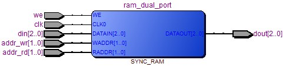

.. _`ch_ExamplesBasicDesigns`:

Design examples
***************

.. raw:: latex

    \chapterquote{The only real renunciation is that which abandons, in the midst of worldly duties, all selfish thoughts and desires.}{Meher Baba}

Introduction
============

In previous chapters, some simple designs were introduces e.g. mod-m counter and flip-flops etc. to introduce the VHDL programming. In this chapter various examples are added, which can be used to implement or emulate a system on the FPGA board. 

All the design files are provided inside the 'VHDLCodes' folder inside the main project directory; which can be used to implement the design using some other software as well. Each section shows the list of VHDL-files require to implement the design in that section. Lastly, all designs are tested using **Modelsim** and on **Altera-DE2 FPGA board**. Set a desired design as 'top-level entity' to implement or simulate it. 

Random number generator
=======================

In this section, random number generator is implemented using linear feedback shift register. VHDL files required for this example are listed below, 

* rand\_num\_generator.vhd
* rand\_num\_generator\_visualTest.vhd
* clockTick.vhd
* modMCounter.vhd

Note that, 'clockTick.vhd' and 'modMCounter.vhd' are discussed in :numref:`Chapter %s <ch_VisualVerification>`.

Linear feedback shift register (LFSR)
-------------------------------------

Long LFSR can be used as '**pseudo-random number generator**'.  These random numbers are generated based on initial values to LFSR. The sequences of random number can be predicted if the initial value is known. However, if LFSR is quite long (i.e. large number of initial values are possible), then the generated numbers can be considered as random numbers for practical purposes.  

LFSR polynomial are written as :math:`{{\mathbf{x}}^{\mathbf{3}}}{\mathbf{ + }}{{\mathbf{x}}^{\mathbf{2}}}{\mathbf{ + 1}}`}, which indicates that the feedback is provided through output of '**xor**' gate whose  inputs are connected to positions **3**, **2** and **0** of LFSR. Some of the polynomials are listed in Table :numref:`tbl_polynomial`.

.. _`tbl_polynomial`:

.. table:: Feedback polynomials

    +--------------------+---------------------------------+
    | **Number of bits** | **Feedback polynomial**         |
    +====================+=================================+
    | 3                  | :math:`{x^3} + {x^2} + 1`       |
    +--------------------+---------------------------------+
    | 4                  | :math:`{x^4} + {x^3} + 1`       |
    +--------------------+---------------------------------+
    | 5                  | :math:`{x^5} + {x^3} + 1`       |
    +--------------------+---------------------------------+
    | 6                  | :math:`{x^6} + {x^5} + 1`       |
    +--------------------+---------------------------------+
    | 7                  | :math:`{x^7} + {x^6} + 1`       |
    +--------------------+---------------------------------+
    | 9                  | :math:`{x^9} + {x^5} + 1`       |
    +--------------------+---------------------------------+
    | 10                 | :math:`{x^{10}} + {x^7} + 1`    |
    +--------------------+---------------------------------+
    | 11                 | :math:`{x^{11}} + {x^9} + 1`    |
    +--------------------+---------------------------------+
    | 15                 | :math:`{x^{15}} + {x^{14}} + 1` |
    +--------------------+---------------------------------+
    | 17                 | :math:`{x^{17}} + {x^{14}} + 1` |
    +--------------------+---------------------------------+
    | 18                 | :math:`{x^{18}} + {x^{11}} + 1` |
    +--------------------+---------------------------------+

Random numbers are generated using LFSR in :numref:`vhdl_rand_num_generator`. The code implements the design for 3 bit LFSR, which can be modified for LFSR with higher number of bits as shown below,  

**Explanation** :numref:`vhdl_rand_num_generator`

    The listing is currently set according to 3 bit LFSR i.e. N = 3 in Line 16.  'q' is the output of LFSR, which is random in nature. Lines 29-32 sets the initial value for LFSR to 1 during reset operations. Note that, LFSR can not have '0' as initial values. Feedback polynomial is implemented at Line 41. Line 52 shifts the last N bits (i.e. N to 1) to the right by 1 bit and the $N^{th}$ bit is feed with 'feedback\_value' and stored in 'r\_next' signal. In next clock cycle, value of r\_next is assigned to r\_reg through Line 34. Lastly, the value r\_reg is avalaible to output port from Line 53.
    
    Simulation results are shown in :numref:`fig_rand_num_generator`. Here, we can see that total 7 different numbers are generated by LFSR, which can be seen between two cursors in the figure.  Further, q values are represented in 'hexadecimal format' which are same as r\_reg values in 'binary format'. 
    
    Note that, in :numref:`fig_rand_num_generator`, the generated sequence contains '8, C, 6, B, 5, 2 and 1'; and if we initialize the system with any of these values, outputs will contain same set of numbers again. But, if we initialize the system with '3' (which is not the set), then the generate sequences will be entirely different.
    
    .. _`fig_rand_num_generator`:

    .. figure:: fig/dex/rand_num_generator.jpg
       :width: 100%

       Random number generation with N = 3

    
    To modify the feedback polynomial, first insert the correct number of bits (i.e. N) in  Line 16. Next, modify the feedback\_value at line 41, according to new value of 'N'.

    Note that maximum-length for a polynomial is defined as $2^N-1$, but not all the polynomials generate maximum length; e.g. N = 5 generates total 28 sequences (not 31) before repetition as shown in :numref:`fig_rand_num_generatorN5`.

    .. note::

        Distributions using LFSR: 
        
        * Even number polynomial should be used for generating the 'Uniformly distributed numbers', as it does not miss any number from the sequences. 
        * Then, the uniformly distributed numbers can be used to generate the 'Gaussian distribution' using 'center limit theorem'. 
            
    .. _`fig_rand_num_generatorN5`:

    .. figure:: fig/dex/rand_num_generatorN5.jpg
       :width: 100%

       Total sequences are 28 (not 31) for N = 5

.. literalinclude:: codes/Chapter-Design-Examples/rand_num_generator.vhd
    :language: vhdl
    :linenos:
    :caption: Random number generation with LFSR
    :name: vhdl_rand_num_generator

Visual test
-----------

:numref:`vhdl_rand_num_generator_visualTest` can be used to test the :numref:`vhdl_rand_num_generator` on the FPGA board. Here, 1 second clock pulse is used to visualize the output patterns. Please read :numref:`Chapter %s <ch_VisualVerification>` for better understanding of the listing. Note that,  N = 3 is set in Line 13 according to :numref:`vhdl_rand_num_generator`.

For displaying outputs on FPGA board, set reset to 1 and then to 0. Then LEDs will blink to display the generated bit patterns by LFSR; which are shown in :numref:`fig_rand_num_generator`. 

.. literalinclude:: codes/Chapter-Design-Examples/rand_num_generator_visualTest.vhd
    :language: vhdl
    :linenos:
    :caption: Visual test : Random number generation with LFSR
    :name: vhdl_rand_num_generator_visualTest

.. _`sec_shiftrg`:

Shift register
==============

Shift register are the registers which  are used to shift the stored bit in one or both directions. In this section, shift register is implemented which can be used for shifting data in both direction. Further it can be used as parallel to serial converter or serial to parallel converter. VHDL files required for this example are listed below, 

* shift\_register.vhd
* shift\_register\_visualTest.vhd
* clockTick.vhd
* modMCounter.vhd

Note that, 'clockTick.vhd' and 'modMCounter.vhd' are discussed in :numref:`Chapter %s <ch_VisualVerification>`.

Bidirectional shift register
----------------------------

:numref:`vhdl_shift_register` implements the bidirectional shift register which is explained below, 

**Explanation** :numref:`vhdl_shift_register`

    In the listing, the 'ctrl' port is used for 'shifting', 'loading' and 'reading' data operation. Lines 32-39 clear the shift register during reset operation, otherwise go to the next state. 
    
    Lines 41-53 performs various operations based on 'ctrl' values. Note that, to perform right shift (Line 47), data is continuously provided from last port i.e. (data(N-1)); whereas for left shift (Line 49) data is provided from first port i.e. (data(0)). 
    
    Next, ctrl=''00'' is provided for reading the data. It can be used for serial to parallel conversion i.e. when all the bits are shifted and register is full; then set ctrl to ''00'' and read the data, after that set ctrl to ''01'' or ''10'' for getting next set of bits. 
    
    Similarly, for parallel to serial converter, first load the data using ctrl=''11''; and then perform the shift operation until all the bits are read and then again load the data. Note that, in this case, last bit propagates (i.e. data(N-1) for right shift or data(0) for left shift) during shifting; which is actually designed for serial to parallel converter. But this will affect the working of parallel to serial converter, as we will set ctrl to ''11'', when all the data is shifted, therefore all the register which were filled by values from last port, will be overwritten by the new parallel data. 
    
    Lastly, data is available on the output port 'q\_reg' from Line 55. For, parallel to serial converter, use ony one pin of 'q\_reg' i.e. q\_reg(0) for right shift or q(N-1) for left shift; whereas for serial to parallel conversion, complete  'q\_reg' should be read.
    
    :numref:`fig_shift_register` shows the shifting operation performed by the listing. Here first data ( i.e. 00110000) is loaded with ctrl=''11''. Then shifted to right after first cursor and later to the left i.e. after second cursor.
    
    .. _`fig_shift_register`:

   Right and left shifting operations

.. literalinclude:: codes/Chapter-Design-Examples/shift_register.vhd
    :language: vhdl
    :linenos:
    :caption: Bidirectional shift register
    :name: vhdl_shift_register

Visual test
-----------

:numref:`vhdl_shift_register_visualTest` can be used to test the :numref:`vhdl_shift_register` on the FPGA board. Here, 1 second clock pulse is used to visualize the output patterns. Here, outputs (i.e. q\_reg) are displayed on LEDR; whereas 'shifting-control (i.e. ctrl)' and data-load (i.e. data) operations are performed using SW[16:15] and SW[7:0] respectively. Here, we can see the shifting of LEDR pattern towards right or left based on SW[16:15] combination. Please read :numref:`Chapter %s <ch_VisualVerification>` for better understanding of the listing.

.. literalinclude:: codes/Chapter-Design-Examples/shift_register_visualTest.vhd
    :language: vhdl
    :linenos:
    :caption: Visual test : bidirectional shift register
    :name: vhdl_shift_register_visualTest

Parallel to serial converter
----------------------------

If data is loaded first (i.e. ctrl = ''11''), and later shift operation is performed (i.e.. ctrl = ''01'' or ''10''); then :numref:`vhdl_shift_register` will work as 'parallel to serial converter'. In :numref:`vhdl_parallel_to_serial` shows the parallel to serial converter which is tested in :numref:`vhdl_parallel_and_serial_top_visual_v1`.

.. literalinclude:: codes/Chapter-Design-Examples/parallel_to_serial.vhd
    :language: vhdl
    :linenos:
    :caption: Parallel to serial converter
    :name: vhdl_parallel_to_serial

Serial to parallel converter
----------------------------

If shifting is performed first (i.e.. ctrl = ''01'' or ''10''), and later data is read (i.e. ctrl = ''00''); then :numref:`vhdl_shift_register` will work as 'serial to parallel converter'. In :numref:`vhdl_serial_to_parallel` shows the serial to parallel converter which is tested in :numref:`vhdl_parallel_and_serial_top_visual_v1`.

.. literalinclude:: codes/Chapter-Design-Examples/serial_to_parallel.vhd
    :language: vhdl
    :linenos:
    :caption: Serial to parallel converter
    :name: vhdl_serial_to_parallel

Top level connection between serial and parallel converters
-----------------------------------------------------------

In :numref:`vhdl_parallel_and_serial_top_v1`, the parallel-counter-data is converted into serial data using :numref:`vhdl_parallel_to_serial`. Then received serial data is converted back to parallel data by :numref:`vhdl_serial_to_parallel`. The simulation results are shown in :numref:`fig_parallel_and_serial_top_v1`

.. literalinclude:: codes/Chapter-Design-Examples/parallel_and_serial_top_v1.vhd
    :language: vhdl
    :linenos:
    :caption: Connection between serial and parallel converters
    :name: vhdl_parallel_and_serial_top_v1

.. _`fig_parallel_and_serial_top_v1`:

   Simulation results for :numref:`vhdl_parallel_and_serial_top_v1`

Visual test for serial and parallel converters
----------------------------------------------

In :numref:`vhdl_parallel_and_serial_top_visual_v1`, the reduced clock-rate is applied to :numref:`vhdl_parallel_and_serial_top_v1`, so that output can be seen on LEDs. Here, generated counter outputs are displayed on LEDG, whereas the received outputs (i.e. after conversion) are displayed on LEDG. 

.. literalinclude:: codes/Chapter-Design-Examples/parallel_and_serial_top_visual_v1.vhd
    :language: vhdl
    :linenos:
    :caption: Visual test for serial and parallel converters
    :name: vhdl_parallel_and_serial_top_visual_v1

.. _`sec_RAM`:

Random access memory (RAM)
==========================

RAM is memory cells which are used to store or retrieve the data. Further, FPGA chips have separate RAM modules which can be used to design memories of different sizes and types, as shown in this section. VHDL files required for this example are listed below, 

* single\_port\_RAM.vhd
* single\_port\_RAM\_visualTest.vhd
* dual\_port\_RAM.vhd
* dual\_port\_RAM\_visualTest.vhd

Single port RAM
---------------

Single port RAM has one input port (i.e. address line) which is used for both storing and retrieving the data, as shown in :numref:`fig_single_port_RAM`. Here 'addr[1:0]' port is used for both 'read' and 'write' operations. :numref:`vhdl_single_port_RAM` is used to generate this design. 

.. _`fig_single_port_RAM`:

.. figure:: fig/dex/single_port_RAM.jpg
   :width: 70%

   RTL view : Single port RAM (:numref:`vhdl_single_port_RAM`)

**Explanation** :numref:`vhdl_single_port_RAM`

    In the listing port 'addr' (Line 31) is 2 bit wide as 'addr\_width' is set to 2 (Line 24). Therefore, total '4 elements (i.e. :math:`2^2`)' can be stored in the RAM. Further, 'din' port (Line 32) is 3 bit wide as 'data\_width' is set to 3 (Line 25); which means the data should be 3 bit wide. **In summary, current RAM-designs can store '4 elements' in it and each elements should be 3-bit wide**.
    
    Write enable (we) port should be high and low for storing and retrieving the data respectively. 'din' port is used to write the data in the memory; whereas 'dout' port is used for reading the data from the memory. In Lines 43-48, the write operation is performed on rising edge of the clock; whereas read operation is performed at Line 53. 
    
    Note that, 'ram\_type' (Line 38) is created using integer array (as 'addr\_width' is integer at Line 2); whereas 'addr' port is of 'std\_logic\_vector' type (Line 31). Therefore, type conversion is required during write and read operations at Lines 46 and 53 respectively. Further, the type 'std\_logic\_vector' can not be converted directly to 'integer', therefore it is converted to 'unsigned' type before converting to 'integer'. 
    
    Lastly, :numref:`fig_single_port_RAM_Wave` shows the simulation results for the design. Here, 'we' is set to 1 after first cursor and the data is written at three different addresses (not 4). Next, 'we' is set to 0 after second cursor and read operations are performed for all addresses. Since, no values is stored for address '10', therefore dout is displayed as 'UUU' for this address as shown after third cursor. 

    .. _`fig_single_port_RAM_Wave`:

    .. figure:: fig/dex/single_port_RAM_Wave.jpg
       :width: 100%

       Simulation results : Single port RAM (:numref:`vhdl_single_port_RAM`)

.. literalinclude:: codes/Chapter-Design-Examples/single_port_RAM.vhd
    :language: vhdl
    :linenos:
    :caption: Single port RAM
    :name: vhdl_single_port_RAM

Visual test : single port RAM
-----------------------------

:numref:`vhdl_single_port_RAM_visualTest` can be use to test the :numref:`vhdl_single_port_RAM` on FPGA board. Different combination of switches can be used to store and retrieve the data from RAM. These data will be displayed on LEDs during read operations. 

.. literalinclude:: codes/Chapter-Design-Examples/single_port_RAM_visualTest.vhd
    :language: vhdl
    :linenos:
    :caption: Visual test : single port RAM
    :name: vhdl_single_port_RAM_visualTest

Dual port RAM
-------------

In single port RAM, the same 'addr' port is used for read and write operations; whereas in dual port RAM dedicated address lines are provided for read and write operations i.e. 'addr\_rd' and 'addr\_wr' respectively, as shown in :numref:`fig_dual_port_RAM`. Also, the listing can be further modified to allow read and write operation through both the ports. 

.. _`fig_dual_port_RAM`:

   Dual port RAM

:numref:`vhdl_dual_port_RAM` is used to implement :numref:`fig_dual_port_RAM`, which is same as :numref:`vhdl_single_port_RAM` with three changes. First, two address ports are used at Line 32 (i.e. 'addr\_rd' and 'addr\_wr') instead of one. Next, 'addr\_wr' is used to write the data at Line 47; whereas 'addr\_rd' data is used to retrieve the data at Line 54. Hence, read and write operation can be performed simultaneously using these two address lines.

:numref:`fig_dual_port_RAM_wave` shows the simulation results for dual port RAM. Here, on the first cursor, '011' is written at address '01'. On next cursor, this value is read along with writing operation as location '10'. Lastly, last two cursor shows that if read and write operation is performed simultaneously on one address e.g. '01', then new data will be available at 'dout' port after one clock cycle. 

.. _`fig_dual_port_RAM_wave`:

   Simulation results : Dual port RAM (:numref:`vhdl_dual_port_RAM`)

.. literalinclude:: codes/Chapter-Design-Examples/dual_port_RAM.vhd
    :language: vhdl
    :linenos:
    :caption: Dual port RAM
    :name: vhdl_dual_port_RAM

Visual test : dual port RAM
---------------------------

:numref:`vhdl_dual_port_RAM_visualTest` can be use to test the :numref:`vhdl_dual_port_RAM` on FPGA board. Different combination of switches can be used to store and retrieve the data from RAM. These data will be displayed on LEDs during read operations. 

.. literalinclude:: codes/Chapter-Design-Examples/dual_port_RAM_visualTest.vhd
    :language: vhdl
    :linenos:
    :caption: Visual test : dual port RAM
    :name: vhdl_dual_port_RAM_visualTest

language = Vhdl,
label      = {}
]{.vhd}

Read only memory (ROM)
======================

ROMs are the devices which are used to store information permanently. In this section, ROM is implemented on FPGA to store the display-pattern for seven-segment device, which is explained in :numref:`sec_sevenSegmentDisplay`. VHDL files required for this example are listed below, 

* ROM\_sevenSegment.vhd
* ROM\_sevenSegment\_visualTest.vhd

.. _`sec_ROMusingRAM`:

ROM implementation using RAM (block ROM)
----------------------------------------

:numref:`vhdl_ROM_sevenSegment` implements the ROM using a block of RAM, which stores the seven-segment display pattern in it. :numref:`fig_ROM_using_RAM` shows the RTL view of the listing, where ROM is implemented using synchronous RAM (denoted by 'SYNC RAM' in the figure). 

Note that, the 'write enable (WE)' port is not provided in the implementation, therefore 'WE' is set to '0' permanently (see :numref:`fig_ROM_using_RAM`); hence, new data can not be written in the RAM. And data stored during initialization of RAM will be stored permanently. Therefore, the RAM can be considered as ROM. This implementation of ROM is also referred as 'block ROM'. 

.. _`fig_ROM_using_RAM`:

.. figure:: fig/dex/ROM_using_RAM.jpg
   :width: 70%

   RTL view : block ROM (:numref:`vhdl_ROM_sevenSegment`)

**Explanation** :numref:`vhdl_ROM_sevenSegment`

    Data from the ROM is accessed through address line; therefore two ports are provided in the design i.e. addr and data (Lines 27-28). 'addr\_width' (Line 22) is the number of addresses, which corresponds to total number elements to be stored. Further, 'addr\_bits' (Line 23) is also defined, which is the minimum number of bits required to represent the total number of addresses i.e. 'addr\_width'. Lastly, 'data\_width' is declared at Line 24, which defines the number of bits in each element.
    
    Line 34 defines the ROM type (named as rom\_type) i.e. ROM has 16 elements (i.e. addr\_width) and each element contains 7 bits (i.e. data\_width). Next in Line 36, a ROM is created (named as sevenSegment\_ROM) of type 'rom\_type'; and patterns for seven-segment display are inserted in Lines 37-52 (see :numref:`sec_sevenSegmentDisplay` for details). These values are stored sequentially in ROM i.e. patterns 0, A and F are stored at location 0, 10 and 15 respectively. 
    
    Note that, ROM is created using 'integer' data type (see Line 22 and 34); whereas address line 'addr' has type 'std\_logic\_vector'. Therefore, to read the memory location, the 'addr' value must be changed to 'integer' which is done at Line 55. Since 'std\_logic\_vector' can not be converted directly to integer, therefore it is changed to 'unsigned' first, and then converted to 'integer'. 
    
    In summary, input 'addr' is the 'binary' address, which is converted into ''integer' format. Then ROM element is accessed based on this 'integer' address, which is finally provided at the output port i.e. 'data'. :numref:`fig_ROM_sevenSegment` shows the retrieved 'data' values from the ROM for different 'addr' values e.g. last waveform presents that 'addr' is '1111' and the corresponding 'data' value is '0111000'. 
    
    .. _`fig_ROM_sevenSegment`:

    .. figure:: fig/dex/ROM_sevenSegment.jpg
       :width: 100%

       Retrieving data from ROM

.. literalinclude:: codes/Chapter-Design-Examples/ROM_sevenSegment.vhd
    :language: vhdl
    :linenos:
    :caption: Seven segment display pattern stored in ROM
    :name: vhdl_ROM_sevenSegment

ROM implementation logic cells (distributed ROM)
------------------------------------------------

Note that, in Line 36 of :numref:`vhdl_ROM_sevenSegment`, the 'signal' keywords is used for 'sevenSegment\_ROM', which stores the **constant** values in Lines 37-52. If the 'signal' keyword is replaced by 'constant', then the design will be implemented using logical cells i.e. with 'Mux' as presented in :numref:`fig_ROM_using_logic_cells` (instead of block RAM). This design is referred as 'distributed ROM'. 

.. _`fig_ROM_using_logic_cells`:

   Partial RTL view : distributed ROM  (modified :numref:`vhdl_ROM_sevenSegment`)

Distributed ROM vs Block ROM
----------------------------

Note that, :numref:`fig_ROM_using_logic_cells` illustrate that large number of logical cells are required for distributed ROM implementation; hence it may result in lack of resources for implementing other logical designs. 

Further, block RAM is the memory module which is embedded in the FPGA device.  Therefore, ROM implementation using RAM does not use the regular logic cells; hence block ROM is the preferred way to implement the ROM as discussed in :numref:`sec_ROMusingRAM`. 

Visual test
-----------

:numref:`vhdl_ROM_sevenSegment_visualTest` is provided the input 'addr' through switches 'SW' (Line 20) and then output is from :numref:`vhdl_ROM_sevenSegment` is received to signal 'data' (Lines 31-32); which is finally displayed on seven segment display devices (Line 34) and LEDs (Line 35). Here, we can see the switch value on the seven-segment display devices along with the ROM content on LEDs; e.g. if SW value is '011' then '3' will be displayed on seven-segment display and '0000110' will be displayed on LEDs. 

.. literalinclude:: codes/Chapter-Design-Examples/ROM_sevenSegment_visualTest.vhd
    :language: vhdl
    :linenos:
    :caption: Display ROM data on seven segment display and LEDs 
    :name: vhdl_ROM_sevenSegment_visualTest

Defining ROM contents in file
-----------------------------

We can define the content of the ROM in the separate file and then read this file using VHDL code. Please note following items about this style,

* The code will become **device specific** because Altera devices support the '.mif' files whereas Xilinx devices support the '.CGF' files, which have different formats for storing the ROM contents.
* Design **can not be simulated directly** using Modelsim. 

Since, we are using 'Quartus software' in this tutorial, therefore '.mif' files are discussed in this section. ROM data is defined in 'seven\_seg\_data.mif' file as shown in :numref:`vhdl_seven_seg_data_mif`. In '.mif' file, the comments are written between two '\%  \%' signs (both single line e.g. Line 1 and multiline e.g. Lines 8-12). Further, we need to define certain parameters i.e. data and address types (see comments for details). Lastly, at Line 18, we set the values at all the addresses as '0' and then values are assigned at each address. This can be useful, when we want to store data at fewer locations. 

Next, :numref:`vhdl_ROM_sevenSegment_mif` is same as the :numref:`vhdl_ROM_sevenSegment` except Lines 35-41 where ROM data is read from the '.mif file', instead of defining in the same file. Please read the comments for understand these lines. 

Finally, :numref:`vhdl_ROM_sevenSegment_mif_visualTest` is exactly same as :numref:`vhdl_ROM_sevenSegment_visualTest` except :numref:`vhdl_ROM_sevenSegment_mif` is instantiated at Line 31.

.. literalinclude:: codes/Chapter-Design-Examples/seven_seg_data.mif
    :language: matlab
    :linenos:
    :caption: ROM data stored in '.mif file'
    :name: vhdl_seven_seg_data_mif

.. literalinclude:: codes/Chapter-Design-Examples/ROM_sevenSegment_mif.vhd
    :language: vhdl
    :linenos:
    :caption: VHDL code to read '.mif' file
    :name: vhdl_ROM_sevenSegment_mif

.. literalinclude:: codes/Chapter-Design-Examples/ROM_sevenSegment_mif_visualTest.vhd
    :language: vhdl
    :linenos:
    :caption: Top level design for :numref:`vhdl_ROM_sevenSegment_mif`
    :name: vhdl_ROM_sevenSegment_mif_visualTest

.. _`sec_LCDinterface`:

LCD interface
=============

In this section, a package is defined in :numref:`vhdl_LCD_SSD_display_pkg` which converts the binary data into seven-segment-display-format and lcd-data-format. 

Example 1
---------

In :numref:`vhdl_LCD_SSD_display`, this package is used to display the value provided by the switches on the seven-segment device and on the LCD. Further, the counting-pattern is also displayed on the LCD screen. The ASCII-values are shown in :numref:`fig_asciiValues` which are used for displaying values on LCD screen. **Note that, a clock divider is implemented in the design at Lines 85-100**. Please see the comments for more details. 

.. _`fig_asciiValues`:

   Chart : ASCII values

.. literalinclude:: codes/Chapter-Design-Examples/LCD_SSD_display_pkg.vhd
    :language: vhdl
    :linenos:
    :caption: Package for converting binary-format into seven-segment and ASCII format
    :name: vhdl_LCD_SSD_display_pkg

.. literalinclude:: codes/Chapter-Design-Examples/LCD_SSD_display.vhd
    :language: vhdl
    :linenos:
    :caption: LCD and seven-segment display
    :name: vhdl_LCD_SSD_display

Example 2
---------

In :numref:`vhdl_LCD_SSD_display`, we used the the 'mod' and 'division' operation to display the integer values on the LCD. Note that, the division operation requires lots of hardware and for large integer values it can not be synthesized as well. Therefore it is better to display the number in 'Hexadecimal' format as shown in :numref:`vhdl_LCD_BER_display`. Note that, the binary format is not suitable as well, as it will need large number of characters to display the values on LCD. 

Further, in :numref:`vhdl_LCD_BER_display` the message format is defined, but the actual values are obtained from the :numref:`vhdl_LCD_BER_display_top`. In this way, we can separate the 'calculation' and 'displaying' designs, which is more manageable than previous case. 

.. literalinclude:: codes/Chapter-Design-Examples/LCD_BER_display.vhd
    :language: vhdl
    :linenos:
    :caption: Message displayed on the LCD
    :name: vhdl_LCD_BER_display

.. literalinclude:: codes/Chapter-Design-Examples/LCD_BER_display_top.vhd
    :language: vhdl
    :linenos:
    :caption: Top level entity which provides the values to :numref:`vhdl_LCD_BER_display`
    :name: vhdl_LCD_BER_display_top

Example 3 : Error counting
--------------------------

In :numref:`vhdl_LCD_BER_display_top`, we if we change the position of the switches, then corresponding values are shown in the LCD display. In this section, we will use two switches where one switch will act as transmitted signal and second switch will act as detected signal. If the two values are different, then error-count and transmitted-bit-count will increase; but if both the values are same then only bit-count will increase (and error-count will remain constant as there is not error). 

For this, first we need to design a error-count circuit as shown in :numref:`vhdl_error_counter_v1`. Next, we integrated :numref:`vhdl_error_counter_v1` and :numref:`vhdl_LCD_SSD_display` in one listing i.e. :numref:`vhdl_error_lcd_connection_v1`; this is done so that we need to instantiate only one design to count and display the errors. In the other words, the main design should send the transmitted and detected bit patterns to :numref:`vhdl_error_lcd_connection_v1` and the rest of the job, i.e. error calculation and error display, will be performed by the :numref:`vhdl_error_lcd_connection_v1`, as discussed in next paragraph.

Finally a top level design is created in :numref:`vhdl_error_lcd_connection_test_v1`, which sends the transmitted and detected bit patterns (using SW) to the :numref:`vhdl_error_lcd_connection_v1`. If both switches are at the same position then only transmitted-bit-count will increase, otherwise both error-count and transmitted-bit-count will increase.  And the counting will stop when the maximum number of errors will be reached.

.. note::
    
    
    * Different clock-rates are used for LCD-display and error-calculation, as both the design needs different frequency of operations, as shown in top level design for the error counter (see Lines 58 and 61 of :numref:`vhdl_error_lcd_connection_test_v1`). 
    * The 'reset\_n' is used in the design which is (KEY(3)) on the DE2 board. This is also important because the SW switches of the DE2 board are not implemented with debouncing circuits, therefore if the error calculation are performed on high clock rate (in actual system, not in the current design), then 200 errors will be detected on the reset operation itself. 
    * Further, error calculations is skipped for first few clocks as shown in Lines 67-76 of :numref:`vhdl_error_counter_v1`. During these cycles, '0xFFF...' are displayed on the screen. Please, read  the comments for more details. 
    * Lastly is better to use 'KEY (i.e. reset\_n)' for reset operations at the top level design only; because by default 'KEY' is set to high position, therefore 'not' operation is required as shown in Line 28 of :numref:`vhdl_error_lcd_connection_test_v1`. If we use 'reset\_n' then it will create lots of confusion, as not operation is used with it for resetting the system. 
    

.. literalinclude:: codes/Chapter-Design-Examples/error_lcd_connection_test_v1.vhd
    :language: vhdl
    :linenos:
    :caption: Top level design which sends the transmitted and detected bit pattern
    :name: vhdl_error_lcd_connection_test_v1

.. literalinclude:: codes/Chapter-Design-Examples/error_counter_v1.vhd
    :language: vhdl
    :linenos:
    :caption: Error counter
    :name: vhdl_error_counter_v1

.. literalinclude:: codes/Chapter-Design-Examples/error_lcd_connection_v1.vhd
    :language: vhdl
    :linenos:
    :caption: Connect error-counting and LCD-display in one design
    :name: vhdl_error_lcd_connection_v1

VGA interface
=============

In this section, VGA interface is crated for FPGA devices. VHDL files required for this example are listed below, 

* sync\_VGA.vhd
* sync\_VGA\_visualTest.vhd
* sync\_VGA\_visualTest2.vhd
* clockTick.vhd
* modMCounter.vhd

Note that, 'clockTick.vhd' and 'modMCounter.vhd' are discussed in :numref:`Chapter %s <ch_VisualVerification>`.

Synchronization circuit
-----------------------

To display the data generated from FPGA on the VGA screen, we need to send synchronization signal along with some other signals e.g. horizontal synchronization signal, vertical synchronization signals and 25 MHz VGA clock etc. :numref:`vhdl_sync_VGA` generates a synchronization circuit to display the data on the VGA screen.   

.. literalinclude:: codes/Chapter-Design-Examples/sync_VGA.vhd
    :language: vhdl
    :linenos:
    :caption: VGA synchronization circuit
    :name: vhdl_sync_VGA

Visual test : change screen color with switches
-----------------------------------------------

:numref:`vhdl_sync_VGA_visualTest` can be used to test :numref:`vhdl_sync_VGA`. The color of the screen will be change according to combination of switches. 

.. literalinclude:: codes/Chapter-Design-Examples/sync_VGA_visualTest.vhd
    :language: vhdl
    :linenos:
    :caption: Change screen color with switches
    :name: vhdl_sync_VGA_visualTest

Visual test : display different colors on screen
------------------------------------------------

:numref:`vhdl_sync_VGA_visualTest2` displays four different colors on the screen as shown in :numref:`fig_sync_VGA_visualTest2`. 

.. _`fig_sync_VGA_visualTest2`:

   Screen with four different colors (:numref:`vhdl_sync_VGA_visualTest2`)

.. literalinclude:: codes/Chapter-Design-Examples/sync_VGA_visualTest2.vhd
    :language: vhdl
    :linenos:
    :caption: Display different colors on screen
    :name: vhdl_sync_VGA_visualTest2
