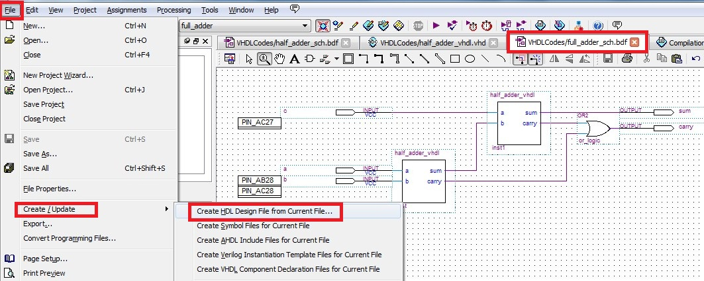
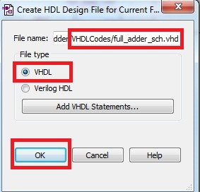

.. _`ch_FirstProject`:

First project
*************

.. raw:: latex

    \chapterquote{Real happiness lies in making others happy.}{Meher Baba}

Introduction
============

In this tutorial, full adder is designed with the help of half adders. Here we will learn following methods to create/implement the digital designs using Altera-Quartus software, 

* Digital design using 'block schematics',
* Digital design using 'VHDL codes',
* Manual pin assignment for implementation,
* Pin assignments using '.csv' file,
* Loading the design on FPGA. 
* Converting the 'VHDL design' to 'Symbols'
* Converting the 'Block schematic' to 'VHDL code' and 'Symbols'. 

If you do not have the FPGA-board, then skip the last part i.e. 'loading the design on FPGA'. Simulation of the designs using 'Modelsim' is discussed in :numref:`Chapter %s <ch_OverView>`. 

`Quartus II 11.1sp2 Web Edition <https://www.altera.com/downloads/software/quartus-ii-we/111sp2.html>`_ and `ModelSim-Altera Starter <https://www.altera.com/downloads/software/modelsim-starter/111.html>`_ software are used for this tutorial, which are freely available and can be downloaded from the `Altera website <https://www.altera.com/downloads/download-center.html>`_.  All the codes can be `downloaded from the website <http://pythondsp.readthedocs.io/en/latest/pythondsp/toc.html>`_. First line of each listing in the tutorial, is the name of the VHDL file in the downloaded zip-folder.

.. Note that, Altera-Modelsim-Starter version does not allow simulation of mixed design i.e. VHDL design mixed with Verilog can not be simulated. You need to buy the full edition of Altera-modelsim for this. Further, `Active-HDL student <https://www.aldec.com/en/products/fpga_simulation/active_hdl_student>`_ version can be downloaded for free and can be used for mixed-modeling simulation. 

.. _`sec_new_project`:

Creating the project
====================

* To create a new project, first open the Quartus and go to File-->New Project Wizard, as shown in :numref:`fig_createNewProject`. 
    
    .. _`fig_createNewProject`:

    .. figure:: fig/fp/1.jpg
       :width: 80%

       Create new project

    
* 'Introduction' window will appear after this, click 'next' and fill the project details as shown in :numref:`fig_nameProject`. 
    
    .. _`fig_nameProject`:

    .. figure:: fig/fp/2.jpg
       :width: 80%

       Name and location of project

    
* After this, 'Add files' window will appear, click on 'next' here as we do not have any file to add to this project. 
    
* Next, 'Family and Device settings' page will appear, select the proper device setting based on your FPGA board and click 'Finish' as shown in :numref:`fig_deviceSettings`. If you don't have FPGA board, then simply click 'Finish'. 

    .. _`fig_deviceSettings`:

    .. figure:: fig/fp/3.jpg
       :width: 80%

       Devices settings

    
* After clicking on finish, the project will be created as shown in :numref:`fig_device_settings`. **Note that, the tutorials are tested on DE2-115, DE2 (cyclone-II family) or DE0-Nano boards, therefore project settings may be different for different chapters. You need to select the correct device while running the code on your system.** This can be done by double-clicking on the device name, as shown in :numref:`fig_device_settings`.
    
    .. _`fig_device_settings`:

    .. figure:: fig/fp/device_settings.jpg
       :width: 80%

       Updated Devices settings

Digital design using 'block schematics'
=======================================

Digitals design can be create using two methods i.e. using 'block-schematics' and with programming language e.g. VHDL or verilog etc. Both have their own advantages in the design-process, as we will observe in the later chapters of the tutorials. 

In this section, we will create a half\_adder using block-schematics method, as shown below,

* For this, click on File-->New-->Block diagram/ Schematics files, as shown in :numref:`fig_block_schematics`; and a blank file will be created.
    
    .. _`fig_block_schematics`:

    .. figure:: fig/fp/4.jpg
       :width: 40%

       Create new block schematics

    
* Double click (anywhere) in the blank file, and a window will pop-up; select the 'and' gate from this window as shown in :numref:`fig_select_gate`. Similarly, select the 'xor' gate. 
    
    .. _`fig_select_gate`:

    .. figure:: fig/fp/5.jpg
       :width: 80%

       Select 'and' gate

    
* Next, right click on the 'xor' gate and then click on 'Generate Pins for Symbol Ports', as shown in :numref:`fig_add_pins`. 
    
    .. _`fig_add_pins`:

    .. figure:: fig/fp/6.jpg
       :width: 80%

       Add ports

* Now, connect the input ports of 'xor' gate with 'and' gate (using mouse); then Next, right click on the 'and' gate and then click on 'Generate Pins for Symbol Ports'. Finally rename the input and output ports (i.e. x, y, sum and carry) as shown in :numref:`fig_make_connections`. 
    
    .. _`fig_make_connections`:

    .. figure:: fig/fp/7.jpg
       :width: 80%

       Make connections

    
* Finally, save the design with name 'half\_adder\_sch.bdf'. It's better to save the design in the separate folder, so that we can distinguish the user-defined and system-generated files, as shown in :numref:`fig_save_project` where VHDL codes are saved inside the 'VHDLCodes' folders, which is inside the main project directory. 
    
    .. _`fig_save_project`:

    .. figure:: fig/fp/8.jpg
       :width: 80%

       Save project in separate directory i.e. VHDLCodes here

    
* Since the project name is 'full\_adder', where as the half adder's design name is 'half\_adder\_sch.bdf' (i.e. not same as the project name), therefore we need to set this design as top level entity for compiling the project. For this, go to project navigator and right click on the 'half\_adder\_sch.bdf' and set it as top level entity, as shown in :numref:`fig_top_level_project`.  
    
    .. _`fig_top_level_project`:

    .. figure:: fig/fp/9.jpg
       :width: 80%

       Select top level entity for the project

    
* Now, we can analyze the file as shown in :numref:`fig_analyze_design`. If all the connections are correct that analysis option will not show any error. 
    
Note that, 'start compilation' option (above the Analyse option in the figure) is used when we want to generate the .sof/.pof file, to load the design on the FPGA, whereas analyze option only checks for the syntax errors. We will use 'compilation' option in next section. 
    
    .. _`fig_analyze_design`:

    .. figure:: fig/fp/10.jpg
       :width: 80%

       Analyze the design
    

.. _`sec_compile`:

Manual pin assignment and compilation
=====================================

Please enter correct pin location according to your FPGA board, as shown in this section. If you do not have the board, then skip this section and go to :numref:`sec_digital_des_with_vhdl`.

 
Once design is analyzed, then next step is to assign the correct pin location to input and output ports. This can be done manually or using .csv file. In this section, we will assign pin manually. Follow the below steps for pin assignments, 

* First open the 'Pin-planner' by clicking Assignments-->Pin Planner as shown in :numref:`fig_pin_planner`.
    
    .. _`fig_pin_planner`:

    .. figure:: fig/fp/11.jpg
       :width: 80%

       Pin planner

    
* Next, type the names of the input and output ports along with the pin-locations on the board, as shown in :numref:`fig_pin_assgn`. Details of the Pin-locations are provided with the manual of the FPGA-boards e.g. in DE2-115 board, pin 'PIN\_AB28' is connected with switch SW0. By assign this pin to 'x', we are connecting the port 'x' with switch SW0.
    
    .. _`fig_pin_assgn`:

    .. figure:: fig/fp/12.jpg
       :width: 80%

       Pin assignment

    
* After assigning the pin, analyse the design again (see :numref:`fig_analyze_design`). After this, we can see the pin numbers in the '.bdf' file, as shown in :numref:`fig_display_pin_assgn`.
    
    .. _`fig_display_pin_assgn`:

    .. figure:: fig/fp/13.jpg
       :width: 80%

       Assigned pins to ports

    
* Finally, compile the design using 'ctrl+L' button (or by clicking processing-->Start compilation, as shown in :numref:`fig_start_compilation`). 
    
    .. _`fig_start_compilation`:

    .. figure:: fig/fp/14.jpg
       :width: 80%

       Start compilation

* After successful compilation, if we see the pin-assignment again, then we will find that direction of the pin are assigned now, as shown in :numref:`fig_pin_assgn_direction` (which were set to 'unknown' during analysis as in :numref:`fig_pin_assgn`)
    
    .. _`fig_pin_assgn_direction`:

    .. figure:: fig/fp/15.jpg
       :width: 80%

       Direction of the ports
    

.. _`sec_load_fpga_design`:

Load the design on FPGA
=======================

Follow the below, steps to load the design on FPGA, 

* Connect the FPGA to computer and turn it on. 

* Full compilation process (:numref:`sec_compile`), generates the .sof/.pof files, which can be loaded on the FPGA board. To load the design on FPGA board, go to **Tools-->Programmer**. And a programmer window will pop up. 

* In the programmer window (see :numref:`fig_load_design`), look for two things i.e. position '1' should display 'USB-BLASTER' and position '6' should display the '.sof' file. If any of this mission then follow below steps, 

    * If USB-BLASTER is missing, then click on 'Hardware setup (location 2 in :numref:`fig_load_design`)' and then double click on USB-BLASTER in the pop-up window (location 3). This will display the USB-BLASTER at location 4. Finally close the pop-up window. 
        
    * If '.sof' file is not displayed at location 6, then click on 'Add file...' (location 7) and select the '.sof' file from main project directory (or in output\_files folder in main project diretory).
    
* Finally click on the 'start' button in :numref:`fig_load_design` and check the operation of 'half adder' using switches SW0 and SW1; output will be displayed on green LEDs i.e. LEDG0 and LEDG1. 
    
    .. _`fig_load_design`:

    .. figure:: fig/fp/load_design.jpg
       :width: 80%

       Load the design on FPGA

.. _`sec_digital_des_with_vhdl`:

Digital design using 'VHDL codes'
=================================

In this section, half adder is implemented using VHDL codes. For this, click on File-->New-->VHDL files, as shown in :numref:`fig_block_schematics`; and a blank file will be created. Type the Listing \ref{vhdl_half_adder_vhdl` in this file and save it as 'half\_adder\_vhdl.vhd'. 

Now, set this design as 'top level entity' (:numref:`fig_top_level_project`). We can analyze the design now, but we will do it after assigning the pins using .csv file in next section.

.. literalinclude:: codes/Chapter-FirstProject/half_adder_vhdl.vhd
    :language: vhdl
    :linenos:
    :caption: VHDL code for half adder
    :name: vhdl_half_adder_vhdl

Pin assignments using '.csv' file
=================================

In this section, we will learn to assign the pins using .csv files. For this. Note that, we used input port as 'a' and 'b' in VHDL design (instead of 'x' and 'y' as in :numref:`fig_make_connections`), so that we can observe the change in the pin assignments. 

To assign the pins using csv file, follow the below steps, 

    * First type the content in :numref:`fig_pin_ass_csv` in a text-file and save it as 'pin\_assg\_file.csv'. 
    
    .. _`fig_pin_ass_csv`:

    .. figure:: fig/fp/20.jpg
       :width: 30%

       Content of pin\_assg\_file.csv

* Next, click on the Assignments-->Import Assignments as shown in :numref:`fig_import_assg`. And locate the file pin\_assg\_file.csv by clicking on the $\cdots$ button, in the popped-up window, as shown in :numref:`fig_locate_assg`. 
    
    .. _`fig_import_assg`:

    .. figure:: fig/fp/21.jpg
       :width: 80%

       Import assignments

    
    .. _`fig_locate_assg`:

    .. figure:: fig/fp/22.jpg
       :width: 80%

       Locate the csv file

    
* Now, analyze the design (:numref:`fig_analyze_design`) and then open the pin planner (:numref:`fig_pin_planner`). We can see the new pin assignments as shown in :numref:`fig_pin_assg_from_csv` (If proper assignments do not happen then check, whether the VHDL design is set as top level or not and import assignments again and analyze the design). 
    
    .. _`fig_pin_assg_from_csv`:

    .. figure:: fig/fp/23.jpg
       :width: 80%

       Pin assignments from csv file

* Finally, compile and load and check the design as discussed in :numref:`sec_load_fpga_design`. 

.. _`sec_vhdl_to_symbol`:

Converting the VHDL design to symbol
====================================

VHDL code can be converted into block schematic format,  which is quite useful for connecting various modules together. In this section, half adder's vhdl file is converted into schematic and then two half adder is connected to make a full adder. Note that, this connection can be made using VHDL code as well, which is discussed in :numref:`Chapter %s <ch_OverView>`. 

Follow the below steps to create a full adder using this method,

* Right click on the 'half\_adder\_vhdl.vhd' and click on 'Create symbol file for current file' as shown in :numref:`fig_vhdl_to_symbol`. It will create a symbol for half adder design. 
    
    .. _`fig_vhdl_to_symbol`:

    .. figure:: fig/fp/24.jpg
       :width: 80%

       Convert VHDL code to symbol

* Now, create a new 'block schematic file' (:numref:`fig_block_schematics`). 
* Next, double click on this file and add the half adder symbol as shown in :numref:`fig_ha_symbol`.
    
    .. _`fig_ha_symbol`:

    .. figure:: fig/fp/25.jpg
       :width: 80%

       Add half adder symbo

  
* Again add one more 'half adder symbol' along with 'or' gate and connect these components as shown in :numref:`fig_fa_design`. 
    
    .. _`fig_fa_design`:

    .. figure:: fig/fp/26.jpg
       :width: 80%

       Full adder using half adders

    
* Since, one more port (i.e. c) is added to the design, therefore modify the 'pin\_assg\_file.csv' as shown in :numref:`fig_update_pin_assg`. 
    
    .. _`fig_update_pin_assg`:

    .. figure:: fig/fp/27.jpg
       :width: 30%

       Modify 'pin_assg_file.csv' file

* Save the design as 'full\_adder\_sch.bdf'. 
* Import the assignment again; and compile the design (see pin assignments as well for 5 ports i.e. a, b, c, sum and carry). Finally load the design on FGPA. 

Convert Block schematic to 'VHDL code' and 'Symbol'
===================================================

We can convert the '.bdf' file to VHDL code as well. In this section, full adder design is converted to VHDL code. For this open the file 'full\_adder\_sch.bdf'. Then go to File-->Create/Update-->Create HDL Design File... as shown in :numref:`fig_bdf_to_vhdl` and select the file type as 'VHDL' and press OK; the file will be saved in the VHDLCodes folder (see :numref:`fig_to_vhdl`). The content of the generated 'VHDL' file are shown in Listing \ref{vhdl_full_adder_sch`. 

Now, we can convert this VHDL code into symbol as shown in :numref:`sec_vhdl_to_symbol`. 

.. note::

    Note that, if we can to convert the '.bdf' file into symbol, then we need to convert it into VHDL code first, and then we can convert the VHDL code into symbol file. 

.. _`fig_bdf_to_vhdl`:

   Convert schematic to VHDL

.. _`fig_to_vhdl`:

   Select VHDL

.. literalinclude:: codes/Chapter-FirstProject/full_adder_sch.vhd
    :language: vhdl
    :linenos:
    :caption: VHDL code for full adder
    :name: vhdl_full_adder_sch

Conclusion
==========

In this chapter, we learn to implement the design using schematic and coding methods. Also, we did the pin assignments manually as well as using csv file. Finally, we learn to convert the VHDL code into symbol file; and schematic design into VHDL code. 

.. note::

  Please see the :numref:`Appendix %s <NiosQuartusModelsim>`  as well, where some more details about symbol connections are shown, along with the methods for using the codes provided in this tutorial.