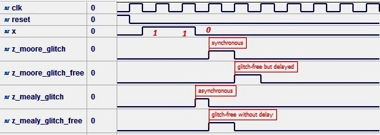
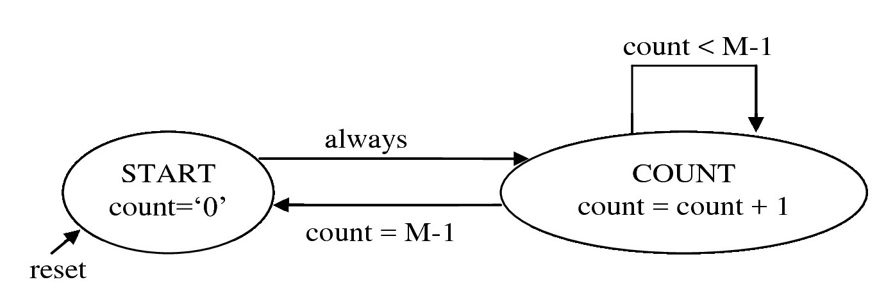

.. _`ch_FSM`:

Finite state machines
*********************

.. raw:: latex

    \chapterquote{People must give and then receive. First give and then you will have all. But instead, people want to first have all and then think of giving. This is not the right way.}{Meher Baba}

Introduction
============

In previous chapters, we saw various examples of the combinational circuits and sequential circuits. In combinational circuits, the output depends on the current values of inputs only; whereas in sequential circuits, the output depends on the current values of the inputs along with the previously stored information. In the other words, storage elements, e.g. flip flogs or registers, are required for sequential circuits. The information stored in these elements can be seen as the states of the system. If a system transits between finite number of such internal states, then finite state machines (FSM) can be used to design the system. The FSM designed can be classified as 'Moore machine' and 'Mealy machine' which are discussed in this chapter.  

This chapter is organized as follows. First, Moore and Mealy designs are discussed in :numref:`sec_MealyMooreDesign`. Then an example of these designs are shown in :numref:`sec_FSMExample`. After this the sequential circuit designs using FSM are discussed in details. 

.. _`sec_MealyMooreDesign`:

Comparison: Mealy and Moore designs
===================================

FSM design is known as Moore design if the output of the system depends only on the states (see :numref:`fig_MooreEdgeDetector`); whereas it is known as Mealy design if the output depends on the states and external inputs (see :numref:`fig_MealyEdgeDetector`). Further, a system may contain both types of designs simultaneously. 

.. note::

    Following are the differences in Mealy and Moore design, 

    * In Moore machine, the outputs depend on states only, therefore it is '**synchronous machine**' and the output is available after 1 clock cycle as shown in :numref:`fig_edgeDetectorWave`. Whereas, in Mealy machine output depends on states along with external inputs; and the output is available as soon as the input is changed therefore it is '**asynchronous machine**' (See :numref:`fig_Mealy_MooreGlitchFree` for more details).
    * Mealy machine requires fewer number of states as compared to Moore machine as shown in :numref:`vhdl_edgeDetector`.   
    * Moore machine should be preferred for the designs, where glitches (see :numref:`sec_glitches`) are not the problem in the systems. 
    * Mealy machines are good for synchronous systems which requires 'delay-free and glitch-free' system (See example in :numref:`sec_exampleRegularMMGlitchFree`), but careful design is required for asynchronous systems. Therefore, Mealy machine can be complex as compare to Moore machine. 

.. _`sec_FSMExample`:

Example: Rising edge detector
=============================

Rising edge detector generates a tick for the duration of one clock cycle, whenever input signal changes from 0 to 1. In this section, state diagrams of rising edge detector for Mealy and Moore designs are shown. Then rising edge detector is implemented using VHDL code. Also, outputs of these two designs are compared. 

State diagrams: Mealy and Moore design
--------------------------------------

:numref:`fig_MealyEdgeDetector` and :numref:`fig_MooreEdgeDetector` are the state diagrams for Mealy and Moore designs respectively. In :numref:`fig_MealyEdgeDetector`, the output of the system is set to 1, whenever the system is in the state 'zero' and value of the input signal 'level' is 1; i.e. output depends on both the state and the input. Whereas in :numref:`fig_MooreEdgeDetector`, the output is set to 1 whenever the system is in the state 'edge' i.e. output depends only on the state of the system. 

.. _`fig_MealyEdgeDetector`:

   Mealy Design

.. _`fig_MooreEdgeDetector`:

   Moore Design

Implementation
--------------

Both Mealy and Moore designs are implemented in :numref:`vhdl_edgeDetector`. The listing can be seen as two parts i.e. Mealy design (Lines 36-54) and Moore design (Lines 56-80). Please read the comments for complete understanding of the code. The simulation waveforms i.e. :numref:`fig_edgeDetectorWave` are discussed in next section. 

.. literalinclude:: codes/Chapter-Finite-state-machines/edgeDetector.vhd
    :language: vhdl
    :linenos:
    :caption: Edge detector: Mealy and Moore designs
    :name: vhdl_edgeDetector

Outputs comparison
------------------

In :numref:`fig_edgeDetectorWave`, it can be seen that output-tick of Mealy detector is generated as soon as the 'level' goes to 1, whereas Moore design generate the tick after 1 clock cycle. These two ticks are shown with the help of the two red cursors in the figure. Since, output of Mealy design is immediately available therefore it is preferred for synchronous designs. 

.. _`fig_edgeDetectorWave`:

   Simulation waveforms of rising edge detector in :numref:`vhdl_edgeDetector`

Visual verification
-------------------

:numref:`vhdl_edgeDetector_VisualTest` can be used to verify the results on the FPGA board. Here, clock with 1 Hz frequency is used in line 19, which is defined in :numref:`vhdl_clockTick`. After loading the design on FPGA board, we can observe on LEDs that the output of Moore design displayed after  Mealy design, with a delay of 1 second.  

.. literalinclude:: codes/Chapter-Finite-state-machines/edgeDetector_VisualTest.vhd
    :language: vhdl
    :linenos:
    :caption: Visual verification of edge detector
    :name: vhdl_edgeDetector_VisualTest

.. _`sec_glitches`:

Glitches
========

Glitches are the short duration pulses which are generated in the combinational circuits. These are generated when more than two inputs change their values simultaneously. Glitches can be categorized as 'static glitches' and 'dynamic glitches'. Static glitches are further divided into two groups i.e. 'static-0' and 'static-1'. 'Static-0' glitch is the glitch which occurs in logic '0' signal i.e. **one short pulse** 'high-pulse (logic-1)' appears in logic-0 signal (and the signal settles down). Dynamic glitch is the glitch in which **multiple short pulses** appear before the signal settles down. 

.. note::

    Most of the times, the glitches are not the problem in the design. Glitches create problem when it occur in the outputs, which are used as clock for the other circuits. In this case, glitches will trigger the next circuits, which will result in incorrect outputs. In such cases, it is very important to remove these glitches. In this section, the glitches are shown for three cases. Since, clocks are used in synchronous designs, therefore :numref:`sec_glitchInsSync` is of our main interest.
  
Combinational design in asynchronous circuit
--------------------------------------------

:numref:`tbl_glitch_table` shows the truth-table for :math:`2 \times 1` multiplexer and corresponding Karnaugh map is shown in :numref:`fig_glitch_sol`. Note that, the glitches occurs in the circuit, when we exclude the 'red part' of the solution from the :numref:`fig_glitch_sol`, which results in minimum-gate solution, but at the same time the solution is disjoint. To remove the glitch, we can add the prime-implicant in red-part as well. This solution is good, if there are few such gates are required; however if the number of inputs are very high, whose values are changing simultaneously then this solution is not practical, as we need to add large number of gates.

.. _`tbl_glitch_table`:

.. table:: Truth table of :math:`2 \times 1` Multiplexer

    +-----+-----+-----+---+
    | sel | in0 | in1 | z |
    +=====+=====+=====+===+
    | 0   | 0   | 0   | 0 |
    +-----+-----+-----+---+
    | 0   | 0   | 1   | 0 |
    +-----+-----+-----+---+
    | 0   | 1   | 0   | 1 |
    +-----+-----+-----+---+
    | 0   | 1   | 1   | 1 |
    +-----+-----+-----+---+
    | 1   | 0   | 0   | 0 |
    +-----+-----+-----+---+
    | 1   | 0   | 1   | 1 |
    +-----+-----+-----+---+
    | 1   | 1   | 0   | 0 |
    +-----+-----+-----+---+
    | 1   | 1   | 1   | 1 |
    +-----+-----+-----+---+

.. _`fig_glitch_sol`:

   Reason for glitches and solution

.. _`fig_glitches`:

   Glitches in design in :numref:`vhdl_glitchEx`

.. literalinclude:: codes/Chapter-Finite-state-machines/glitchEx.vhd
    :language: vhdl
    :linenos:
    :caption: Glitches in multiplexer
    :name: vhdl_glitchEx

Unfixable Glitch
----------------

:numref:`vhdl_manchester_code` is another example of glitches in the design as shown in :numref:`fig_manchesterGlitch`. Here, glitches are continuous i.e. these are occurring at every change in signal 'din'. Such glitches are removed by using D-flip-flop as shown in :numref:`sec_glitchInsSync`. Since the output of Manchester code depends on both edges of clock (i.e. half of the output changes on '+ve' edge and other half changes at '-ve' edge), therefore such glitches are unfixable; as in VHDL both edges can not be connected to one D flip flop. However, the simulation can be performed with both edges connected to D flip flop as shown in :numref:`vhdl_manchester_code2`; where glitches are removed using D flip flop.

.. _`fig_manchesterGlitch`:

   Glitches in :numref:`vhdl_manchester_code`

.. literalinclude:: codes/Chapter-Finite-state-machines/manchester_code.vhd
    :language: vhdl
    :linenos:
    :caption: Glitches in Manchester coding
    :name: vhdl_manchester_code

.. literalinclude:: codes/Chapter-Finite-state-machines/manchester_code2.vhd
    :language: vhdl
    :linenos:
    :caption: Non-synthesizable solution for removing glitches
    :name: vhdl_manchester_code2

.. _`sec_glitchInsSync`:

Combinational design in synchronous circuit
-------------------------------------------

Combination designs in sequential circuits were discussed in :numref:`fig_combSeqBlock`. The output of these combination designs can depend on states only, or on the states along with external inputs. The former is known as Moore design and latter is known as Mealy design as discussed in :numref:`sec_MealyMooreDesign`. Since, the sequential designs are sensitive to edge of the clock, therefore the glitches can occur only at the edge of the clock. Hence, the glitches at the edge can be removed by sending the output signal through the D flip flop, as shown in :numref:`fig_combSeqBlockGlitchFree`. Various VHDL templates for sequential designs are shown in :numref:`sec_MooreTemplates` and :numref:`sec_MealyTemplates`. 

.. _`fig_combSeqBlockGlitchFree`:

   Glitch-free sequential design using D flip flop

.. _`sec_MooreTemplates`:

Moore architecture and VHDL templates
=====================================

:numref:`fig_combSeqBlockGlitchFree` shows the different block for the sequential design. In this figure, we have three blocks i.e. 'sequential logic', 'combinational logic' and 'glitch removal block'. In this section, we will define three process-statements to implemented these blocks (see :numref:`vhdl_moore_regular_template2`). Further, 'combinational logic block' contains two different logics i.e. 'next-state' and 'output'. Therefore, this block can be implemented using two different block, which will result in four process-statements (see :numref:`vhdl_moore_regular_template`). 

Moore and Mealy machines can be divided into three categories i.e. 'regular', 'timed' and 'recursive'. The differences in these categories are shown in :numref:`subfig_regular` - :numref:`subfig_recursive` for Moore machine. In this section, we will see different VHDL templates for these categories. Note that, the design may be the combinations of these three categories, and we need to select the correct template according to the need. Further, the examples of these templates are shown in :numref:`sec_VHDLtemplateExample`.

.. _`subfig_regular`:

   Regular Moore machine

.. _`subfig_timed`:

.. figure:: fig/fsm/timed.jpg
   :width: 60%

   Timed Moore machine : next state depends on time as well

.. _`subfig_recursive`:

   Recursive Moore machine : output 'z' depends on output i.e. feedback required

Regular machine
---------------

Please see the :numref:`subfig_regular` and note the following points about regular Moore machine,

* Output depends only on the states, therefore **no 'if statement'** is required in the process-statement. For example, in Lines 76-78 of :numref:`vhdl_moore_regular_template`, the outputs (Lines 77-78) are defined inside the 'when' statement which contains only state i.e. 's0' (Line 76). 
* Next-state depends on current-state and and  **current external inputs**. For example, the 'state\_next' at Line 46 of :numref:`vhdl_moore_regular_template` is defined inside 'if statement' (Line 45) which depends on current input. Further, this 'if statement' is defined inside the state 's0' (Line 44). Hence the next state depends on current state and current external input.    

.. note::

    In regular Moore machine, 
    
    * Outputs depend on current external inputs. 
    * Next states depend on current states and current external inputs.

.. literalinclude:: codes/Chapter-Finite-state-machines/moore_regular_template.vhd
    :language: vhdl
    :linenos:
    :caption: VHDL template for regular Moore FSM : separate 'next\_state' and 'output' logic
    :name: vhdl_moore_regular_template

:numref:`vhdl_moore_regular_template2` is same as :numref:`vhdl_moore_regular_template`, but the ouput-logic and next-state logic are combined in one process block. 

.. literalinclude:: codes/Chapter-Finite-state-machines/moore_regular_template2.vhd
    :language: vhdl
    :linenos:
    :caption: VHDL template for regular Moore FSM : combined 'next\_state' and 'output' logic
    :name: vhdl_moore_regular_template2

Timed machine
-------------

If the state of the design changes after certain duration (see :numref:`subfig_timed`), then we need to add the timer in the VHDL design which are created in :numref:`vhdl_moore_regular_template` and :numref:`vhdl_moore_regular_template`. For this, we need to add one more process-block which performs following actions, 

* **Zero the timer** : The value of the timer is set to zero, whenever the state of the system changes. 
* **Stop the timer** : Value of the timer is incremented till the predefined 'maximum value' is reached and then it should be stopped incrementing. Further, it's value should **not** be set to zero until state is changed. 

.. note::

    In timed Moore machine, 

        * Outputs depend on current external inputs. 
        * Next states depend on time along with current states and current external inputs.

Template for timed Moore machine is shown in :numref:`vhdl_moore_timed_template`, which is exactly same as :numref:`vhdl_moore_regular_template2` except with following changes, 

* Timer related constants are added at Line 23-29.
* A process block is added to stop and zero the timer (Lines 44-56). 
* Finally, timer related conditions are included for next-state logic e.g.  Lines 67 and 69 etc.

.. literalinclude:: codes/Chapter-Finite-state-machines/moore_timed_template.vhd
    :language: vhdl
    :linenos:
    :caption: VHDL template timed Moore FSM : separate 'next\_state' and 'output' logic
    :name: vhdl_moore_timed_template

Recursive machine
-----------------

In recursive machine, the outputs are fed back as input to the system (see :numref:`subfig_recursive`). Hence, we need additional process-statement which can store the outputs which are fed back to combinational block of sequential design, as shown in :numref:`vhdl_moore_recursive_template`. The listing is same as :numref:`vhdl_moore_timed_template` except certain signals and process block are defined to feedback the output to combination logic; i.e. Lines 31-33 contain the signals (feedback registers) which are required to be feedback the outputs. Here, '\_next' and '\_reg' are used in these lines, where 'next' value is fed back as 'reg' in the next clock cycle inside the process statement which is defined in Lines 64-75. Lastly, 'feedback registers' are also used to calculate the next-state inside the 'if statement' e.g. Lines 89 and 94. Also, the value of feedback registers are updated inside these 'if statements' e.g. Lines 96 and 100. 

.. note::

    In recursive Moore machine, 

        * Outputs depend on current external inputs. Also, values in the feedback registers are used as outputs.
        * Next states depend current states, current external input, current internal inputs (i.e. previous outputs feedback as inputs to system) and time (optional).

.. literalinclude:: codes/Chapter-Finite-state-machines/moore_recursive_template.vhd
    :language: vhdl
    :linenos:
    :caption: VHDL template recursive Moore FSM : separate 'next\_state' and 'output' logic
    :name: vhdl_moore_recursive_template

.. _`sec_MealyTemplates`:

Mealy architecture and VHDL templates
=====================================

Template for Mealy architecture is similar to Moore architecture. The minor changes are required as outputs depend on current input as well, as discussed in this section.

Regular machine
---------------

In Mealy machines, the output is the function of current input and states, therefore the output will also defined inside the if-statements (Lines 50-51 etc.). Rest of the code is same as :numref:`vhdl_moore_regular_template2`. 

.. literalinclude:: codes/Chapter-Finite-state-machines/mealy_regular_template.vhd
    :language: vhdl
    :linenos:
    :caption: VHDL template for regular Mealy FSM : combined 'next\_state' and 'output' logic
    :name: vhdl_mealy_regular_template

Timed machine
-------------

:numref:`vhdl_mealy_timed_template` contains timer related changes in :numref:`vhdl_mealy_regular_template`. See description of :numref:`vhdl_moore_timed_template` for more details. 

.. literalinclude:: codes/Chapter-Finite-state-machines/mealy_timed_template.vhd
    :language: vhdl
    :linenos:
    :caption: VHDL template for timed Mealy FSM : combined 'next\_state' and 'output' logic
    :name: vhdl_mealy_timed_template

Recursive machine
-----------------

:numref:`vhdl_mealy_recursive_template` contains recursive-design related changes in :numref:`vhdl_mealy_timed_template`. See description of :numref:`vhdl_moore_recursive_template` for more details. 

.. literalinclude:: codes/Chapter-Finite-state-machines/mealy_recursive_template.vhd
    :language: vhdl
    :linenos:
    :caption: VHDL template for recursive Mealy FSM : combined 'next\_state' and 'output' logic
    :name: vhdl_mealy_recursive_template

.. _`sec_VHDLtemplateExample`:

Examples
========

.. _`sec_exampleRegularMMGlitchFree`:

Regular Machine : Glitch-free Mealy and Moore design
----------------------------------------------------

In this section, a non-overlapping sequence detector is implemented to show the differences between Mealy and Moore machines. :numref:`vhdl_sequence_detector` implements the 'sequence detector' which detects the sequence '110'; and corresponding state-diagrams are shown in :numref:`fig_non-overlap-design`. The RTL view generated by the listing is shown in :numref:`fig_Mealy_Moore_RTL_glitchfree`, where two D-FF are added to remove the glitches from Moore and Mealy model. Also, in the figure, if we click on the state machines, then we can see the implemented state-diagrams e.g. if we click on 'state\_reg\_mealy' then the state-diagram in :numref:`fig_Altera_Mealy_seq_det_state` will be displayed, which is exactly same as :numref:`subfig_Mealy_seq_det_state`. 

Further, the testbench for the listing is shown in :numref:`vhdl_sequence_detector_tb`, whose results are illustrated in :numref:`fig_Mealy_MooreGlitchFree`. Please note the following points in :numref:`fig_Mealy_MooreGlitchFree`,

* Mealy machines are asynchronous as the output changes as soon as the input changes. It does not wait for the next cycle. 
* If the output of the Mealy machine is delayed, then glitch will be removed and the output will be same as the Moore output. Note that, there is no glitch in this system. This example shows how to implement the D-FF to remove glitch in the system (if exists). 
* Glitch-free Moore output is delayed by one clock cycle. 
* If glitch is not a problem, then we should use Moore machine, because it is synchronous in nature. But, if glitch is problem and we do not want to delay the output then Mealy machines should be used. 

.. _`fig_non-overlap-design`:

   Non-overlap sequence detector : 110 (Moore design)

.. _`subfig_Mealy_seq_det_state`:

   Non-overlap sequence detector : 110 (Mealy design)

.. _`fig_Altera_Mealy_seq_det_state`:

   State diagram generated by Quartus for Mealy machine in :numref:`vhdl_sequence_detector`

.. _`fig_Mealy_Moore_RTL_glitchfree`:

   RTL view generated by :numref:`vhdl_sequence_detector`

.. _`fig_Mealy_MooreGlitchFree`:

   Mealy and Moore machine output for :numref:`vhdl_sequence_detector_tb`

.. literalinclude:: codes/Chapter-Finite-state-machines/sequence_detector.vhd
    :language: vhdl
    :linenos:
    :caption: Glitch removal using D-FF
    :name: vhdl_sequence_detector

.. literalinclude:: codes/Chapter-Finite-state-machines/sequence_detector_tb.vhd
    :language: vhdl
    :linenos:
    :caption: Testbench for :numref:`vhdl_sequence_detector`
    :name: vhdl_sequence_detector_tb

Timed machine : programmable square wave
----------------------------------------

:numref:`vhdl_square_wave_ex` generates the square wave using Moore machine, whose 'on' and 'off' time is programmable (see Lines 10 and 11) according to state-diagram in :numref:`fig_program_s_wave`. The simulation waveform of the listing are shown in :numref:`fig_square_wave_ex`.

.. _`fig_program_s_wave`:

   State diagram for programmable square-wave generator

.. _`fig_square_wave_ex`:

   Moore Simulation waveform of :numref:`vhdl_square_wave_ex`

.. literalinclude:: codes/Chapter-Finite-state-machines/square_wave_ex.vhd
    :language: vhdl
    :linenos:
    :caption: Square wave generator
    :name: vhdl_square_wave_ex

Recursive Machine : Mod-m counter
---------------------------------

:numref:`vhdl_counterEx` implements the Mod-m counter using Moore machine, whose state-diagram is shown in :numref:`fig_counter_state_diagram`. Machine is recursive because the output signal 'count\_moore\_reg' (Line 52) is used as input to the system (Line 35). The simulation waveform of the listing are shown in :numref:`fig_counterEx`

.. _`fig_counter_state_diagram`:

   State diagram for Mod-m counter

.. _`fig_counterEx`:

   Simulation waveform of :numref:`vhdl_counterEx`

.. note::

    It is not good to implement every design using FSM e.g. :numref:`vhdl_counterEx` can be easily implement without FSM as shown in :numref:`vhdl_modMCounter`. Please see the :numref:`sec_whentouseFsm` for understading the correct usage of FSM design. 
    
.. literalinclude:: codes/Chapter-Finite-state-machines/counterEx.vhd
    :language: vhdl
    :linenos:
    :caption: Mod-m Counter
    :name: vhdl_counterEx

.. _`sec_whentouseFsm`:

When to use FSM design
======================

We saw in previous sections that, once we have the state diagram for the FSM design, then the VHDL design is a straightforward process. But, it is important to understand the correct conditions for using the FSM, otherwise the circuit will become complicated unnecessary. 

* We should not use the FSM diagram, if there is only 'one loop' with 'zero or one control input'. 'Counter' is a good example for this. A 10-bit counter has 10 states with no control input (i.e. it is free running counter). This can be easily implemented without using FSM as shown in :numref:`vhdl_binaryCounter`. If we implement it with FSM, then we need 10 states; and the code and corresponding design will become very large. 
    
* If required, then FSM can be use for 'one loop' with 'two or more control inputs'. 
    
* FSM design should be used in the cases where there are very large number of loops (especially connected loops) along with two or more controlling inputs. 
    
Conclusion
==========

In this chapter, Mealy and Moore designs are discussed. Also, 'edge detector' is implemented using Mealy and Moore designs. This example shows that Mealy design requires fewer states than Moore design. Further, Mealy design generates the output tick as soon as the rising edge is detected; whereas Moore design generates the output tick after a delay of one clock cycle. Therefore, Mealy designs are preferred for synchronous designs. 