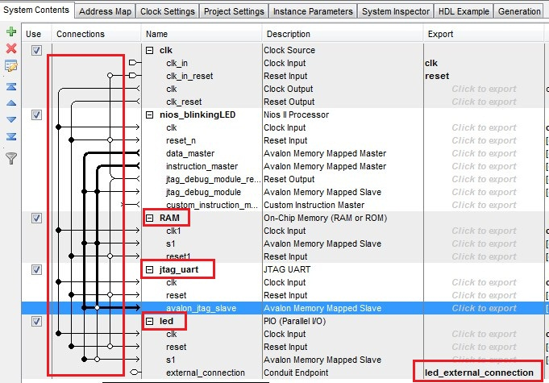

.. _`ch_NiosOverview`:

Simulate and implement SoPC design
**********************************

.. raw:: latex 

    \chapterquote{Do not be angry with him who backbites you, but be pleased, for thereby he serves you by diminishing the load of your sanskaras; also pity him because he increases his own load of sanskaras.}{Meher Baba}

Introduction
============

In this tutorial, we will learn to design embedded system on FPGA board using Nios-II processor, which is often known as 'System on Programmable chip (SoPC)'. Before beginning the SoPC design, let's understand the difference between 'computer system', 'embedded system' and 'SoPC system'. **Computer systems**, e.g. personal computers (PCs), support various end user applications. Selection of these computer systems for few specific applications, e.g. timers settings, displays and buzzers in microwave-ovens or washing machines etc.,  is not a cost effective choice. The **Embedded systems** are cost effective solution for such cases, where only few functionalities are required in the system.  Since, embedded systems are designed for specific tasks, therefore the designs can be optimized based on the applications. Further, **SoPC systems** are the programmable embedded systems i.e. we can design the embedded systems using Verilog/VHDL codes and implement them on the FPGA board.

Nios II is a 32-bit embedded-processor architecture designed for Altera-FPGA board. In :numref:`fig_NiosFlowChart`, various steps are shown to design the SoPC system on the FPGA board using Nios-II processor. In this chapter, these steps are discussed and a system is designed which displays the message on the computer and blinks one LED using FPGA board. Further, the outputs of this system is verified using Modelsim.  **It is recommended to read first two chapters before practicing the codes, as various issues related to the use of Nios software are discussed in these chapters**.

.. _`fig_NiosFlowChart`:

   Flow chart for creating the embedded system

.. note:: 

    Note that, the NIOS-projects can not be run directly on the system, after downloading it from the website; therefore only 'necessary files are provided on the `website <http://pythondsp.readthedocs.io/en/latest/pythondsp/toc.html>`_. Please see :numref:`Appendix %s <NiosQuartusModelsim>` to compile and synthesize the provided codes.

.. note::

    Also, if you change the location of the project in your system (after creating it) or change the FPGA-board, then you need to follow the instructions in the :numref:`Appendix %s <NiosQuartusModelsim>` again.  

.. _`sec_CreateQuartusProject`:

Creating Quartus project
========================

First, we need to create the project at desired location, with following steps, 

* Path to project directory should not contain any spaces in the names of folder as shown in :numref:`fig_createProject`, as path will not be detected by the Nios-II software in later part of the tutorial. 

.. _`fig_createProject`:

   Create project

    
* Choose the correct FPGA device as shown in :numref:`fig_createProjectPage3`. If you do not have any, then select correct device family and use it for rest of the tutorial. **Note that, 'simulation' is the most important process of the design, and FPGA board is not required for creating and simulating the embedded design.** Hence, if you don't have FPGA board, you can still use the tutorial. Implementation of the design on the FPGA board requires the loading the '.sof' and '.elf' files on the board, which is not a big deal.  

.. _`fig_createProjectPage3`:

   Select FPGA device

* Lastly, choose the correct simulation-software and language  i.e. Modelsim-Altera and VHDL respectively as shown in :numref:`fig_createProjectPage4`.

.. _`fig_createProjectPage4`:

   Select simulation software

Create custom peripherals
=========================

We can create peripheral devices e.g. adder, divider or clock generator using VHDL. Then these devices can be used in creating the SoPC using Nios-II software as discussed in :numref:`sec_CreateGenerateQsys`. For simplicity of the tutorial, only predefined-peripherals are used in the designs, which are available in Nios-II software. Creating and using the custom-peripherals will be discussed in later chapters. 

.. _`sec_CreateGenerateQsys`:

Create and Generate SoPC using Qsys
===================================

SoPC can be created using two tools in Quartus software i.e. 'SOPC builder' and 'Qsys' tools. Since Qsys is the recommended tool by the Altera, therefore we will use this tool for generating the SoPC system. To open the Qsys tool, go to Tools-->Qsys in Quartus software. Next, follow the below steps to create the SoPC system,

* Rename 'clk\_0' to 'clk' by right clicking the name (optional step). Note that, renaming steps are optional; but assigning appropriate names to the components is good practice as we need to identify these components in later tutorial. 
* In component library, search for Nios processor as shown in :numref:`fig_AddNiosProcessor` and select the Nios II/e (i.e. economy version) for this tutorial. Note that various errors are displayed in the figure, which will be removed in later part of this section. Next, rename the processor to 'nios\_blinkingLED' and  connect the clock and reset port to 'clk' device, by clicking on the circles as shown in :numref:`fig_ConnectClock`. 
    
.. _`fig_AddNiosProcessor`:

   Add Nios processor

    
.. _`fig_ConnectClock`:

   Rename Nios processor and connect the ports
    
* Next add the 'onchip memory' to the system with 20480 (i.e. 20k) bytes as shown in :numref:`fig_onchipMemory` and rename it to RAM. For different FPGA boards, we may need to reduce the memory size, if the 'memory-overflow' error is displayed during 'generation' process in :numref:`fig_SystemGeneated`.
    
.. _`fig_onchipMemory`:

   Add onchip memory to the system

* After that, search for 'JTAG UART' and add it with default settings. It is used for the communication of the FPGA device to Nios software. More specifically, it is required display the outputs of the 'printf' commands on the Nios software. 
    
* Next, add a PIO device for blinking the LED. Search for PIO device and add it as '1 bit' PIO device (see :numref:`fig_PIO`), because we will use only one blinking LED. Since, the PIO device, i.e. 'LED', is available as external port, therefore name of the 'external\_connection' must be defined as shown in :numref:`fig_LEDsettings`. 
    
.. _`fig_PIO`:

   Add 1 bit PIO for one blinking LED

    
.. _`fig_LEDsettings`:

   Settings for PIO and other device

    
* Then, add all the connections as shown in the :numref:`fig_LEDsettings`. Also, add the JTAG slave to the data master of Nios processors i.e. IRQ in :numref:`fig_interupt`
    
.. _`fig_interupt`:

   Connect IRQ

    
* Next, double click on the to the Nios processor i.e. 'nios\_blinkingLED' in the :numref:`fig_LEDsettings`; and set RAM as reset and exception vectors as shown in :numref:`fig_NiosRam`.

.. _`fig_NiosRam`:

   Setting Reset and Exception vector for Nios processor
    
    
* Then, go to Systems-->Assign Base Address. This will assign the unique addresses for all the devices. With the help of these address, the devices can be accessed by C/C++ codes in Nios-II software. If everything is correct till this point, we will get the '0 Errors, 0 Warnings' message as shown in :numref:`fig_CompleteNios`.

.. _`fig_CompleteNios`:

   0 errors and 0 warnings

   
* Finally, to allow the simulation of the designs, go to 'generation' tab and set the tab as shown in the :numref:`fig_simulationQsys`. **Note that, VHDL can not be used as simulation language, as this version of Quartus does not support it**. Since, generated verilog files are used for the simulation settings settings only, therefore we need not to look at these files. Hence it does not matter, whether these files are created using VHDL or Verilog. 

.. _`fig_simulationQsys`:

   Simulation settings    
    

* Save the system with desired name e.g. 'nios\_blinkingLED.qsys' and click on generate button. If system is generated successfully, we will get the message as shown in :numref:`fig_SystemGeneated`

.. _`fig_SystemGeneated`:

   System generated successfully
  
    
* After this process, a **'nios\_blinkingLED.sopcinfo'** file will be generated, which is used by Nios-II software to create the embedded design. This file contains all the information about the components along with their base addresses etc. Further, two more folders will be created inside the 'nios\_blinkingLED' folder i.e. '**synthesis**' and '**testbench**'. These folders are generated as we select the 'synthesis' and 'simulation' options in :numref:`fig_simulationQsys`, and contains various information about synthesis (e.g. 'nios\_blinkingLED.qip' file) and simulation (e.g. 'nios\_blinkingLED\_tb.qsys' file). The **'nios\_blinkingLED.qip**' file will be used for the creating the top module for the design i.e. LEDs will be connected to FPGA board using this file; whereas '**nios\_blinkingLED\_tb.qsys**' contains the information about simulation waveforms for the testbenches. Lastly, '**nios\_blinkingLED\_tb.spd**' is generated which is used by Nios software to start the simulation process. 
    
* In this way, SoPC system can be generated. Finally, close the Qsys tool.  In next section, Nios software will be used to create the blinking-LED system using 'nios\_blinkingLED.sopcinfo' file.

.. _`sec_Nios_create_sys`:

Create Nios system
==================

In previous section, we have created the SoPC system and corresponding .sopcinfo file was generated. In this section, we will use the .sopcinfo file to create a system with blinking LED functionality. 

To open the Nios software from Quarturs software, click on Tools-->Nios II software Build Tools for Eclipse. If you are using it first time, then it will ask for work space location; you can select any location for this.  

.. _`sec_add_modify_bsp`:

Add and Modify BSP
==================

To use the .sopcinfo file, we need to create a 'board support package (BSP)'. Further, BSP should be modify for simulation purpose, as discussed in this section.

.. _`sec_AddBSP`:

Add BSP
-------

To add BSP, go to File-->New-->Nios II Board Support Package. Fill the project name field and select the .sopcinfo file as shown in :numref:`fig_CreateBSP`. Rest of the field will be filled automatically. 

.. _`fig_CreateBSP`:

   Add board support package (BSP)

After clicking on finish, BSP\_blinkingLED folder will be created which contains various files e.g. system.h, io.h and drivers etc. These files are generated based on the information in the .sopcfile e.g. in :numref:`fig_systemH`, which shows the partial view of system.h file, contains the information about LED along with the base address (note that, this LED was added along with base address in :numref:`sec_CreateGenerateQsys`).  Note that, address location is defined as 'LED\_BASE' in the system.h file; and we will use this name in the tutorial instead of using the actual base address. In this way, we need not to modify the 'C/C++' codes, when the base address of the LED is changed during Qsys modification process.  

.. _`fig_systemH`:

   system.h file

.. _`sec_ModifyBSP`:

Modify BSP (required for using onchip memory)
---------------------------------------------

.. note::

    Some modifications are required in the BSP file for using onchip memory (due to it's smaller size). Also, due to smaller size of onchip memory, C++ codes can not be used for NIOS design. Further, these settings are not required for the cases where external RAM is used for memory e.g. SDRAM (discussed in :numref:`Chapter %s <ch_UartSdramPython>`); and after adding external RAM, we can use C++ code for NIOS design as well. 

To modify the BSP, right click on 'BSP\_blinkingLED' and then click on Nios II-->BSP Editor. Then select the 'enable\_reduce\_device\_drivers' and 'enable\_small\_c\_library' as shown in :numref:`fig_modifyBSP`; then click on the '**generate**' button to apply the modifications.

.. _`fig_modifyBSP`:

   Modify BSP

.. _`sec_AddApplication`:

Create application using C/C++
==============================

In previous section, various information are generated by BSP based to .sopcinfo file. In this section, we will write the 'C' application to blink the LED. Further, we can write the code using C++ as well. 

To create the application, go to File-->New-->Nios II Application. Fill the application name i.e. 'Application\_blinkingLED' and select the BSP location as shown in :numref:`fig_createApplication`. 

To create the C application, right click on the 'Application\_blinkingLED' and go to New-->Source File. Write the name of source file as 'main.c' and select the '**Default C source template**'.

.. _`fig_createApplication`:

   Create Application

Next, write the code in 'main.c' file as shown in :numref:`c_main`. After writing the code, right click on the 'Application\_blinkingLED' and click on 'build project'. 

**Explanation** :numref:`c_main`

    The 'io.h' file at Line 2, contains various functions for operations on input/output ports e.g. IOWR(base, offset, data) at Line 15 is define in it. Next, IOWR uses three parameter i.e. base, offset and data which are set to 'LED\_BASE', '0' and 'led\_pattern' respectively at Line 15. 'LED\_BASE' contains the based address, which is defined in 'system.h' file at Line 4 (see :numref:`fig_systemH` as well). Lastly, 'alt\_u8' is the custom data-type (i.e. unsigned 8-bit integer), which is used at line 7 and defined in 'alt\_types.h' at Line 3. It is required because, for predefined C data types e.g. int and long etc. the size of the data type is defined by the compiler; but using 'alt\_types.h' we can define the exact size for the data.  
    
    Since 'alt\_u8' is 8 bit wide, therefore led\_pattern is initialized as '0$\times$01' (i.e. 0000-0001) at Line 7. Then this value is inverted at Line 14 (for blinking LED). Lastly, this pattern is written on the LED address at Line 15. Second parameter, i.e. offset is set to 0, because we want to write the pattern on LED\_BASE (not to other location with respect of LED\_BASE). Also, dummy loop is used at Line 19 is commented, which will be required for visual verification of the blinking LED in :numref:`sec_AddLoadNIOS`.

.. literalinclude:: codes/Chapter-Simulate-and-implement-SoPC/main.c
    :language: c
    :linenos:
    :caption: Blinking LED with C application
    :name: c_main

.. _`sec_SimulateNios`:

Simulate the Nios application
=============================

In previous section, we built the Nios application. To simulate this system, right click on 'Application\_blinkingLED' and go to Run as-->NOIS II Modelsim. Then select the location of Modelsim software i.e. 'win32aloem' or 'win64aloem' folder as shown in :numref:`fig_ModelsimLocation`; this can be found inside the folders where Altera software is installed. 

.. _`fig_ModelsimLocation`:

   Search for Modelsim location

Next, click on the advance button in :numref:`fig_ModelsimLocation` and a new window will pop-up. Fill the project location as shown in :numref:`fig_ProjectLocationSImulation` and close the pop-up window. This location contains the '.spd' file, which is required for simulation. 

 .. _`fig_ProjectLocationSImulation`:

   Search for Project Location

 
After above step, 'Qsys testbench simulation package descriptor file name' column will be filled with '.spd' file automatically as shown in :numref:`fig_RunSimulation`. If not, do it manually by searching the file, which is available in the project folder. If everything is correct, then apply and run buttons will be activated. Click on apply and then run button to start the simulation. 

  .. _`fig_RunSimulation`:

   Run simulation

 
Modelsim window will pop-up after clicking the run button, which will display all the external ports as shown in :numref:`fig_modelsimPopUp`. Right click on the external signals and click on 'add to wave'. Next go to transcript section at the bottom of the modelsim and type 'run 3 ms'. The simulator will be run for 3 ms and we will get outputs as shown in :numref:`fig_modelsimOutputs`. In the figure, there are 3 signals i.e. clock, reset and LED, where last waveform i.e. 'nios\_blinkingled\_inst\_led\_external\_connection\_export' is the output waveform, which will be displayed on the LEDs. 

 .. _`fig_modelsimPopUp`:

   Modelsim window

.. _`fig_modelsimOutputs`:

   Blinking LED simulation waveform

Adding the top level VHDL design
================================

In last section, we designed the Nios system for blinking LED and tested it in modelsim. Now, next task is to implement this design on FPGA board. For this we, need to add a top level design, which connects all the input and output ports on the FPGA. Here, we have only three ports i.e. clock, reset and LEDs. 

First add the design generated by the Qsys system to the project. For this, we need to add the '.qip' file into the project. This file can be found in 'synthesis folder as shown in :numref:`fig_AddQip`. 

  .. _`fig_AddQip`:

   Adding .qip file (available in synthesis folder)

Next, we need to add a new VHDL file for port mapping. For this, create a new VHDL file with name 'blinkingLED\_VisualTest.vhd' as shown in :numref:`vhdl_blinkingLED_VisualTest`. Then set it as 'top level entity' by right clicking it. Note that, for port-mapping, the component is declared in Lines 14-20 because Qsys generates the files in 'Verilog' format. Since, we are using Verilog files in VHDL design therefore 'component' declaration is required for port mapping (for more details, see the tutorial on `Verilog designs in VHDL <http://pythondsp.blogspot.com/2016/10/chapter-6-verilog-designs-in-vhdl.html>`_). Further, this declaration and port map code can be copied from Qsys software as well, which is available on 'HDL example' tab as shown in :numref:`fig_qsysVHDLCode`.

  .. _`fig_qsysVHDLCode`:

   Copy port mapping code from Qsys

Top level design can be implemented using '.bdf' file as well. For this go to File-->new-->Block diagram/Schematic file; and double click on the file. Next add the QSys design from the popped up window, as shown in :numref:`fig_qsysBdfCode`. Then right click on the design and select 'Generate Pins for Symbol Ports'. Next, assign the pin-numbers by giving proper name to input and output ports, as shown in :numref:`fig_qsysBdfPinAssg`. 

**Now, select any one of these designs (i.e. .vhd or .bdf file) as top level design**.

.. _`fig_qsysBdfCode`:

   Create top level design using Block schematic method

.. _`fig_qsysBdfPinAssg`:

   Pin assignments for block schematic method

.. _`sec_AddLoadVHDL`:

Load the Quartus design (i.e. .sof/.pof file)
=============================================

Before loading the desing on FPGA board, import the pin assignments from Assignments-->Import assignments and select the 'DE2\_PinAssg\_PythonDSP.csv' file, which is available on the website along with the codes. Lastly, compile the design and load the generated '.sof' or '.pof' file on the FPGA chip.  

.. literalinclude:: codes/Chapter-Simulate-and-implement-SoPC/blinkingLED_VisualTest.vhd
    :language: vhdl
    :linenos:
    :caption: Top level design
    :name: vhdl_blinkingLED_VisualTest

.. _`sec_AddLoadNIOS`:

Load the Nios design (i.e. '.elf' file)
=======================================

In previous section, VHDL design is loaded on the FPGA board. This loading creates all the necessary connections on the FPGA board. Next we need to load the Nios design, i.e. '.elf file', on the board. Since 50 MHz clock is too fast for visualizing the blinking of the LED, therefore a dummy loop is added in the 'main.c' file (see Lines 10 and 19) as shown in :numref:`c_mainVisual`. This dummy loop generates delay, hence LED does not change its state immediately. 

.. literalinclude:: codes/Chapter-Simulate-and-implement-SoPC/mainVisual.c
    :language: c
    :linenos:
    :caption: Blinking LED with C application
    :name: c_mainVisual

After these changes, right click on the 'Application\_blikingLED' folder and click on Run as-->Nios II Hardware. The may load correctly and we can see the outputs. Otherwise a window will appear as shown in :numref:`fig_1run`. If neither window appears nor design loaded properly, then go to Run-->Run Configuration-->Nios II Harware and select a hardware or create a harware by double-clicking on it. 

.. _`fig_1run`:

   Run configuration

Next, go to 'Target connection' tab and click on 'refresh connection' and select the two ignore-boxes of 'System ID checks' as shown in :numref:`fig_2run`. Then click on the run button. **Keep the reset button high, while loading the design, otherwise design will not be loaded on the FPGA chip**.

.. _`fig_2run`:

   Run configuration settings

Once Nios design is loaded successfully, then 'Blinking LED' will be displayed on the 'Nios II console'. Now if we change the reset to '0' and then '1' again; then the message will be displayed again as shown in :numref:`fig_FinalOutput`. Further, bilking LED can be seen after this process. 

.. _`fig_FinalOutput`:

   Final outputs

Saving NIOS-console's data to file
==================================

In :numref:`sec_AddLoadNIOS`, the message 'Blinking LED' is displayed on the NIOS console. Most of the time, we need to store the data in a file for further processing e.g. in :numref:`Chapter %s <ch_UartSdramPython>`, sine waveforms are generated using NIOS, and the resulted data is saved in a file and then plotted using Python; note that this plotting operation can not be performed when data in displayed on the NIOS console. 

Please see the `video: NIOS II - Save data to the file using JTAG-UART <https://www.youtube.com/playlist?list=PLpqu8JfoNKiNJpFvKTeBlI-LMzc2TAlRM>`_ if you have problem with this part of tutorial. 

To save the data on a file, first build the project as discussed in the :numref:`sec_AddApplication`. Next, right click on the 'Application\_BlinkingLED' and go to 'NIOS II-->NIOS II Command Shell'. Then, in the command prompt, execute the following two commands, 

* **nios2-download -g Application\_BlinkingLED.elf}** : This will load the NIOS design on the FPGA board. 
    
* **nios2-terminal.exe \-q \-\-quiet \> blinkOut.txt**: This will save the messages in the file 'blinkOut.txt', which will be saved in the 'Application\_BlinkingLED' folder. We can now, reset the system and 'Blinking LED' message will be displayed twice as shown in :numref:`fig_FinalOutput`. 
* **'\-q \-\-quiet'** options is used to suppress the NIOS-generated message in the file. For more options, we can use '\-\-help' option e.g. **nios2-terminal \-\-help**. 
    
* Lastly, '\> sign'  erases the contents of existing file before writing in it. To append the current outputs at the end of the existing file, use '\>\>' option, instead of '\>'. 
        
* We can run these two commands in one step using '\&\&'  operators i.e. 

.. code-block:: shell

    
    nios2-download -g Application\_BlinkingLED.elf &&  nios2-terminal.exe -q --quiet > ../../python/data/blinkOut.txt}.

In this case, '**../../python/data/blinkOut.txt**' command will save the 'blinkOut.txt' file by going two folders-back i.e. '**../../**', then it will save the file in 'data' folder which is inside the 'python' folder. In this way, we can save the results at any location. 
    

Conclusion
==========

In this tutorial, we saw various steps to create a embedded Nios processor design. We design the system for blinking the LED and displaying the message on the 'Nios II console' window. Also, we learn the simulation methods for Nios-II designs. In next chapter, we will learn about adding components to the 'Qsys' file. Also, we will see the process of updating the BSP according to new '.sopcinfo' file. 