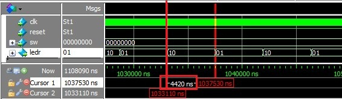
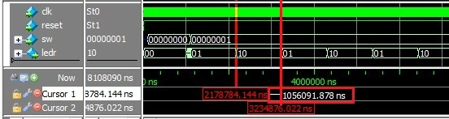

.. _`ch_ReadSwitch`:

Reading data from peripherals
*****************************

.. raw:: latex

    \chapterquote{The greatest error of a man is to think that he is weak by nature, evil by nature. Every man is divine and strong in his real nature. What are weak and evil are his habits, his desires and thoughts, but not himself.}{Ramana Maharshi}

Introduction
============

In :numref:`Chapter %s <ch_NiosOverview>`, the values of the variables in the code i.e. 'led\_pattern' were sent to PIO (peripheral input/output) device  i.e. LED. In this chapter, we will learn to read the values from the PIO. More specifically, the values will be read from the external switches. These values will decide the blinking rate of the LED. Further, we will not create a new '.qsys' file, but modify the previous '.qsys' file to generate the new system. Also, we will see the procedures to modify the existing Nios project i.e. BSP and Application files (instead of creating the new project). 

.. _`sec_ModifyQysFile`:

Modify Qsys file
================

First create or open a Quartus project as discussed in :numref:`Chapter %s <ch_NiosOverview>`. Then open the 'Qsys' file, which we have created in the previous chapter and modify the file as below, 

* **Modify LED port**: Double click on the 'led' and change the 'Width' column to '2' from '1'; because in this chapter, we will use two LEDs which will blink alternatively. 
* **Add Switch Port**: Next, add a new PIO device and set it to 'output' port with width '8' as shown in :numref:`fig_AddSwitch`. Next, rename it to 'switch' and modify it's clock, reset and external connections as shown in :numref:`fig_SwitchConnection`. 
    
    .. _`fig_AddSwitch`:

    .. figure:: fig/niosread/AddSwitch.jpg
       :width: 65%

       Add switch of width 8

    .. _`fig_SwitchConnection`:

    .. figure:: fig/niosread/SwitchConnection.jpg
       :width: 65%

       Rename and Modify the port for Switch

* Next, assign base address by clicking on System-->Assign base addresses. 
* Finally, generate the system, by clicking on the 'Generate button' with correct simulation settings, as shown in :numref:`fig_SystemGeneated`.

Modify top level design in Quartus
==================================

Since, LED port is modified and the 'switch' port is added to the system, therefore top level module should be modified to assign proper connections to the FPGA chip. Top level design for this purpose is shown in :numref:`vhdl_blinkingLED_VisualTestCh2`.

.. literalinclude:: codes/Chapter-Reading-Data-From-Peripherals/blinkingLED_VisualTest.vhd
    :language: vhdl
    :linenos:
    :caption: Modify top level design in Quartus
    :name: vhdl_blinkingLED_VisualTestCh2

Modify  Nios project
====================

Since 'Qsys' system is modified, therefore corresponding '.sopcinfo' file is modified also. Now, we need to update the system according to the new '.sopcinfo' file. 

Adding Nios project to workspace
--------------------------------

If 'workspace is changed' or 'BSP/Application files are removed' from the current workspace, then we need to add these files again in the project, as discussed below, 

.. note::

    If the location of the project is changed, then we need to created the NIOS project again, as shown in :numref:`Appendix %s <NiosQuartusModelsim>`.

* First go to Files-->Import-->'Import Nios II software...' as shown in :numref:`fig_ImportNiosProject`; and select the 'application' from the 'software' folder (see :numref:`fig_LocationProject`) inside the main directory. Finally, give it the correct name i.e. 'Application\_blinkingLED' as shown in :numref:`fig_ApplicationAdded`

    .. _`fig_ImportNiosProject`:

    .. figure:: fig/niosread/ImportNiosProject.jpg
       :width: 65%

       Import Application and BSP files

    .. _`fig_LocationProject`:

    .. figure:: fig/niosread/LocationProject.jpg
       :width: 65%

       Application and BSP files are in software folder

    .. _`fig_ApplicationAdded`:

    .. figure:: fig/niosread/ApplicationAdded.jpg
       :width: 65%

       Add application Name i.e. Application\_blinkingLED

* Similarly, add the BSP folder in the current workspace. 
* Now, open the 'system.h' file in the BSP. Here, we can see that LED data width is still '1' as shown in :numref:`fig_noSwitchBeforeUpdateBSP`. Also, we can not find the 'switch' entries in the system.h file. 

    .. _`fig_noSwitchBeforeUpdateBSP`:

    .. figure:: fig/niosread/noSwitchBeforeUpdateBSP.jpg
       :width: 65%

       LED data width is not updated to '2'

* To update the BSP, right click on the BSP folder and go to Nios-->Generate BSP. It will update the BSP files.
* Sometimes, proper addresses are not assigned during generation in 'Qsys' system as shown in :numref:`fig_SwitchBaseProblem`. Here, SWITCH\_BASE is set to '0$\times$0'. To remove this problem, assign base addresses again and regenerate the system as discussed in :numref:`sec_ModifyQysFile`. 

    .. _`fig_SwitchBaseProblem`:

    .. figure:: fig/niosread/SwitchBaseProblem.jpg
       :width: 65%

       Base address is not assigned to switch
  

        
Add 'C' file for reading switches
=================================

Next, modify the 'main.c' file as shown in :numref:`c_mainCh2`. Finally, build the system by pressing 'ctrl+B'. 

**Explanation** :numref:`c_mainCh2`

    'IORD(base, offset)' command is used the read the values form I/O ports as shown at Line 19 of the listing. Line 19 reads the values of the switches; which is multiply by variable 'itr' (see Line 22), to set the delay value base on switch patterns. Also, 'iter 'value is set to '1000' at Line 11, so that multiplication can produce sufficient delay to observe the blinking LEDs.

.. literalinclude:: codes/Chapter-Reading-Data-From-Peripherals/main.c
    :language: c
    :linenos:
    :caption: Blinking LED with C application
    :name: c_mainCh2

    
Simulation and Implementation
=============================

If build is successful, then we can simulate and implement the system as discussed in :numref:`Chapter %s <ch_NiosOverview>`. :numref:`fig_simulation00` and :numref:`fig_simulation01` illustrate the simulation results for switch patterns '0000-0000' and '0000-0001' respectively. Note that, blinking patterns are shown by '01' and '10', which indicates that LEDs will blink alternatively. Also, blinking-time-periods for patterns '0000-0000' and '0000-0001' are '4420 ns' and '1057091 ns' respectively (see square boxes in the figures), which show that blinking periods depend on the switch patterns. 
    
.. _`fig_simulation00`:

   Simulation waveforms with switch pattern '0000-0000'

.. _`fig_simulation01`:

   Simulation waveforms with switch pattern '0000-0001'
  
    
To implement the design, compile the top level design in Quartus and load the '.sof' file on the FPGA chip. Then load the '.elf' file from Nios software to FPGA chip. After this, we can see the alternatively blinking LEDs on the board. 

Conclusion
==========

In this chapter, values from the PIO device i.e. switch patterns are read using IORD command. These switch patterns are used to decide the blinking rate of the LEDs. Further, we discussed the procedure to modify the existing Qsys, Quartus and Nios to extend the functionalities of the system. 

