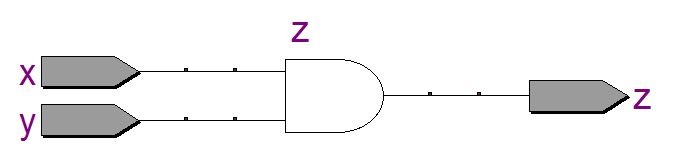
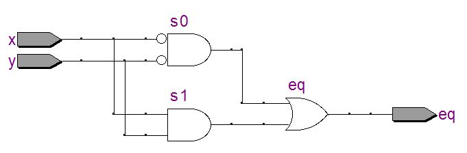
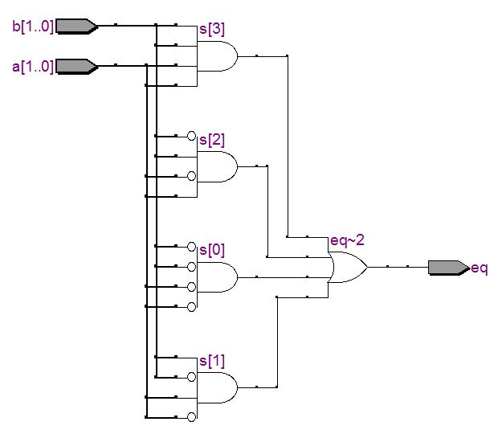
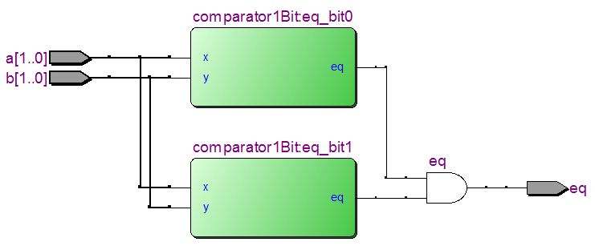
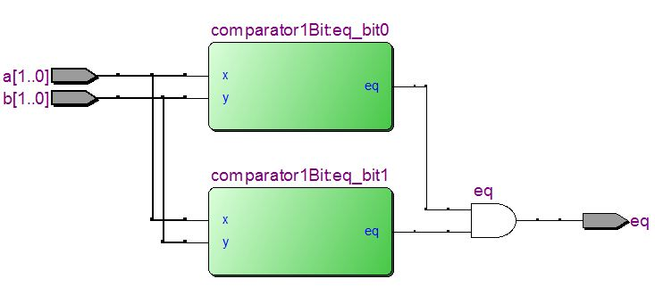
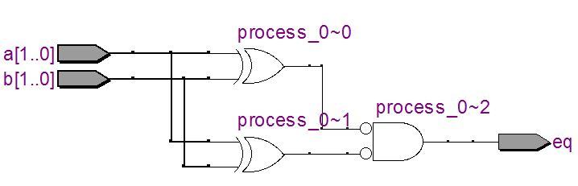
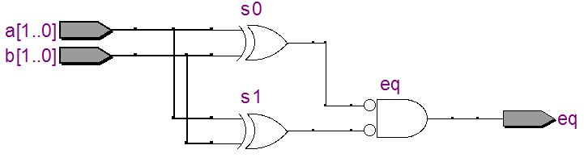
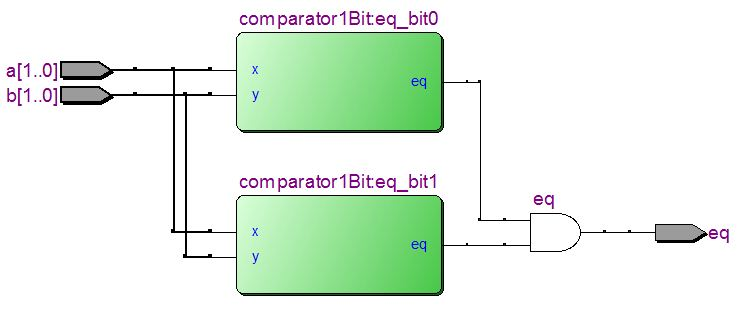

.. _`ch_OverView`:

Overview
********

.. raw:: latex

    \chapterquote{Always be in readiness to serve the cause of humanity. Select the kind of work you are qualified to do by your individual aptitude and abilities. And whatever service you can render must faithfully be carried out.}{Meher Baba}

Introduction
============

VHDL is the hardware description language which is used to model the digital systems. VHDL is quite verbose, which makes it human readable. In this tutorial, following 3 elements of VHDL designs are discussed briefly, which are used for modeling the digital system.. 

* Entity and Architecture

* Modeling styles

    - Dataflow modeling
    - Structural modeling
    - Behavioral modeling
    - Mixed modeling

* Packages

The 2-bit comparators are implemented using various methods and corresponding designs are illustrated, to show the differences in these methods. All these topics are elaborated in later chapters. Note that, all the features of VHDL can not be synthesized i.e. these features can not be converted into designs. Non-synthesizable features are used to test the design by writing testbenches, which are discussed in :numref:`Chapter %s <ch_Testbench>`. Rest of the chapters use only those features of VHDL which can be synthesized. All the codes in this tutorial are tested using Modelsim and implemented on FPGA board. Further, the implementation processes, i.e. pin-assignments and downloading the design on FPGA etc, are discussed in :numref:`Chapter %s <ch_FirstProject>` and :numref:`Chapter %s <ch_VisualVerification>`.

.. note::

    Unlike any other electronics designs, if the VHDL design pass the simulation, then it guarantees that it will pass the physical implementation as well. Also, simulation is the only way to verify the large designs and lots of template are shown in :numref:`Chapter %s <ch_Testbench>`. Some visual verification can also be performed for smaller designs by reducing the clock rate as discussed in :numref:`Chapter %s <ch_VisualVerification>`.

Entity and Architecture
=======================

In this section, we discuss 'entity declaration' and 'architecture body' along with three different ways of modeling i.e. 'data flow', 'structural' and 'behavioral' modeling. In practice, these three styles are mixed together to model a digital circuit.  

Entity declaration
------------------

Entity specifies the input-output ports of the design along with optional 'generic constants'. The 'generic constants' are discussed in :numref:`subsec_Generic`. Further, the architecture contains the VHDL codes which describe the functionality of the design, which is converted into hardware by the compiler. Lastly, **library** contains implementation the commonly used designs. Some of the standard libraries are shown in :numref:`sec_libPack`. Also, we can create our own libraries using packages which are discussed in :numref:`sec_ovPackage` and :numref:`Chapter %s <ch_Package>`. 

In :numref:`fig_andEx`, a simple 'and' gate is shown; which is generated by :numref:`vhdl_andEx`. :numref:`vhdl_andEx` is included to understand the meaning of 'entity declaration' and 'architecture body'. Also in VHDL, '\-\-' is used for comments; please read comments as well to understand the codes.

The entity declaration (lines 6-11) contains all the name of the input and outputs ports as shown in :numref:`vhdl_andEx`. Here, the design has two input ports i.e. 'x' and 'y' and one output port i.e. 'z', which are defined inside the 'port' block in line 7. Name of the entity 'andEx' is defined in line 6. Lastly, we need to import libraries to the listing which contains various functions e.g. library 'IEEE' (line 3) contains the package 'std\_logic\_1164' (line 4), in which 'std\_logic' is defined. 'std\_logic' is used in line 8 and 9, to define the 1-bit input and output data-types. Lastly, entity block is closed with 'end' keyword in line 11. All these terms, i.e. IEEE library and packages along with data-types, are discussed in detail in :numref:`Chapter %s <ch_Datatypes>`.  

.. _`fig_andEx`:

   Circuit generated by :numref:`vhdl_andEx`

.. literalinclude:: codes/Chapter-Overview/andEx.vhd
    :language: vhdl
    :linenos:
    :caption: 'and' gate example, design: :numref:`fig_andEx`
    :name: vhdl_andEx

Architecture body
-----------------

Actual behavior of the design is defined in  the 'architecture body'. In :numref:`vhdl_andEx`, 'and' gate is implemented with 'x' and 'y' as input, and 'z' as output. This behavior is defined in line 15. In line 13, the name of the architecture is defined as 'arch' and then name of the entity is given i.e. 'andEx'. Complete logic is defined between 'begin' and 'end' statements i.e. line 14 and 16. Further, we can define intermediate signals of the design (i.e. apart from ports) between line 13-14 as shown in next sections. Next section contains more details about architecture body along with different modeling styles. 

Modeling styles
===============

In VHDL, the architecture can be defined in four ways as shown in this section. Two bit comparator is designed with different styles; which generates the output '1' if the numbers are equal, otherwise output is set to '0'.   

.. _`sec_dataflowOverview`: 

Dataflow modeling
-----------------

In this modeling style, the relation between input and outputs are defined using signal assignments. In the other words, we do not define the structure of the design explicitly; we only define the relationships between the signals; and structure is implicitly created during synthesis process. :numref:`vhdl_andEx` is the example of dataflow design, where relationship between inputs and output are given in line 15. 

.. _`tbl_comparator1Bit`:

.. table:: TheTruth table for 1 bit comparator, :numref:`vhdl_comparator1Bit`

    +---+---+----+
    | x | y | eq |
    +===+===+====+
    | 0 | 0 | 1  |
    +---+---+----+
    | 0 | 1 | 0  |
    +---+---+----+
    | 1 | 0 | 0  |
    +---+---+----+
    | 1 | 1 | 1  |
    +---+---+----+

.. _`tbl_comparator2Bit`:

.. table:: Truth table for 2 bit comparator, :numref:`vhdl_comparator2Bit`

    +-----------+-----------+----+
    | a[1] a[0] | b[1] b[0] | eq |
    +===========+===========+====+
    | 0 0       | 0 0       | 1  |
    +-----------+-----------+----+
    | 0 0       | 0 1       | 0  |
    +-----------+-----------+----+
    | 0 0       | 1 0       | 0  |
    +-----------+-----------+----+
    | 0 0       | 1 1       | 0  |
    +-----------+-----------+----+
    | 0 1       | 0 0       | 0  |
    +-----------+-----------+----+
    | 0 1       | 0 1       | 1  |
    +-----------+-----------+----+
    | 0 1       | 1 0       | 0  |
    +-----------+-----------+----+
    | 0 1       | 1 1       | 0  |
    +-----------+-----------+----+
    | 1 0       | 0 0       | 0  |
    +-----------+-----------+----+
    | 1 0       | 0 1       | 0  |
    +-----------+-----------+----+
    | 1 0       | 1 0       | 1  |
    +-----------+-----------+----+
    | 1 0       | 1 1       | 0  |
    +-----------+-----------+----+
    | 1 1       | 0 0       | 0  |
    +-----------+-----------+----+
    | 1 1       | 0 1       | 0  |
    +-----------+-----------+----+
    | 1 1       | 1 0       | 0  |
    +-----------+-----------+----+
    | 1 1       | 1 1       | 1  |
    +-----------+-----------+----+

In this section, two more examples of dataflow modeling are shown i.e. '1 bit' and '2 bit' comparators; which are used to demonstrate the differences between various modeling styles in the tutorial. :numref:`tbl_comparator1Bit` and :numref:`tbl_comparator2Bit` show the truth tables of '1 bit' and '2 bit' comparators.  As the name suggests, the comparator compare the two values and sets the output 'eq' to 1, when both the input values are equal; otherwise 'eq' is set to zero. The corresponding boolean expressions are shown below, 

For 1 bit comparator: 

.. math:: 
    :label: eq_1bitComparator

    eq = x' y' + x y

For 2 bit comparator: 

.. math:: 
    :label: eq_2bitComparator

    eq = a'[1]a'[0]b'[1]b'[0] + a'[1]a[0]b'[1]b[0] + a[1]a'[0]b[1]b'[0] + a[1]a[0]b[1]b[0]

Above two expressions are implemented using VHDL in :numref:`vhdl_comparator1Bit` and :numref:`vhdl_comparator2Bit`, which are explained below.

**Explanation** :numref:`vhdl_comparator1Bit`: 1 bit comparator

    :numref:`vhdl_comparator1Bit` implements the 1 bit comparator based on :eq:`eq_1bitComparator`. Two intermediate signals are defined between 'architecture declaration' and 'begin' statement (known as declaration section) as shown in line 14. These two signals ('s0' and 's1') are defined to store the values of x'y' and 'xy' respectively. Values to these signals are assigned at line 16 and 17. Finally :eq:`eq_1bitComparator` performs 'or' operation on these two signals, which is done at line 19. When we compile this code using 'Quartus software', it implements the code into hardware design as shown in :numref:`fig_comparator1Bit`.
   

    The compilation process to generate the design is shown in :numref:`Appendix %s <NiosQuartusModelsim>`. Also, we can check the input-output relationships of this design using Modelsim, which is also discussed briefly in :numref:`Appendix %s <NiosQuartusModelsim>`.

.. literalinclude:: codes/Chapter-Overview/comparator1Bit.vhd
    :language: vhdl
    :linenos:
    :caption: Comparator 1 Bit
    :name: vhdl_comparator1Bit

.. note::

    Note that, the statements in 'dataflow modeling' and 'structural modeling' (described in section :numref:`sec_structureModeling`) are the concurrent statements, i.e. these statements execute in parallel. In the other words, order of statements do not affect the behavior of the circuit; e.g. if we exchange line 16 and 19 in :numref:`vhdl_comparator1Bit`, again we will get the :numref:`fig_comparator1Bit` as implementation. This is discussed in detail in :numref:`sec_concurrentSeq`. 
    
    On the other hand, statements in 'behavior modeling' (described in section :numref:`sec_behaviourModeling`) executes sequentially and any changes in the order of statements will change the behavior of circuit. 

**Explanation** :numref:`fig_comparator1Bit`: 1 bit comparator

    :numref:`fig_comparator1Bit` is generated by Quartus software according to the VHDL code shown in :numref:`vhdl_comparator1Bit`. Here, 's0' is the 'and' gate with inverted inputs 'x' and 'y', which are generated according to line 16 in :numref:`vhdl_comparator1Bit`. Similarly,  's1' 'and' gate is generated according to line 17. Finally output of these two gates are applied to 'or' gate (named as 'eq') which is defined at line 19 of the :numref:`vhdl_comparator1Bit`.   

.. _`fig_comparator1Bit`:

   1 bit comparator, :numref:`vhdl_comparator1Bit`

**Explanation** :numref:`vhdl_comparator2Bit`: 2 bit comparator

    This listing implements the :eq:`eq_2bitComparator`. Here, we are using two bit input, therefore 'std\_logic\_vector' is used at line 8. '1 downto 0' sets the 1 as MSB (most significant bit) and 0 as LSB(least significant bit) i.e. the 'a[1]' and 'b[1]' are the MSB, whereas 'a[0]' and 'b[0]' are the LSB. Since we need to store four signals (lines 16-19), therefore 's' is defined as 4-bit vector in line 14. Rest of the working is same as :numref:`vhdl_comparator1Bit`. The implementation of this listing is shown in :numref:`fig_comparator2Bit`. 

.. literalinclude:: codes/Chapter-Overview/comparator2Bit.vhd
    :language: vhdl
    :linenos:
    :caption: Comparator 2 Bit
    :name: vhdl_comparator2Bit

.. _`fig_comparator2Bit`:

   2 bit comparator, :numref:`vhdl_comparator2Bit`

.. _`sec_structureModeling`:

Structural modeling
-------------------

In previous section, we designed the 2 bit comparator based on :eq:`eq_2bitComparator`. Further, we can design the 2 bit comparator using 1-bit comparator as well, with following steps, 

* First compare each bit of 2-bit numbers using 1-bit comparator;  i.e. compare 'a[0]' with 'b[0]' and 'a[1]' with 'b[1]' using 1-bit comparator (as shown in :numref:`tbl_comparator2Bit`). 
* If both the values are equal, then set the output 'eq' as 1, otherwise set it to zero. 

This method is known as 'structural' modeling, where we use the pre-defined designs to create the new designs (instead of implementing the 'boolean' expression). This method is quite useful, because most of the large-systems are made up of various small design units. Also, it is easy to create, simulate and check the various small units instead of one large-system. :numref:`vhdl_comparator2BitStruct` and :numref:`vhdl_comparator2BitStructComponent` are the examples of structural designs, where 1-bit comparator is used to created a 2-bit comparator.  

**Explanation** :numref:`vhdl_comparator2BitStruct`

    In this listing, line 6-11 defines the entity, which has two input ports of 2-bit size and one 1-bit output port. Then two signals are defined (line 14) to store the outputs of two 1-bit comparators, as discussed below.
    
    'eq\_bit0' and 'eq\_bit1' in lines 16 and 18 are the names of the two 1-bit comparator used in this design. We can see these names in the resulted design, which is shown in Fig. :numref:`vhdl_comparator2BitStruct`.  
    
    Next, 'comparator1bit' in lines 16 and 18 is the name of entity of 1-bit comparator (:numref:`vhdl_comparator1Bit`). With this declaration, i.e. comparator1bit, we are calling the design of 1-bit comparator to current design. 
    
    Then, 'port map' statements in lines 17 and 19, are assigning the values to the input and output port of 1-bit comparator. For example, in line 17, input ports of 1-bit comparator, i.e. 'x' and 'y', are assigned the values of 'a(0)' and 'b(0)' from this design; and the output 'y' of 1-bit comparator is stored in the signal 's0'. Further, in line 21, if signals 's0' and 's1' are 1 then 'eq' is set to 1 using 'and' gate, otherwise it will be set to 0.
    
    Lastly, 'work' in lines 16 and 18, is the compilation library; where all the compiled designs are stored. The statement 'work.comparator1bit' indicates to look for the 'comparator1bit' entity in 'work' library. Final design generated by Quartus software for :numref:`vhdl_comparator2BitStruct` is shown in :numref:`fig_comparator2BitStruct`. 

.. literalinclude:: codes/Chapter-Overview/comparator2BitStruct.vhd
    :language: vhdl
    :linenos:
    :caption: Structure modeling using work directory
    :name: vhdl_comparator2BitStruct

.. _`fig_comparator2BitStruct`:

   2 bit comparator, :numref:`vhdl_comparator2BitStruct`

**Explanation** :numref:`fig_comparator2BitStruct`

    In this figure, a[1..0] and b[1..0]  are the input bits  whereas 'eq' is the output bit. Thick lines after a[1..0] and b[1..0] show that there are more than 1 bits e.g. in this case these lines have two bits. These thick lines are changed to thin lines before going to comparators; which indicates that only 1 bit is sent as input to comparator. 
    
    In 'comparator1Bit: eq\_bit0', the 'comparator1Bit' is the name of the entity defined for 1-bit comparator (:numref:`vhdl_comparator1Bit`); whereas the 'eq\_bit0' is the name of this entity defined in line 16 of listing :numref:`vhdl_comparator2BitStruct`. Lastly outputs of two 1-bit comparator are sent to 'and' gate according to line 21 in listing :numref:`vhdl_comparator2BitStruct`. 
    
    Hence, from this figure we can see that the 2-bit comparator can be designed by using two 1-bit comparator. 

**Explanation** :numref:`vhdl_comparator2BitStructComponent`

    The working of the listing is same as :numref:`vhdl_comparator2BitStructComponent`, with some small differences as discussed here.  In :numref:`vhdl_comparator2BitStruct`, work directory is used to find the 1-bit comparator design; whereas in :numref:`vhdl_comparator2BitStructComponent`, the 1-bit comparator is explicitly declared as 'component' in 2-bit comparator design as shown in line 14-19. Further, in lines 22 and 24 of  :numref:`vhdl_comparator2BitStructComponent`, the name of the component i.e. 'comparator1Bit' is defined; instead of 'work.comparator1Bit' which is used in lines 16 and 18 of :numref:`vhdl_comparator2BitStruct`. The final design generated by Quartus software is shown in :numref:`fig_comparator2BitStructComponent` which is exactly same as  :numref:`fig_comparator2BitStruct`.

.. literalinclude:: codes/Chapter-Overview/comparator2BitStructComponent.vhd
    :language: vhdl
    :linenos:
    :caption: Structure modeling using component declaration
    :name: vhdl_comparator2BitStructComponent

.. _`fig_comparator2BitStructComponent`:

   2 bit comparator, :numref:`vhdl_comparator2BitStructComponent`

* Note that, multiple architectures can be defined for one entity. For example, in this tutorial, various architectures are created for two bit comparator with different entity names; but these architectures can be saved in single file with one entity name. Then, 'configuration' method can be used to select a particular architecture, which may result in complex code.    
* Throughout the tutorials, we use only single architecture for each entity, therefore 'configuration' is not discussed in this tutorial. 

.. note:: 
    
    Remember that, all the input ports must be connected in 'port map' whereas connections with output ports are optional e.g. in line 13, 'eq=>s0' is optional, if we do not need the output 'eq' in the current design, then we can skip this declaration. But 'x' and 'y' are the input ports, therefore these connection can not be skipped in port mapping.     

.. _`sec_behaviourModeling`:

Behavioral modeling
-------------------

In behavioral modeling, the 'process' keyword is used and all the statements inside the process statement execute sequentially, and known as 'sequential statements'. Various conditional and loop statements can be used inside the process block as shown in :numref:`vhdl_comparator2BitProcess`. Further, process blocks are concurrent blocks, i.e. if an architecture body contains multiple process blocks (see :numref:`vhdl_comparator2BitProcess2`), then all the process blocks will execute in parallel. 

**Explanation** :numref:`vhdl_comparator2BitProcess`: Behavioral modeling

    Entity is declared in line 6-11 which is same as previous codes. In architecture body, the 'process' block is declared in line 15, which begins and ends at line 16 and 22 respectively. Therefore all the statements between line 16 to 22 will execute sequentially and Quartus Software will generate the design based on the sequences of the statements.  Any changes in sequences will result in different design.
    
    The 'process' keyword takes two argument in line 15 (known as 'sensitivity list'), which indicates that the process block will be executed if and only if there are some changes in 'a' and 'b'. In line 17-21, the 'if' statement is declared which sets the value of 'eq' to 1 if both the bits are equal (line 17-18), otherwise 'eq' will be set to 0 (line 19-20). :numref:`fig_comparator2BitProcess` shows the design generated by the Quartus Software for this listing. '=' in line 17 is one of the condition operators, which are discussed in detail in :numref:`Chapter %s <ch_Datatypes>`. Unlike python, we can not interchange single (') and double quotation mark (''); single quotation is used for 1-bit (i.e. '1'), whereas double quotation is used for more than one bits (i.e. ''101'') e.g. if we use double quotation in line 18, then it will generate error during compilation.    

.. literalinclude:: codes/Chapter-Overview/comparator2BitProcess.vhd
    :language: vhdl
    :linenos:
    :caption: Behavioral modeling
    :name: vhdl_comparator2BitProcess

.. _`fig_comparator2BitProcess`:

   2 bit comparator, :numref:`vhdl_comparator2BitProcess`

Mixed modeling
--------------

We can mixed all the modeling styles together as shown in :numref:`vhdl_comparator2BitProcess2`. Here two process blocks are used in line 16 and 25, which is the behavior modeling style. Then in line 34, dataflow style is used for assigning the value to output variable 'eq'.

**Explanation** :numref:`vhdl_comparator2BitProcess2`: Mixed modeling

    Entity is declared in line 6-11, which is same as previous listings. Two process blocks are used here. Process block at line 16 checks whether the LSB of two numbers are equal or not; if equal then signal 's0' is set to 1 otherwise it is set to 0. Similarly, the process block at line 25, sets the value of 's1' based on MSB values. Lastly, line 34 sets the output 'eq' to 1 if both 's0' and 's1' are 1, otherwise it is set to 0. The design generated for this listing is shown in :numref:`fig_comparator2BitProcess2`.

.. literalinclude:: codes/Chapter-Overview/comparator2BitProcess2.vhd
    :language: vhdl
    :linenos:
    :caption: Behavioral modeling with multiple 'process' statements
    :name: vhdl_comparator2BitProcess2

.. _`fig_comparator2BitProcess2`:

   2 bit comparator, :numref:`vhdl_comparator2BitProcess2`

.. _`sec_ovPackage`:

Packages
========

If certain declarations are used frequently, e.g. components and functions etc., then these declaration can store in 'packages' as shown in :numref:`vhdl_packageEx`. After this, we can import these declaration in the design as shown in :numref:`vhdl_comparator2BitPackage`, where the design in :numref:`vhdl_comparator2BitStructComponent` is rewritten using packages.

**Explanation** :numref:`vhdl_packageEx`: Package declaration

    We define the component 'compare1Bit' in :numref:`vhdl_comparator2BitStructComponent` for structure modeling. Suppose this component declaration is used at various other designs as well, then it's better to store it in the 'package' and call the package in the designs; instead of rewriting the component-declaration in all the designs.
    
    In :numref:`vhdl_packageEx`, the package is defined with name 'packageEx' (line 6) and inside this package the component 'compare1Bit' is defined (line 7-12), which is exactly same as :numref:`vhdl_comparator2BitStructComponent`. 

.. literalinclude:: codes/Chapter-Overview/packageEx.vhd
    :language: vhdl
    :linenos:
    :caption: Package declaration
    :name: vhdl_packageEx

**Explanation** :numref:`vhdl_comparator2BitPackage`

    Next, we need to call the package (defined in :numref:`vhdl_packageEx`) to the current design, which can be done as shown in line 6 of :numref:`vhdl_comparator2BitPackage`. This line includes the packageEx in the current design. The only difference between :numref:`vhdl_comparator2BitPackage` and :numref:`vhdl_comparator2BitStructComponent` is the component declaration at line 14-19 in :numref:`vhdl_comparator2BitStructComponent`, which is not done in :numref:`vhdl_comparator2BitPackage`, as it is imported from package at line 6. The final design generated is shown in :numref:`fig_comparator2BitPackage`, which is exactly same as :numref:`fig_comparator2BitStructComponent`. 

.. literalinclude:: codes/Chapter-Overview/comparator2BitPackage.vhd
    :language: vhdl
    :linenos:
    :caption: Using Packages
    :name: vhdl_comparator2BitPackage

.. _`fig_comparator2BitPackage`:

   2 bit comparator, :numref:`vhdl_comparator2BitPackage`

Conclusion
==========

In this tutorial, various features of VHDL designs are discussed briefly. We designed the two bit comparator with four modeling styles i.e. dataflow, structural, behavioral and mixed styles. Also, differences between the generated-designs with these four methods are shown. Lastly, packages are discussed to store the common declaration in the designs. 