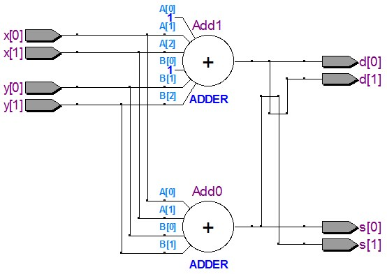
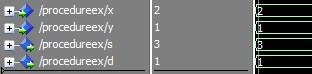

.. _`ch_Package`:

Procedures, functions and packages
**********************************

.. raw:: latex

    \chapterquote{If anyone would be the first, he must be last of all and servant of all.}{Jesus Christ}

Introduction
============

In this chapter, procedure and packages are discussed. Procedures are used to define common operations within many designs. Further, packages are used to define common declarations i.e. port names and constants values etc. in one file, instead of declaring in each file as shown in :numref:`ch_OverView`. 

Procedure
=========

A procedure contains a list of input and outputs arguments, and defined in declaration part of the architecture as shown in lines 19-25 of :numref:`vhdl_procedureEx`. 

**Explanation** :numref:`vhdl_procedureEx`

    In line 19, 'sum2Num' is the name of the procedure, which has two input signal (a and b) and two output signals (sum and diff). Then, line 27 maps the input and output port of the entity to this procedure. Note that signal 'p' is mapped to 'sum' signal, therefore line 28 is used to assign the value of 'p' to output port 'd'. :numref:`fig_procedureEx` is the design generated by the listing, whereas  :numref:`fig_procedureExWave` is the simulation waveforms. 

.. _`fig_procedureEx`:

   Design generated by :numref:`vhdl_procedureEx`

.. _`fig_procedureExWave`:

   Waveform for :numref:`vhdl_procedureEx`

.. literalinclude:: codes/Chapter-Package/procedureEx.vhd
    :language: vhdl
    :linenos:
    :caption: Procedure
    :name: vhdl_procedureEx

Function
========

'Functions' are similar to 'procedures' but can have input-ports only and return only one value. Note that, a 'return' statement is required in the functions as shown in Lines 23 and 21 of :numref:`vhdl_funcEx` and :numref:`vhdl_funcEx2` respectively. :numref:`vhdl_funcEx` implements the adder using function; whereas :numref:`vhdl_funcEx2` changes the 'binary number' into 'seven-segment display format' which is discussed in :numref:`sec_sevenSegmentDisplay`. Further the example of  function inside the package is shown in :numref:`sec_LCDinterface`. 

.. literalinclude:: codes/Chapter-Package/funcEx.vhd
    :language: vhdl
    :linenos:
    :caption: Adder using function
    :name: vhdl_funcEx

.. literalinclude:: codes/Chapter-Package/funcEx2.vhd
    :language: vhdl
    :linenos:
    :caption: Sevensegment display using function
    :name: vhdl_funcEx2

.. note::

    Differences between the function and the procedure blocks, 

    * Procedures can have both input and output ports, whereas the functions can have only input ports. 
    * Functions can return only one value using 'return' keyword; whereas procedures do not have 'return' keyword but can return multiple values using 'output' port.

Packages
========

Note that the functions and the procedures can be defined in declaration parts of the entities and architectures; but the best place for defining these are in the packages. The packages are already discussed in :numref:`ch_OverView`. In this section, package body is discussed using :numref:`vhdl_myPackage` and :numref:`vhdl_packageCall`.

**Explanation** :numref:`vhdl_myPackage`

    In the listing constants (line 9), signals (line 17), data-types (line 18) and procedure (line 12) are defined inside the package 'myPackage'. Further, procedure is declared in the package (line 12-19), and then defined in the package body (line 24-29). All these declarations are used by :numref:`vhdl_packageCall`. 

.. literalinclude:: codes/Chapter-Package/myPackage.vhd
    :language: vhdl
    :linenos:
    :caption: Package
    :name: vhdl_myPackage

**Explanation** :numref:`vhdl_packageCall`

    In this listing, line 6 adds all the declaration of 'myPackage' to current design. Note that, 'work' is the default directory where all the compiled file are stored. 

    Next, line 30 adds two number, in which 'S' is defined in the package. 

    Line 33 is using the procedure 'sum2Num' which is declared in the package. The working of this part is same as :numref:`vhdl_procedureEx`. 

    Line 26 defines the signal 'currentState' of type 'stateType' which is declared in package. Similarly, signal 'f' used in line 38 which is also defined in the package. Rest of the working of line 38-55 is same as :numref:`vhdl_ifLoop`.

.. literalinclude:: codes/Chapter-Package/packageCall.vhd
    :language: vhdl
    :linenos:
    :caption: Adding Package to current design
    :name: vhdl_packageCall

Conclusion
==========

In this chapter, we discuss the procedure and package. We define some of the previous designs in the package, and then use the package to create new design. 