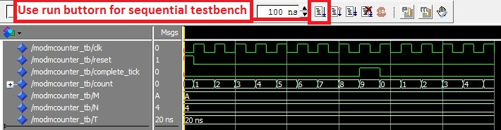

.. _`ch_Testbench`:

Testbenches
***********

.. raw:: latex

  \chapterquote{Desire for nothing except desirelessness. Hope for nothing except to rise above all hopes. Want nothing and you will have everything.}{Meher Baba}

Introduction
============

In previous chapters, we generated the simulation waveforms using modelsim, by providing the input signal values manually; if the number of input signals are very large and/or we have to perform simulation several times, then this process can be quite complex, time consuming and irritating. Suppose input is of 10 bit, and we want to test all the possible values of input i.e. :math:`2^{10}-1`, then it is impossible to do it manually. In such cases, testbenches are very useful; also, tested design more reliable and prefer by the other clients as well. Further, with the help of testbenches, we can generate results in the form of csv (comma separated file), which can be used by other softwares for further analysis e.g. Python, Excel and Matlab etc.  

**Since testbenches are used for simulation purpose only (not for synthesis), therefore full range of VHDL constructs can be used e.g. keywords 'assert', 'report' and 'for loops' etc. can be used for writing testbenches.**

**Modelsim-project is created in this chapter for simulations**, which allows the relative path to the files with respect to project directory as shown in :numref:`sec_read_data_from_file`. Simulation can be run without creating the project, but we need to provide the full path of the files as shown in Lines 30-34 of :numref:`vhdl_read_file_ex`. 

Lastly, mixed modeling is not supported by Altera-Modelsim-starter version, i.e. Verilog designs with VHDL and vice-versa can not be compiled in this version of Modelsim. 

Testbench for combinational circuits
====================================

In this section, various testbenches for combinational circuits are shown, whereas testbenches for sequential circuits are discussed in next section. For simplicity of the codes and better understanding, a simple half adder circuit is tested using various simulation methods. 

Half adder
----------

:numref:`vhdl_half_adder` shows the VHDL code for the half adder which is tested using different ways, 

.. literalinclude:: codes/Chapter-Testbenches/half_adder.vhd
    :language: vhdl
    :linenos:
    :caption: Half adder
    :name: vhdl_half_adder

Simple testbench
----------------

Note that, testbenches are written in separate VHDL files as shown in :numref:`vhdl_half_adder_simple_tb`. Simplest way to write a testbench, is to invoke the 'design for testing' in the testbench and provide all the input values in the file,  as explained below, 

**Explanation** :numref:`vhdl_half_adder_simple_tb`

  In this listing, a testbench with name 'half\_adder\_simple\_tb' is defined at Lines 7-8. Note that, entity of testbench is always empty i.e. no ports are defined in the entity (see Lines 7-8). Then 4 signals are defined i.e. a, b, sum and carry (Lines 11-12) inside the architecture body; these signals are then connected to actual half adder design using structural modeling (see Line 15). Lastly, different values are assigned to input signals e.g. 'a' and 'b' at lines 16 and 17 respectively. 
  
  In Line 22, value of 'a' is 0 initially (at 0 ns), then it changes to '1' at 20 ns and again changes to '0' **at** 40 ns (**do not confuse with after 40 ns, as after 40 ns is with respect to 0 ns, not with respect to 20 ns**). Similarly, the values of 'a' becomes '0' and '1' **at** 40 and 60 ns respectively. In the same way value of 'b' is initially '0' and change to '1' at 40 ns at Line 23. In this way 4 possible combination are generated for two bits ('ab') i.e. 00, 01, 10 and 11 as shown in :numref:`fig_half_adder_simple_tb`; also corresponding outputs, i.e. sum and carry, are shown in the figure. 
  
  **To generate the waveform, first compile the 'half\_adder.vhd and then 'half\_adder\_simple\_tb.vhd' (or compile both the file simultaneously.)**. Then simulate the half\_adder\_simple\_tb.vhd file. Finally, click on 'run all' button (which will run the simulation to maximum time i.e. 60 ns here at Line 22)and then click then 'zoom full' button (to fit the waveform on the screen), as shown in :numref:`fig_half_adder_simple_tb`.

**Problem**: Although, the testbench is very simple, but input patterns are not readable. By using the **process statement** in the testbench, we can make input patterns more readable along with inclusion  of various other features e.g. report generation etc., as shown in next section. 

.. literalinclude:: codes/Chapter-Testbenches/half_adder_simple_tb.vhd
    :language: vhdl
    :linenos:
    :caption: Simple testbench for half adder 
    :name: vhdl_half_adder_simple_tb

.. _`fig_half_adder_simple_tb`:

   Simulation results for :numref:`vhdl_half_adder_simple_tb`

.. _`sec_tb_with_process_statement`:

Testbench with process statement
--------------------------------

In :numref:`vhdl_half_adder_process_tb`, process statement is used in the testbench; which includes the input values along with the corresponding output values.  If the specified outputs are not matched with the output generated by half-adder, then errors will be generated. **Note that, process statement is written without the sensitivity list**.

**Explanation** :numref:`vhdl_half_adder_process_tb`

  The listing is same as previous listing till Line 15, and then process statement is used to define the input patterns, which can be seen at lines 20-21 (00),  27-28 (01), 33-34 (10) and 39-40 (11). Further, expected outputs are shown below these lines e.g. line 23 shows that the sum is 0 and carry is 0 for input 00; and if the generated output is different from these values, e.g. error is generated by line 50 for input pattern 01 as shown in :numref:`fig_half_adder_process_error_tb`; as sum generated by half\_adder for line 46-47 is 1, whereas expected sum is defined as 0 for this combination at line 49. Note that, the adder output is correct, whereas the expected value is entered incorrectly; and error is displayed on 'transcript window' of modelsim. 
  
  Also, 'period' is defined as 20 ns at Line 18; and then used after each input values e.g line 22, which indicates that input will be displayed for 20 ns before going to next input values (see in :numref:`fig_half_adder_process_error_tb`).

.. literalinclude:: codes/Chapter-Testbenches/half_adder_process_tb.vhd
    :language: vhdl
    :linenos:
    :caption: Testbench with process statement
    :name: vhdl_half_adder_process_tb

.. _`fig_half_adder_process_tb`:

   Simulation results for :numref:`vhdl_half_adder_process_tb`

.. _`fig_half_adder_process_error_tb`:

   Error generated by :numref:`vhdl_half_adder_process_tb`

Testbench with look-up table
----------------------------

The inputs patterns can be defined in the form of look-table as well as shown in :numref:`vhdl_half_adder_lookup_tb`, instead of define separately at different location as done in :numref:`vhdl_half_adder_process_tb` e.g. at lines 20 and 27 etc. 

**Explanation** :numref:`vhdl_half_adder_lookup_tb`

  Basic concept of this Listing is similar to :numref:`vhdl_half_adder_process_tb` but written in different style. Testbench with lookup table can be  written using three steps as shown below, 
  

  * **Define record** : First we need to define a record which contains the all the possible columns in the look table. Here, there are four possible columns i.e. a, b, sum and carry, which are defined in record at Lines 15-18. 
    
  * **Create lookup table** :  Next, we need to define the lookup table values, which is done at Lines 20-28. Here positional method is used for assigning the values to columns (see line 22-27); further, name-association method can also be used as shown in the comment at Line 23. 
    
  * **Assign values to signals** : Then the values of the lookup table need to be assigned to half\_adder entity (one by one). For this 'for loop' is used at line 35, which assigns the values of ''test-vector's 'a' and 'b' '' to signal 'a' and 'b' (see comment at Line 36 for better understanding). Similarly, expected values of sum and carry are generated at Lines 41-44. Lastly, report is generated for wrong outputs at Lines 46-50. 

  The simulations results and reported-error are shown in :numref:`fig_half_adder_lookup_tb` and :numref:`fig_half_adder_lookup_error_tb` respectively. 

.. literalinclude:: codes/Chapter-Testbenches/half_adder_lookup_tb.vhd
    :language: vhdl
    :linenos:
    :caption: Testbench with look-up table
    :name: vhdl_half_adder_lookup_tb

.. _`fig_half_adder_lookup_tb`:

   Simulation results for :numref:`vhdl_half_adder_lookup_tb`

.. _`fig_half_adder_lookup_error_tb`:

   Error generated by :numref:`vhdl_half_adder_lookup_tb`

.. _`sec_read_data_from_file`:

Read data from file
-------------------

In this section, data from file 'read\_file\_ex.txt' is read and displayed in simulation results. Date stored in the file is shown in :numref:`fig_read_file_table_ex`. 

.. _`fig_read_file_table_ex`:

   Data in file  'read\_file\_ex.txt'

**Explanation** :numref:`vhdl_read_file_ex`

  To read the file, first we need to define a buffer of type 'text', which can store the values of the file in it, as shown in Line 17; file is open in read-mode and values are stored in this buffer at Line 32.  
  
  Next, we need to define the variable to read the value from the buffer. Since there are 4 types of values (i.e. a, b, c and spaces) in file 'read\_file\_ex.txt', therefore we need to define 4 variables to store them, as shown in Line 24-26. Since, variable c is of 2 bit, therefore Line 25 is 2-bit vector; further, for spaces, variable of character type is defined at Line 26. 
  
  Then, values are read and store in the variables at Lines 36-42. Lastly, these values are assigned to appropriate signals at Lines 45-47. Finally, file is closed at Line 52. The simulation results of the listing are show in :numref:`fig_read_file_ex`. 

.. literalinclude:: codes/Chapter-Testbenches/read_file_ex.vhd
    :language: vhdl
    :linenos:
    :caption: Read data from file
    :name: vhdl_read_file_ex

.. _`fig_read_file_ex`:

   Simulation results of :numref:`vhdl_read_file_ex`

.. _`sec_writedatafile`:

Write data to file
------------------

In this part, different types of values are defined in :numref:`vhdl_write_file_ex` and then stored in the file. Here, only 'write\_mode' is used for writing the data to file (not the 'append\_mode'). 

**Explanation** :numref:`vhdl_write_file_ex`

  To write the data to the file, first we need to define a buffer, which will load the file on the simulation environment for writing the data during simulation,  as shown in Line 15 (buffer-defined) and Line 27 (load the file to buffer). 
  
  Next, we need to define a variable, which will store the values to write into the buffer, as shown in Line 19. In the listing, this variable stores three types of value i.e. strings (Lines 31 and 34 etc.), signal 'a' (Line 35) and variable 'b' (Line 37). 
  
  Note that, two keyword are used for writing the data into the file i.e. 'write' and 'writeline'. 'write' keyword store the values in the 'write\_col\_to\_output\_buf' and 'writeline' writes the values in the file. Remember that, all the 'write' statements before the 'writeline' will be written in same line e.g. Lines 34-37 will be written in same line as shown in :numref:`fig_write_file_table_ex`. Lastly, the simulation result for the listing is shown in :numref:`fig_write_file_ex`. 

.. literalinclude:: codes/Chapter-Testbenches/write_file_ex.vhd
    :language: vhdl
    :linenos:
    :caption: Write data to fil
    :name: vhdl_write_file_ex

.. _`fig_write_file_table_ex`:

   Data in file  'write\_file\_ex.txt'

.. _`fig_write_file_ex`:

   Simulation results of :numref:`vhdl_write_file_ex`

Half adder testing using CSV file
---------------------------------

In this section, both read and write operations are performed in :numref:`vhdl_read_write_file_ex`. Further, csv file is used for read and write operations. Content of input and output files are shown in :numref:`fig_half_adder_input` and :numref:`fig_half_adder_output` respectively. 

Please read :numref:`vhdl_read_file_ex` and :numref:`vhdl_write_file_ex` to understand this part, as only these two listings are merged together here. 

**Addition features added to listing are shown below**,

* Lines 63-64 are added to skip the header row, i.e. any row which does not start with boolean-number(see line 42).
*  Also, error will be reported for value 'b' if it is not the boolean. Similarly, this functionality can be added to other values as well.
* Lastly, errors are reported in CSV file at Lines 96-109. This can be seen in :numref:`fig_half_adder_output`. It's always easier to find the location of error using csv file as compare to simulation waveforms (try to find the errors using :numref:`fig_half_adder_output` and compare it with :numref:`fig_half_adder_output`).  
  

.. literalinclude:: codes/Chapter-Testbenches/read_write_file_ex.vhd
    :language: vhdl
    :linenos:
    :caption: Half adder testing using CSV file
    :name: vhdl_read_write_file_ex

.. _`fig_read_write_file_ex`:

   Simulation results of :numref:`vhdl_read_write_file_ex`

.. _`fig_half_adder_input`:

   Content of input file 'half\_adder\_input.csv'

.. _`fig_half_adder_output`:

   Content of input file 'half\_adder\_output.csv'

Testbench for sequential circuits
=================================

In :numref:`sec_tb_with_process_statement`, we saw the use of process statement for writing the testbench for combination circuits. But, in the case of sequential circuits, we need clock and reset signals; hence two additional blocks are required. Since, clock is generated for complete simulation process, therefore it is defined inside the separate process statement. Whereas, reset signal is required only at the beginning of the operations, hence it is not defined inside the process statement. Rest of the procedures/methods for writing the testbenches for sequential circuits are same as the testbenches of the combinational circuits. 

Simulation with infinite duration
---------------------------------

In this section, we have created a testbench which will not stop automatically i.e. if we press the 'run all' button then the simulation will run forever, therefore we need to press the 'run' button as shown in :numref:`fig_modMCounter_tb`.

**Explanation** :numref:`vhdl_modMCounter_tb`

  :numref:`vhdl_modMCounter_tb` is the testbench for mod-M counter, which is discussed in :numref:`sec_ModMCounter`. Here 'clk' signal is generated in the separate process block i.e. Lines 27-33; in this way, clock signal will be available throughout the simulation process. Further, reset signal is set to '1' in the beginning and then set to '0' in next clock cycle (Line 37). If there are further, inputs signals, then those signals can be defined in separate process statement, as discussed in combination circuits' testbenches. 
  
  The simulation results are shown in :numref:`fig_modMCounter_tb`, where counter values goes from 0 to 9 as M is set to 10 (i.e. A in hexadecimal). Further, use 'run' button for simulating the sequential circuits (instead of run-all), as shown in the figure. 

.. literalinclude:: codes/Chapter-Testbenches/modMCounter_tb.vhd
    :language: vhdl
    :linenos:
    :caption: Testbench with infinite duration for modMCounter.vhd
    :name: vhdl_modMCounter_tb

.. _`fig_modMCounter_tb`:

   Simulation results of :numref:`vhdl_modMCounter_tb`

Simulation for finite duration and save data
--------------------------------------------

To run the simulation for the finite duration, we need to provide the 'number of clocks' for which we want to run the simulation, as shown in Line 23 of :numref:`vhdl_modMCounter_tb2`. Then at Lines 47-52 are added to close the file after desired number of clocks i.e. 'num\_of\_clocks'. Also, the data is saved into the file, which is discussed in :numref:`sec_writedatafile`. Now, if we press the **run all** button, then the simulator will stop after 'num\_of\_clocks' cycles. **Note that, if the data is in 'signed or unsigned' format, then it can not be saved into the file. We need to change the data into other format e.g. 'integer', 'natural' or 'std\_logic\_vector' etc. before saving it into the file, as shown in Line 73**. The simulation waveforms and saved results are shown in :numref:`fig_modMCounter_sim_tb2` and :numref:`fig_modMCounter_file_tb2` respectively.

.. _`fig_modMCounter_sim_tb2`:

   Simulation results of :numref:`vhdl_modMCounter_tb2`

.. _`fig_modMCounter_file_tb2`:

   Partial view of saved data by :numref:`vhdl_modMCounter_tb2`

.. literalinclude:: codes/Chapter-Testbenches/modMCounter_tb2.vhd
    :language: vhdl
    :linenos:
    :caption: Testbench with finite duration for modMCounter.vhd
    :name: vhdl_modMCounter_tb2

Conclusion
==========

In this chapter, we learn to write testbenches with different styles for combinational circuits. We saw the methods by which inputs can be read from the file and the outputs can be written in the file. Simulation results and expected results are compared and saved in the csv file and displayed as simulation waveforms; which demonstrated that locating the errors in csv files is easier than the simulation waveforms. Further, we saw the simulation of sequential circuits as well, which is slightly different from combination circuits; but all the methods of combinational circuit simulations can be applied to sequential circuits as well. 