.. _`ch_UartSdramPython`:

UART, SDRAM and Python
**********************

.. raw:: latex

    \chapterquote{The Man who works for others, without any selfish motive, really does good to himself.}{Ramakrishna Paramahansa}

Introduction
============

In this chapter, UART communication is discussed for NIOS design. Values of Sin(x) is generated using NIOS and the data is  received by computer using UART cable. Since, onchip memory is smaller for storing these values, therefore external memory i.e. SDRAM is used. Further, the received data is stored in a file using 'Tera Term' software; finally live-plotting of data is performed using Python.  

In this chapter, we will learn following topics, 

* UART interface,
* Receiving the data on computer using UART communication,
* SDRAM interface,
* Saving data generated by NIOS desgin to a file using 'Tera Term',
* Updating a existing QSys design and corresponding VHDL and NIOS design,
* Live-plotting of data using Python. 

UART interface
==============

First, create a empty project with name 'UartComm' (see :numref:`sec_new_project`). Next, open the QSys from Tools-->Qsys. Add 'Nios Processor', 'On-chip RAM (with 20k total-memory-size), 'JTAG UART' and 'UART (RS-232 Serial Port)' (**all with default settings**). Note that, Baud rate for UART is set to '115200' (see :numref:`fig_uart_settings`), which will be used while getting the data on computer. Lastly, connect these items as shown in :numref:`fig_uart_qsys_conn`; save it as 'Uart\_Qsys.qsys' and finally generate the Qsys system and close the Qsys. Please see :numref:`sec_CreateGenerateQsys`, if you have problem in generating the QSys system.

.. _`fig_uart_settings`:

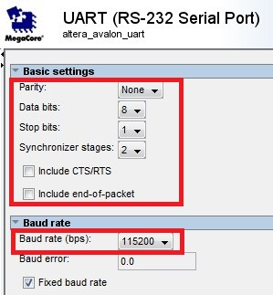

   UART settings

 
.. _`fig_uart_qsys_conn`:

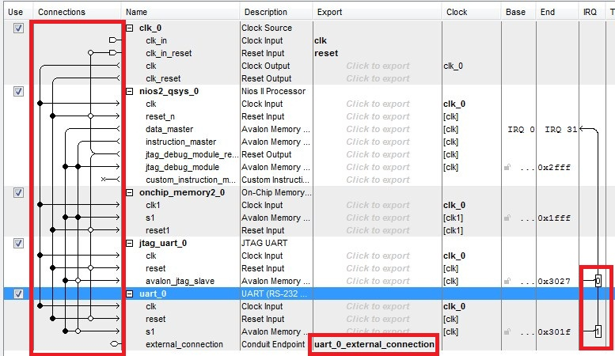

   Qsys connections

Now, add the file 'Uart\_Qsys.qip' to the VHDL project. Next, create a new 'Block diagram (.bdf) file and import the Qsys design to it and assign correct pin numbers to it, as shown in :numref:`fig_uart_top`. Save it as 'Uart\_top.bdf' and set it as 'top  level entity'. Lastly, import the pin assignment file and compile the design. Finally, load the design on FPGA board. 

.. _`fig_uart_top`:

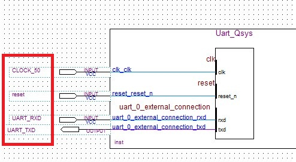

   Top level entity 'Uart\_top.bdf'

NIOS design
===========

In :numref:`Chapter %s <ch_NiosOverview>`, we created the 'BSP' and 'application' file separately for NIOS design. In this chapter, we will use the template provided with NIOS to create the design. For this, open the NIOS software and go to 'Files-->New-->NIOS II Application and BSP from Template'. Next, Select the 'UART\_Qsys.sopcinfo' file and 'Hello World' template and provide the desired name to project e.g. UART\_comm\_app, as shown in Fig , and click 'next'. In this window, enter the desired name for BSP file in the 'Project name' column e.g. 'UART\_comm\_bsp'; and click on Finish.  

.. _`fig_nios_name_uart`:

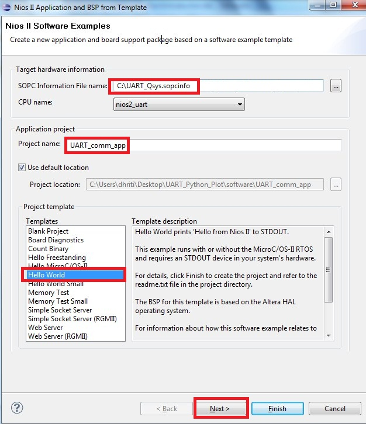

   Create NIOS project from template

Communication through UART
==========================

To received the data on computer, we need some software like Putty or Tera Term. In this tutorial, we are using 'Tera Term software, which can be downloaded freely. Also, we need to change the UART communication settings; so that, we can get messages through UART interface (instead of JTAG-UART)  as shown next. 

Right click on 'UART\_comm\_bsp' and go to 'NIOS II-->BSP editor'; and select UART\_115200 for various communication as shown in :numref:`fig_nios_uart_settings`; and finally click on generate and then click on exit. Now, all the     'printf' statements will be send to computer via UART port (instead of Jtag-uart). We can change it to JTAG-UART again, by changing UART\_115200 to JTAG-UART again. Note that, when we modify the BSP using BSP-editor, then we need to generate the system again.

.. _`fig_nios_uart_settings`:

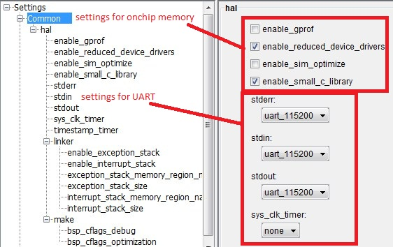

   UART communication settings in NIOS

Now, open the Tera Term and select the 'Serial' as shown in :numref:`fig_teraTerm`. Then go to 'Setup-->Serial Port...' and select the correct baud rate i.e. 115200 and click OK, as shown in :numref:`fig_baudRateteraTerm`. 

.. _`fig_teraTerm`:

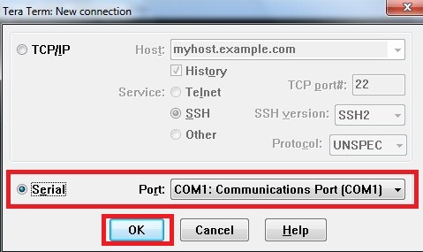

   Serial communication in Tera Term

.. _`fig_baudRateteraTerm`:

.. figure:: fig/uart/7.jpg
   :width: 60%

   Select correct baud rate

Finally, right click on 'UART\_comm\_app' in NIOS and go to 'Run As-->3 NIOS 2 Hardware'. Now, we can see the output on the Tera Term terminal, as shown in :numref:`fig_helloTera`. 

.. _`fig_helloTera`:

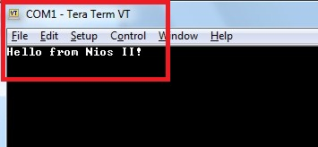

   'Hello from NIOS II!' on Tera Term

SDRAM Interface
===============

Our next aim is to generate the Sine waves using NIOS and then plot the waveforms using python. If we write the C-code in current design, then our system will report the memory issue as onchip memory is too small; therefore we need to use external memory. In this section, first, we will update the Qsys design with SDRAM interface, then we will update the Quartus design and finally add the C-code to generate the Sine waves. 

Modify QSys
-----------

First, Open the UART\_Qsys.qsys file in QSys software. Now, add SDRAM controller with default settings,  as shown in :numref:`fig_sdram_con`. Next, connect all the ports of SDRMA as shown in :numref:`fig_sdram_connections`. Then, double click the 'nios2\_qsys\_0' and select 'SDRAM' as reset and exception vector memory, as shown in :numref:`fig_sdram_vector_memory`. 

.. _`fig_sdram_con`:

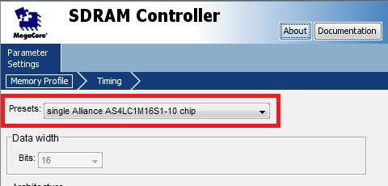

   SDRAM controller

.. _`fig_sdram_connections`:

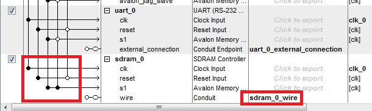

   SDRAM connections

.. _`fig_sdram_vector_memory`:

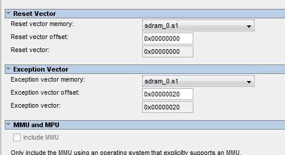

   Select SDRAM as vector memories

Next, we will add 'Switches' to control the amplitude of the sine waves. For this add the PIO device of '8 bit with type input', and rename it as 'switch', as shown in :numref:`fig_switchForAmplitude` . Finally, go to System-->Assign base addresses, and generate the system. 

.. _`fig_switchForAmplitude`:

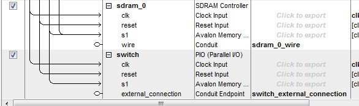

   Add switches for controlling the amplitude of sine waves

Modify Top level Quartus design
-------------------------------

Now, open the 'Uart\_top.bdf' file in Quartus. Right click on the 'Uart\_Qsys' block and select 'Update symbol or block'; then select the option 'Selected symbol(s) or block(s)' and press OK. It will display all the ports for 'SDRAM' and switches. Next, we need to assign the correct 'pin names' to these ports, as shown in :numref:`fig_SDRAM_Pinassg`.  

.. _`fig_SDRAM_Pinassg`:

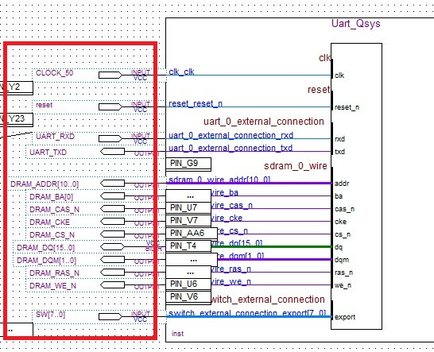

   Assigning Pins to SDRAM and Switches

Note that, there should be '-3 ns clock delay' for SDRAM as compare to FPGA clock, therefore we need to add the clock with '-3 ns delay'. For this, double click on the Uart\_top.bdf (anywhere in the file), and select 'MegaWizard Plug-In Manager'. Then select 'Create a new custom megafunction variation' in the popped-up window and click next. Now, select **ALTPLL** from **IO** in **Installed Plug-Ins** option, as shown in :numref:`fig_dram_clock_altpll`, and click next. Then, follow the figures from :numref:`fig_altpllCreation1` to :numref:`fig_altpllCreation6` to add the ALTPLL to current design i.e. 'Uart\_top.bdf'. Finally, connect the ports of this design as shown in :numref:`fig_altpllCreation7`. Note that, in these connections, output of ATLPLL design is connected to 'DRAM\_CLK', which is clock-port for DRAM. Lastly, compile and load the design on FPGA board. 

.. _`fig_dram_clock_altpll`:

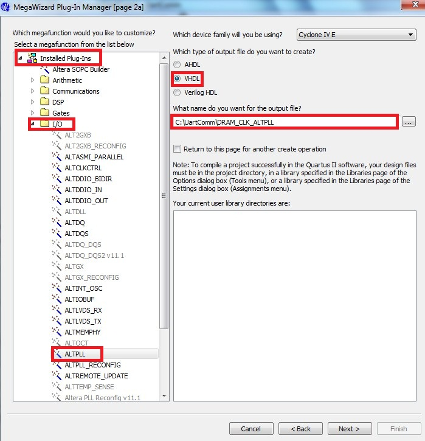

   ALTPLL generation

.. _`fig_altpllCreation1`:

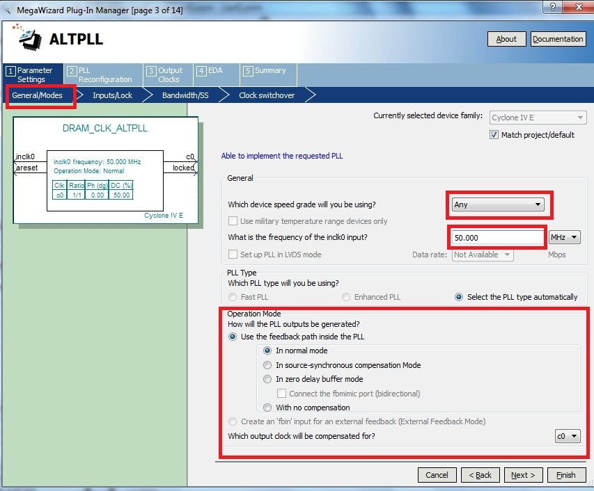

   ALTPLL creation, step 1

.. _`fig_altpllCreation2`:

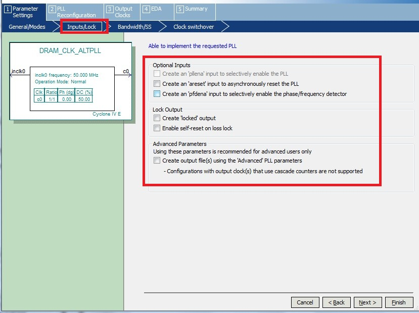

   ALTPLL creation, step 2

.. _`fig_altpllCreation3`:

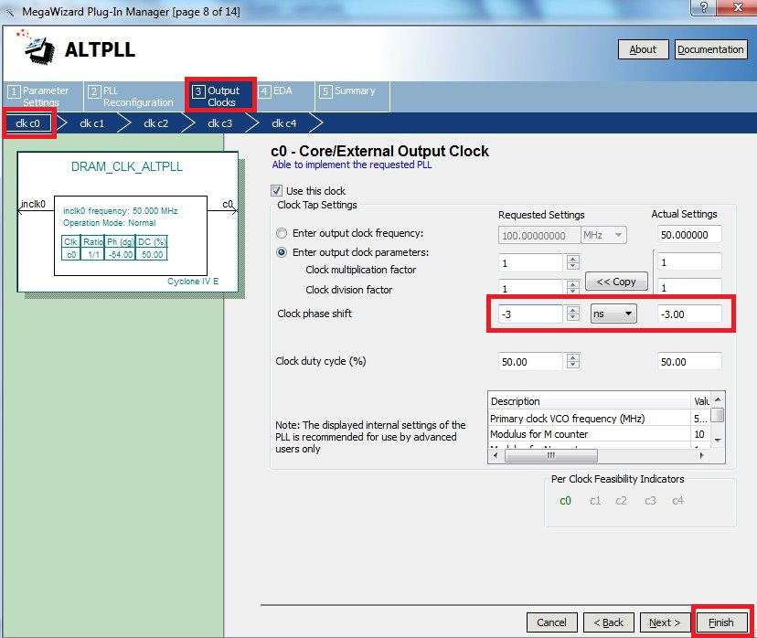

   ALTPLL creation, step 3

.. _`fig_altpllCreation4`:

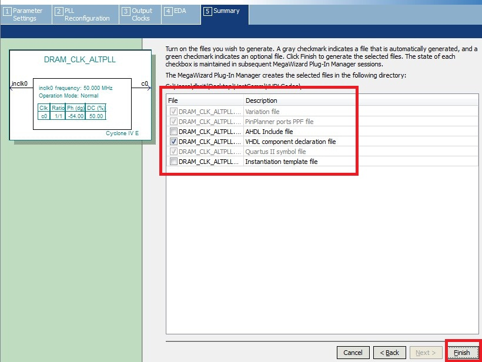

   ALTPLL creation, step 4

.. _`fig_altpllCreation5`:

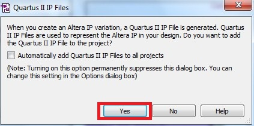

   ALTPLL creation, step 5

.. _`fig_altpllCreation6`:

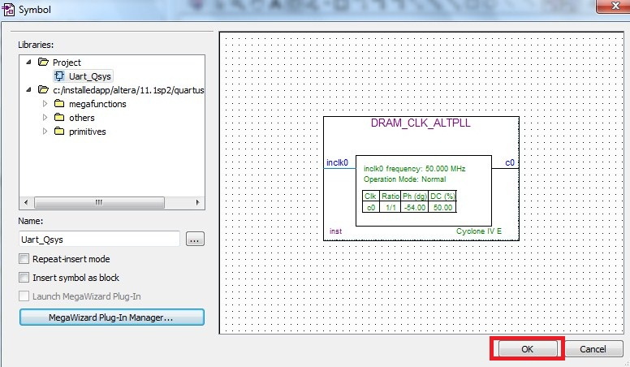

   ALTPLL creation, step 6

.. _`fig_altpllCreation7`:

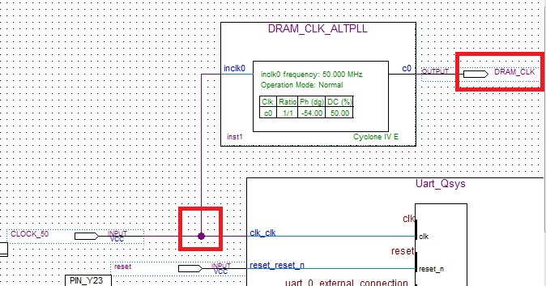

   Connect ALTPLL design with existing design

Updating NIOS design
--------------------

Since, we have udpated the QSys design, therefore the corresponding .sopcinfo file is also updated. Further, BSP files depends on the .sopcinfo file, therefore we need to update the BSP as well. For this, right click on 'Uart\_comm\_bsp' and go to 'NIOS II-->BSP Editor; and update the BSP as shown in :numref:`fig_updateBSPDRAM` and click on 'generate' and then click 'exit'. Note that, 'enable' options are unchecked now, because we are using External memory, which is quite bigger than onchip-memory, so we do not need 'small' size options. 

.. _`fig_updateBSPDRAM`:

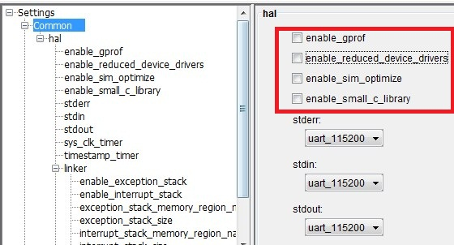

   Update BSP for new Qsys design

Now, update the 'hello\_world.c' file as shown in :numref:`c_uart_sine_wave`. 

.. literalinclude:: codes/Chapter-UART-SDRAM-and-Python/hello_world.c
    :language: c
    :linenos:
    :caption: Sin and Cos wave generation
    :name: c_uart_sine_wave

In Tera Term, we can save the received values in text file as well. Next, go Files-->Log and select the filename at desired location to save the data e.g. 'sineData.txt'. 

Finally, right click on 'UART\_comm\_app' in NIOS and go to 'Run As-->3 NIOS 2 Hardware'. Now, we can see the decimal values on the screen. If all the switches are at '0' position, then values will be '0.000' as amplitude is zero. Further, we can use any combination of 8 Switches to increase the amplitude of the sine and cosine waves. Also, result will be stored in the  'sineData.txt' file. Content of this file is shown in :numref:`fig_contentLogFile`

.. _`fig_contentLogFile`:

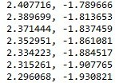

   Content of 'sineData.txt' file

Live plotting the data
======================

In the previous section, we store the sine and cosine wave data on the 'sineData.txt' using UART communication. Now, our last task is to plot this data continuously, so that it look line animation. For this save the :numref:`python_plotLogData`, in the location where 'sineData.txt' is saved. Now, open the command prompt and go to the location of python file. Finally, type **'python main.py'** and press enter. This will start plotting the waveform continuously based on the data received and stored on the 'sineData.txt' file. The corresponding plots are shown in :numref:`fig_plotLogFile`.

.. literalinclude:: codes/Chapter-UART-SDRAM-and-Python/main.py
    :language: python
    :linenos:
    :caption: Code for live plotting of logged data
    :name: python_plotLogData

.. _`fig_plotLogFile`:

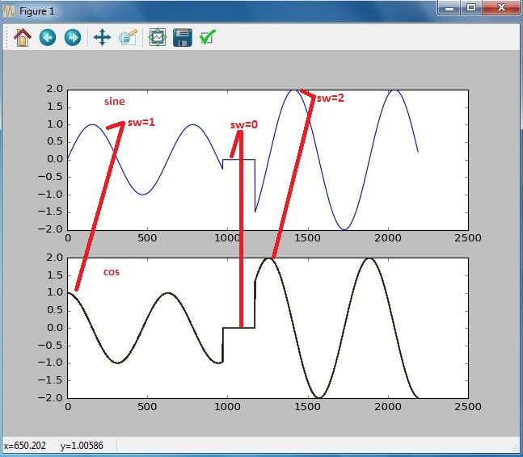

   Plot of 'sineData.txt' file

Conclusion
==========

In this chapter, first we display the 'Hello' message using UART and Tera Term. Then, SDRAM is included in the design and correspondingly all the other designs are updated i.e. Quartus and NIOS. Then, the data is stored in the text file and finally it is plotted with the help of Python programming language. 