.. _`ch_VisualVerification`:

Visual verifications of designs
*******************************

.. raw:: latex

    \chapterquote{Long for what is real. You will then have no time for worrying over what may never happen.}{Meher Baba}

Introduction
============

In previous chapters, we saw various elements of VHDL language with some design examples, which were verified using simulations. In this chapter, various smaller units are designed and then combined together to make the large systems. Further, visual verification is performed in this chapter i.e. the designs are verified using LED displays. Finally, in :numref:`sec_modMCounterVisualTest`, output of mod-m is displayed on various LEDs using smaller designs i.e. counters, clock-ticks and seven segment displays. 

Flip flops
==========

Flip flops are the sequential circuits which are used  to store 1-bit. In this section, D flip flop is designed with various functionalities in it.
 
D flip flop
-----------

In :numref:`vhdl_BasicDFF`, the basic D flip flop is designed with reset button. Output of the flip flop is set to zero if reset value is '1', otherwise output has the same value as input. Further, change in the output value occurs during 'positive edge' of the clock. Design generated by :numref:`vhdl_BasicDFF` is shown in :numref:`fig_BasicDFF`.

**Explanation** :numref:`vhdl_BasicDFF`

    In the listing, 'd' and 'q' are the input and output respectively of the D flip flop. In line 19, output of the D flip flop is set to zero when reset is '1'. In line 20, 'clk'event' checks whether there is any change (or event) in the clock and then 'clk=1' checks if the changed value is '1'; in this way 'rising edge' of the clock can be checked in VHDL. Next in line 21, input value is sent to the output during the rising edge of the clock. Lastly, 'null' is used for 'else' block as we do not want to perform any further operation.

.. literalinclude:: codes/Chapter-Visual-verifications-of-designs/BasicDFF.vhd
    :language: vhdl
    :linenos:
    :caption: Basic D flip flop
    :name: vhdl_BasicDFF

.. _`fig_BasicDFF`:

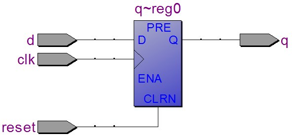

   Basic D flip flop, :numref:`vhdl_BasicDFF`

D flip flop with Enable port
----------------------------

Note that, in :numref:`fig_BasicDFF`, the enable button i.e. 'ENA' is still not connected. Enable button can be used for allowing the change in the output at desired time instant; e.g. if we want to change the output of the D flip flop on every :math:`10^{th} clock`, then we can set the enable to '1' for every :math:`10^{th} clock` and '0' for rest of the clocks. We call this as 'tick' at every 10 clock cycle; and we will see various examples of 'ticks' in this chapter. In this way, we can control the output of the D flip flop. To add the enable functionality in the flip flop, 'en = 1' is added in line 20 of :numref:`vhdl_D_FF`. Rest of the code is same as :numref:`vhdl_BasicDFF`. The design generated by the listing is shown in :numref:`fig_D_FF`

.. literalinclude:: codes/Chapter-Visual-verifications-of-designs/D_FF.vhd
    :language: vhdl
    :linenos:
    :caption: D flip flop with enable
    :name: vhdl_D_FF

.. _`fig_D_FF`:

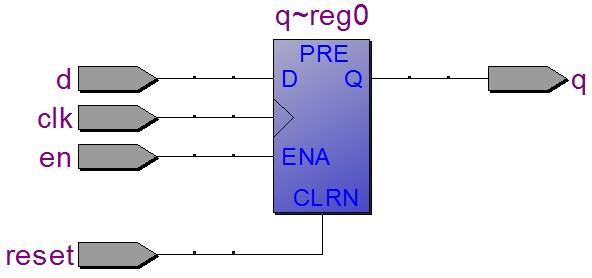

   D flip flop with enable, :numref:`vhdl_D_FF`

Counters
========

In this section, two types of counters are designed i.e. binary counter and mod-m counter. 

Binary counter
--------------

In :numref:`vhdl_binaryCounter`, N-bit binary counter is designed which counts the number from 0 to :math:`2^N-1`. After reaching to maximum count i.e. :math:`2^N-1`, it again starts the count from 0.  

**Explanation** :numref:`vhdl_binaryCounter`

    In the listing, two output ports are defined i.e. 'count' and 'complete\_tick', where 'complete\_tick' is used to generate tick when the 'count' reached to it's maximum value. In line 20, 'MAX\_COUNT' is used to define the maximum count for 'N' bit counter; where 'N' is defined as generic in line 8. 
    
    Signal 'count\_reg' is defined in line 21 and assigned to output at line 39. Since 'count\_reg' is defined as 'unsigned', therefore it's type is changed to 'std\_logic\_vector' in line 39 as output port 'count' is of type 'std\_logic\_vector'.
    
    Value of 'count\_reg' is increased by one and assigned to 'count\_next' in line 34. Then in next clock cycle, this increased value of 'count\_reg' (which is store in 'count\_next') is assigned to  'count\_reg' again through line 28. Design generated by the listing is shown in :numref:`fig_binaryCounter`.  

.. literalinclude:: codes/Chapter-Visual-verifications-of-designs/binaryCounter.vhd
    :language: vhdl
    :linenos:
    :caption: N-bit binary counter
    :name: vhdl_binaryCounter

.. _`fig_binaryCounter`:

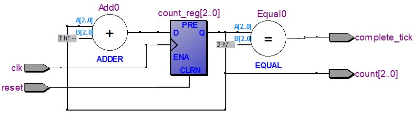

   N-bit binary counter, :numref:`vhdl_binaryCounter`

**Explanation** :numref:`fig_binaryCounter`

    In the figure, component 'Equal0' is generated according to line 37. 3'h7 shows that counter is designed for 3 bit which has the maximum value 7. Output of 'Equal0' i.e.  complete\_tick is set to 1 whenever output is equal to maximum value i.e. 7.
    
    'count\_reg[2:0]' shows that three D flip flops are used to create the 3 bit register. Also, we used only 'clk' and 'reset' ports in the design therefore enable port i.e. 'ENA' is unconnected. 'Add0' is included in the design to increase the value of count according to line 34. Finally, this increased value is assigned to output port in next clock cycle according to line 28. The simulation waveforms for this design is shown in :numref:`fig_binaryCounterWave`. In the waveforms, we can see that a clock pulse is generated at the end of the count (see 'complete\_tick') i.e. '111' in the current example. 

.. _`fig_binaryCounterWave`:

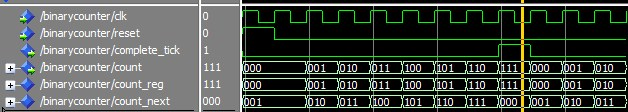

   Simulation waveforms of N-bit binary counter, :numref:`vhdl_binaryCounter`

.. _`sec_ModMCounter`:

Mod-m counter
-------------

Mod-m counter counts the values from 0 to (m-1), which is designed in :numref:`vhdl_modMCounter`. 

**Explanation** :numref:`vhdl_modMCounter`

    The listing is same as :numref:`vhdl_binaryCounter` with some minor changes which are explained here. In line 9, maximum count i.e. M is defined for 'Mod-m counter, then in line 10, number for bits 'N' is defined which is required to count upto (M-1).
    
    In line 37, count is set to zero, when maximum count is reached otherwise it is increased by 1. Line 40 generates a tick for each count completion. The design generated by the listing is shown in :numref:`fig_modMCounter`.

.. literalinclude:: codes/Chapter-Visual-verifications-of-designs/modMCounter.vhd
    :language: vhdl
    :linenos:
    :caption: Mod-m counter
    :name: vhdl_modMCounter

**Explanation** :numref:`fig_modMCounter`

    This figure is same as :numref:`fig_binaryCounter` with few changes to stop the count at 'M'. Firstly, in 'Equal0' component '3'h4' (i.e. 'M-1') is used instead of 3'h7, as 'M' is set to 5 in line 9; and the output of 'Equal0' is set to 1 whenever the count reaches to 4. Then output of 'Equal0' is sent to the multiplexer 'MUX21'; which selects the count 3'h0 whenever the output of 'Equal0' is one, otherwise incremented value (given by 'Add0') is sent to the D flip flops. The simulation waveforms for this design is shown in :numref:`fig_modMCounterWave`. In the waveforms, we can see that a clock pulse is generated at the end of the count i.e. '100' (see 'complete\_tick) in the current example.

.. _`fig_modMCounter`:

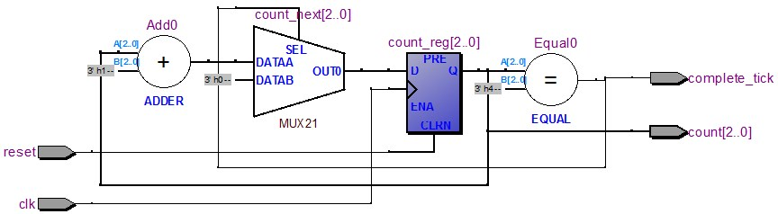

   Mod-m counter, :numref:`vhdl_modMCounter`

.. _`fig_modMCounterWave`:

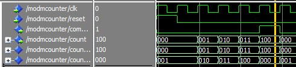

   Simulation waveforms of Mod-m counter, :numref:`vhdl_modMCounter`

Clock ticks
===========

In :numref:`vhdl_clockTick`, Mod-m counter is used to generate the clock ticks of different frequencies, which can be used for operating the devices which work on different clock frequencies. Further, we will use the listing for visual verification of the designs using 'LEDs' and 'seven segment displays'.

**Explanation** :numref:`vhdl_clockTick`

    The listing uses the 'Mod-m' counter (as shown lines 22-24) to generate the ticks with different time period. In line 12, M = 5 is set, to generate the ticks after every 5 clock cycles as shown in :numref:`fig_clockTickWave`. In the figure, two 'red cursors' are used to display the 5 clocks cycles, and during :math:`5^{th}` cycle the output port i.e. 'clkPulse' is set to 1. Further, :numref:`fig_clockTick` shows the structure of the design, whose internal design is defined by Mod-m counter in :numref:`vhdl_modMCounter`. Lastly, different values of 'm' and corresponding 'N' are shown in lines 8-10, to generated the clock ticks of different time period.

.. literalinclude:: codes/Chapter-Visual-verifications-of-designs/clockTick.vhd
    :language: vhdl
    :linenos:
    :caption: Generate clocks of different frequencies
    :name: vhdl_clockTick

.. _`fig_clockTick`:

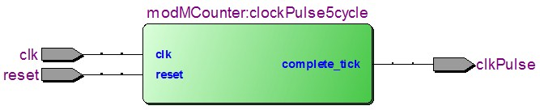

   Clock tick generator, :numref:`vhdl_clockTick`

.. _`fig_clockTickWave`:

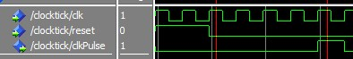

   Simulation waveforms of clock tick generator, :numref:`vhdl_clockTick`

.. _`sec_sevenSegmentDisplay`:

Seven segment display
=====================

In this section, VHDL code for displaying the count on seven segment display device is presented, which converts the hexadecimal number format (i.e. 0 to F) into 7-segment display format. Further, a test circuit is designed to check the output of the design on the FPGA board. 

Implementation
--------------

:numref:`vhdl_hexToSevenSegment` is designed for active-low seven segment display device, i.e. LEDs of the device will glow if input is '0'. Then, at the end of the design, output is generated for both active low and active high seven segment display devices. 

.. _`fig_sevenSegmentImage`:

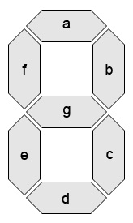

   Seven segment display

**Explanation** :numref:`vhdl_hexToSevenSegment`

    In the listing, hexadecimal number i.e. 'hexNumber' is converted into seven segment format i.e. 'sevenSegment'. Lines 17 to 33 perform this conversion e.g. if hexadecimal number is 0 (i.e. ''0000" in binary format),  then it is converted into ''1000000" in line 18. Since, seven segment display device in the Altera DE2 board is active low, therefore '1' is used in the beginning (i.e. ':math:`g^{th}`' position is set to '1' in :numref:`fig_sevenSegmentImage`),  so that :math:`7^{th}` LED will not glow and '0' will be displayed on the seven segment display. 
    
    Since the design is for active low system, therefore in line 35, the signal 'sevenSegment' is assigned directly to the output port 'sevenSegmentActiveLow'; whereas it is inverted for the active high output port i.e. 'sevenSegmentActiveHigh' in line 36. In this way, we can use this design for any kind of devices. In the next section, test circuit is shown for this design.

.. literalinclude:: codes/Chapter-Visual-verifications-of-designs/hexToSevenSegment.vhd
    :language: vhdl
    :linenos:
    :caption: Hexadecimal to seven segment display conversion
    :name: vhdl_hexToSevenSegment

Test design for 7 segment display
---------------------------------

Till now, we checked the outputs of the circuits using simulation. In this section, output of the code is displayed on the Seven segment devices which is available on the DE2 FPGA board. Further, we can use the design with other boards as well; for this purpose, the only change required is the pin-assignments, which are board specific.  

VHDL code for testing the design is presented in :numref:`vhdl_hexToSevenSegment`. Note that, in this listing, we use the names 'SW' and 'HEX0' etc., which are defined in 'DE2\_PinAssg\_PythonDSP.csv' file. Partial view of this file is shown in :numref:`fig_DE2_PinAssg_PythonDSP`, which is provided in the zip folder along with the codes and can be downloaded from the website. This file is used for 'pin assignment' in Altera DE2 board. DE2 board provides the 18 switches i.e. SW0 to SW17. Pin number for SW0 is 'PIN\_N25', therefore in the '.csv file', we used the name SW[0] for (SW0) and assign the pin number 'PIN\_N25' in location column. Note that, we can not change the header names i.e. 'To' and 'Location' for using the '.csv file'. Further, we can change the names to any other desired names e.g. SW17 is named as 'reset', which will be used for resetting the system in later designs. 

For pin assignments with '.csv file', go to **Assignments-->Import Assignments** and then select the file 'DE2\_PinAssg\_PythonDSP.csv'. Next, to see the pin assignments, go to **Assignments-->Pin Planner**, which will display the pin assignments as shown in :numref:`fig_PinAssignment`. Further, we can manually change the pin location by clicking on the 'Location' column in the figure. 

.. note::

    Names 'SW' and 'HEX0' etc. are used along with 'std\_logic\_vector' in the testing circuits, so that pin numbers are automatically assigned to these ports according to '.csv file'. Otherwise we need to manually assign the pin numbers to the ports.

.. _`fig_DE2_PinAssg_PythonDSP`:

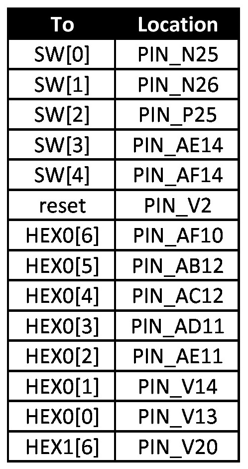

   Partial display of 'Pin assignments file' i.e. DE2\_PinAssg\_PythonDSP.cs

.. _`fig_PinAssignment`:

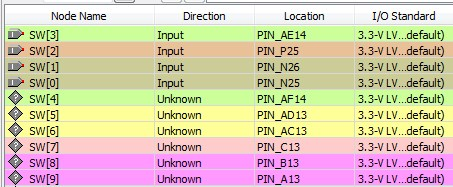

   Partial display of Pin Assignments

**Explanation** :numref:`vhdl_hexToSevenSegment_testCircuit`

    In Line 10 of the listing, 4 bit input port 'SW' is defined. Therefore, pin number will be assigned to these switches according to name 'SW[0]' to 'SW[3]' etc. in the '.csv file'. In line 11, two output ports are defined i.e. HEX0 and HEX1. Next, in line 18 and 22, HEX0 and HEX1 are mapped to active low and active high outputs of the :numref:`vhdl_hexToSevenSegment` respectively. Note that, it is optional to define all the output ports in the port mapping, e.g. output port 'sevenSegmentActiveHigh' is not declared in line 19; whereas all the input ports must be declared in port mapping. 
    
    Now this design can be loaded on the FPGA board. Then, change the switch patterns to see the outputs on the seven segment display devices. Since, HEX0 and HEX1 are set for active low and active high respectively, therefore HEX1 will display the LEDs which are not glowing on the HEX0 e.g. when HEX0 displays the number '8', then HEX1 will not glow any LED as all the LEDs of HEX0 are in the 'on' condition. 

.. literalinclude:: codes/Chapter-Visual-verifications-of-designs/hexToSevenSegment_testCircuit.vhd
    :language: vhdl
    :linenos:
    :caption: Test design for seven segment displa
    :name: vhdl_hexToSevenSegment_testCircuit

.. _`sec_modMCounterVisualTest`:

Visual verification of Mod-m counter
====================================

In previous section, we displayed the outputs on 7 segment display devices, but clocks are not used in the system. In this section, we will verify the designs with clocks, by visualizing the outputs on LEDs and seven segment displays. Since, 50 MHz clock is too fast to visualize the change in the output with eyes, therefore :numref:`vhdl_modMCounter_VisualTest` uses the 1 Hz clock frequency for mod-m counter, so that we can see the changes in the outputs. 

**Explanation** :numref:`vhdl_modMCounter_VisualTest`

    Since, DE2 provides clock with 50 MHz frequency, therefore it should count upto :math:`5 \times 10^7` to elapse 1 sec time i.e. :math:`\frac{{50MHz}}{{5 \times {{10}^7}}} = \frac{{50 \times {{10}^6}Hz}}{{5 \times {{10}^7}}} = 1Hz = 1\sec`. Therefore M=50000000 is used in line 29.   
    
    In the listing, three component are instantiated i.e. 'clockGenerator', 'modMCounter' and 'hexToSevenSegment' for the visual verification of mod-m counter. Further, counts are verified using both LEDs and seven segment display. In line 25, 'clockGenerator' is instantiated which generates the clock of 1 second i.e. 'clk\_Pulse1s'. Then this 1 second clock is used by second instantiation i.e. mod-m counter as shown in line 33. This can be seen in :numref:`fig_modMCounter_VisualTest` where output of 'clockGenerator' is connect with input clock of mod-m counter. Lastly, all these signals are sent to output port i.e. 1 second clock is displayed by LEDR[0] (line 30), whereas 'completed-count-tick' is displayed by LEDR[1] (line 36). Also, counts are displayed by green LEDs i.e. LEDG (line 38).  Further, seven segment display is also instantiated at line 41, to display the count on seven segment display as well. 

.. literalinclude:: codes/Chapter-Visual-verifications-of-designs/modMCounter_VisualTest.vhd
    :language: vhdl
    :linenos:
    :caption: Mod-m counter verification with 1 second clock
    :name: vhdl_modMCounter_VisualTest

.. _`fig_modMCounter_VisualTest`:

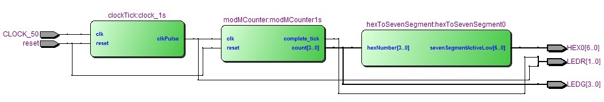

   Mod-m counter verification with 1 second clock

Conclusion
==========

In this chapter, we designed the circuit which generates various 'ticks' of different frequencies. Then the ticks are used for visual verifications of the designs using LEDs and seven segment displays. Further, structural modeling approach is used for the visual verifications of the systems.
